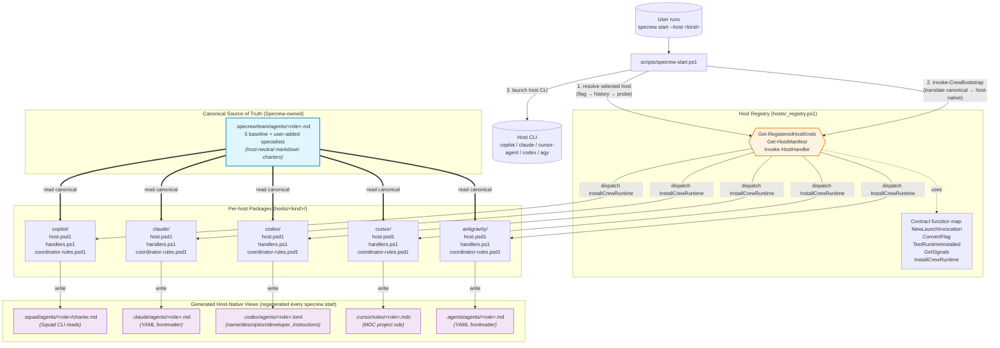

# Specrew Host Package Architecture

> **Status**: Shipped (refactor on branch `multi-host-integration-refactor`, integration-test verified)
> **Companion design doc**: [host-package-architecture.md (design)](../design/host-package-architecture.md)
> **Add-a-host guide**: [add-a-new-host.md](../how-to/add-a-new-host.md)
> **Author**: refactor session 2026-05-24

## Why this exists

Specrew supports multiple agent host CLIs — currently **Copilot**, **Claude Code**, **Cursor**, **Codex**, and **Antigravity** — so the user can pick their preferred AI runtime at launch (`specrew start --host claude`) or by launching the host binary directly after `specrew init` (`claude`, `cursor-agent`, `codex`, `copilot`, or `agy`). Before this refactor, host-specific logic was sprinkled across ~28 source files in switch statements and hardcoded enums. Adding a new host (Windsurf, Grok Code, …) required editing every one of those files.

This architecture moves to the **Open-Closed Principle**: host-neutral core code is **closed for modification** when adding a host; per-host packages are **open for extension** via new folders.

**The promise:** to add a new host, you `mkdir hosts/<kind>/`, write 3 small files, and you're done. No edits to existing files.

## File layout

```text
hosts/
├── _contract.md          # The host-package contract (this is the source-of-truth schema)
├── _registry.ps1         # THE ONLY file host-neutral core code calls
├── copilot/
│   ├── host.psd1                  # Declarative manifest (identity, paths, conventions)
│   ├── handlers.ps1               # 4 contract functions per host
│   └── coordinator-rules.psd1     # Declarative coordinator-prompt surgery rules
├── claude/   (same shape)
├── codex/    (same shape)
├── cursor/   (same shape)
└── antigravity/   (same shape)
```

Each host directory is **self-contained**: everything needed to support the host lives inside its folder, except for the contract definition and the dispatcher.

## Visual overview

The architecture follows Open-Closed Principle: host-neutral core code dispatches through the registry; per-host packages declare and translate everything host-specific.



**Reading the diagram:**

- **Blue (canonical):** `.specrew/team/` is the SINGLE source of truth. User edits ONLY here.
- **Orange (registry):** The dispatcher. Discovers hosts/, validates manifests, routes contract-function calls.
- **Per-host packages:** Each has a manifest (identity), handlers (4+1 contract functions), and coordinator-rules (per-host prompt surgery).
- **Purple (generated views):** Each host's native subagent location. **Regenerated on every `specrew start`** — drift is structurally impossible.

**Adding a new host (e.g., Cursor) = adding `hosts/cursor/` with manifest + handlers + rules.** Every flow in the diagram picks up the new host via the registry without touching existing files.

## The three artifacts per host

### 1. `host.psd1` — declarative manifest

PowerShell data file (hashtable) that declares what the host IS:

```powershell
@{
    Kind                       = 'claude'
    DisplayName                = 'Claude Code CLI'
    Status                     = 'supported'    # or 'deferred' / 'experimental'
    SchemaVersion              = 1
    Binary                     = 'claude'
    InstallUrl                 = 'https://docs.anthropic.com/en/docs/claude-code/installation'
    SkillRoot                  = '.claude/skills'
    HasUserSlashCommandSurface = $true
    SettingsPath               = '.claude/settings.json'
    AgentDir                   = '.claude/agents/'
    InstructionsFile           = 'CLAUDE.md'
    SpeckitAiFlag              = 'claude'
    PreferredAgent             = 'claude'
    HandlersFile               = 'handlers.ps1'
    CoordinatorRulesFile       = 'coordinator-rules.psd1'
}
```

Full schema: see [_contract.md](../../hosts/_contract.md).

### 2. `handlers.ps1` — 5 contract functions

PowerShell script that implements what the host DOES. Naming uses the manifest `Kind` in PascalCase:

| Function (template) | Purpose | Returns |
|---|---|---|
| `New-<Kind>LaunchInvocation` | Build the `<binary> <args...>` to launch the host with Specrew's bootstrap | `pscustomobject @{ Binary; Args[]; Notices[]; HostKind }` |
| `ConvertTo-<Kind>Flag` | Translate a Specrew-side flag (`--remote`, `--allow-all`, `--autopilot`) to host-specific flags | `pscustomobject @{ Args[]; Notice; SuppressWarning }` |
| `Test-<Kind>RuntimeInstalled` | Is the host's Crew runtime deployed in this project? | `bool` |
| `Get-<Kind>Signals` | Detect host-set environment variables (run-time host context) | `string[]` of env-var names that are set |
| `Install-<Kind>CrewRuntime` *(Proposal 108 Slice 9)* | Read canonical `.specrew/team/agents/<role>.md` files and write to this host's native subagent location (`.squad/agents/<role>/charter.md`, `.claude/agents/<role>.md`, `.codex/agents/<role>.toml`, `.agents/agents/<role>.md`). Idempotent; runs on every `specrew start --host <kind>`. | `pscustomobject @{ Actions[]; CrewRuntimePath; Notices[] }` |

**The 5th function deserves its own architectural note.** `Install-<Kind>CrewRuntime` is the contract function that closes the user-observed gap "Claude has no team of agents like Copilot+Squad." Each host's body reads from the canonical Specrew-owned location and translates to the host's native subagent format. The translation is host-specific (Codex uses TOML with `developer_instructions =`; Claude/Antigravity use markdown with YAML frontmatter; Cursor uses MDC project rules; Copilot's Squad CLI uses `.md` charter files), but the **CONTENT — the actual charters defining each role's identity, expertise, and discipline — is identical across all 5 hosts** because they all derive from the same canonical source.

### 3. `coordinator-rules.psd1` — declarative coordinator-prompt surgery

PowerShell data file declaring per-host coordinator-prompt rewrite rules. Two rule kinds: `Strip` (regex-match → delete) and `Replace` (regex-match → substitute with backreferences). The engine applies Specrew's universal FR-011 header rewrite first, then applies each host's rules in declared order.

Example (Codex needs Squad-runtime-path lines stripped AND slash-commands rewritten as pwsh-form because Codex has no user-defined slash-command surface):

```powershell
@{
    Rules = @(
        @{
            Kind        = 'Strip'
            Description = 'FR-012: Squad-runtime-path directive — .squad/decisions.md reference'
            Pattern     = '(?m)^\s*\d+\.\s+.*\.squad[\\/]decisions\.md.*$'
        },
        @{
            Kind        = 'Replace'
            Description = 'FR-014: slash-command boundary-advance → pwsh-form (Codex-only)'
            Pattern     = '/speckit\.specrew-speckit\.sync-([a-z\-]+)'
            Replacement = 'pwsh -File .specify/extensions/specrew-speckit/scripts/sync-boundary-state.ps1 -BoundaryType $1'
        }
    )
}
```

Empty `Rules = @()` is valid — Copilot uses this because it retains all Squad-runtime-path directives + slash-command refs (only the engine's universal header rewrite applies).

## The registry — one file, one responsibility

`hosts/_registry.ps1` is the **only** file host-neutral core code calls. It does three jobs:

### Discovery — `Get-RegisteredHostKinds`

Enumerates `hosts/*/host.psd1` files, validates each manifest, and returns the sorted host-kind list. **No hardcoded enum** — adding `hosts/cursor/host.psd1` makes Cursor automatically appear in:

- Launch-invocation dispatch (`specrew-start.ps1`)
- Flag-translation table (`scripts/internal/host-flag-translation.ps1`)
- Runtime-inventory iteration (`scripts/internal/host-runtime-inventory.ps1`)
- `specrew host list`, `specrew host status`
- `specrew where` (when host-awareness lands in F-043 follow-up)
- Coordinator-prompt surgery (per-host coordinator-rules.psd1 auto-loaded)
- The host-history schema (initial entry for new host added automatically)

### Manifest access — `Get-HostManifest -Kind <kind>`, `Get-SpecrewHostsByStatus -Status supported|deferred|experimental`

Cached after first read. Validation via `Test-HostManifestValid` checks required fields, deferred-status guidance, kind/folder-name parity.

### Dispatch — `Invoke-HostHandler -Kind <kind> -ContractFunction <slot> -Arguments <hashtable>`

Resolves the per-host function name (`New-ClaudeLaunchInvocation` for `Kind=claude, ContractFunction=NewLaunchInvocation`), then dispatches. Handlers are eagerly dot-sourced at registry load time so all handler functions are visible in the calling script's scope. Lazy-loading inside a function broke scope visibility (caught immediately by smoke test on first attempt).

The contract-function map is a small hashtable:

```powershell
$script:HostContractFunctionMap = @{
    'NewLaunchInvocation'  = 'New-{0}LaunchInvocation'
    'ConvertFlag'          = 'ConvertTo-{0}Flag'
    'TestRuntimeInstalled' = 'Test-{0}RuntimeInstalled'
    'GetSignals'           = 'Get-{0}Signals'
    'InstallCrewRuntime'   = 'Install-{0}CrewRuntime'
}
```

To add a new contract slot (e.g., `Get-<Kind>CostCatalogUrl` for F-041), add one entry here AND export the function from each handlers.ps1. The dispatcher itself stays unchanged.

## Host-neutral surfaces (built on top of the registry)

The following surfaces no longer have per-host switches; they iterate the registry:

| Surface | File | Pattern |
|---|---|---|
| Launch dispatch | `scripts/specrew-start.ps1` Get-SpecrewHostLaunchInvocation | `Invoke-HostHandler -ContractFunction NewLaunchInvocation` |
| Flag translation | `scripts/internal/host-flag-translation.ps1` Get-HostFlagTranslation | `Invoke-HostHandler -ContractFunction ConvertFlag` |
| Runtime inventory | `scripts/internal/host-runtime-inventory.ps1` Get-SpecrewHostRuntimeInventory | iterates `Get-RegisteredHostKinds`, calls `Invoke-HostHandler -ContractFunction TestRuntimeInstalled` per host |
| Coordinator-prompt surgery | `scripts/internal/coordinator-prompt-surgery.ps1` Invoke-SpecrewCoordinatorPromptSurgery | engine reads `coordinator-rules.psd1` per host, applies declared Strip/Replace rules |
| Host history | `scripts/internal/host-history.ps1` New-SpecrewHostHistory | initial schema entries built from `Get-RegisteredHostKinds` |
| `specrew host` command | `scripts/specrew-host.ps1` (list/use/status) | every output iterates `Get-RegisteredHostKinds`; deferred hosts shown with their `DeferredGuidance` |

## What changed vs the pre-refactor architecture

| Metric | Before (F-040 merged) | After (Phase A-D complete) | Delta |
|---|---|---|---|
| Files with hardcoded 4-host enum tuple | 4+ in active dispatch paths | 1 (`scripts/specrew-init.ps1` — agent-enable validator + iteration-config.yml template; documented Phase D follow-up; allow-listed in firewall test) | -3 from active dispatch |
| Files with hardcoded 3-host enum tuple | several | 1 (`tests/manual/multi-host-smoke.ps1` — intentional smoke-test fixture) + allow-listed | -several |
| Per-host switch statements in active dispatch | ~5 clusters in specrew-start.ps1 + 12-arm in host-flag-translation.ps1 + 3-rule surgery in coordinator-prompt-surgery.ps1 + 4-arm × 4 in detect-hosts.ps1 | 0 (all registry-driven) | structurally impossible to drift |
| Per-host launch dispatch | 80-line switch in specrew-start.ps1 with 3 hosts (Antigravity missing — latent bug) | registry delegate; all 5 hosts via manifests | -90% + closed bug |
| Per-host flag translation | 121-line file with 12-arm switch | 55-line shim; 4 small handler files | -55% on shim, +data-driven |
| Coordinator-prompt surgery | 123-line file with hardcoded patterns | 130-line rules engine + 4 declarative `coordinator-rules.psd1` files | data-driven |
| `detect-hosts.ps1` 4 lookup functions | Hardcoded switches duplicating manifest data | 1-line manifest reads via `Get-HostManifest` | -150 lines / +manifest source-of-truth |
| Cost to add a new host (e.g., Cursor) | Edit ~28 files | `mkdir hosts/<kind>/` + 3 files + 3 ValidateSet updates + 2 entries in Specrew.psd1 = ~8 edits, none to existing core logic | ~70% reduction |
| Latent bugs from drift | 2 audit-flagged (Antigravity missing from launch switch + coordinator-surgery ValidateSet); 1 found in deep-review (Antigravity missing `InstructionsFile`) | 0 (structural firewall test catches new violations on every CI run) | structurally impossible |
| Structural test for "no hardcoded host enums outside hosts/" | none | `tests/integration/host-coupling-firewall.tests.ps1` (157 files scanned, allow-list documented) | new safety net |

## Test coverage

- **`tests/integration/host-registry.tests.ps1`** — registry discovery, manifest validation, kind/folder parity, legacy parity (registry matches `Get-SpecrewSupportedHostKinds`), per-host Binary + SkillRoot parity, status filter, unknown-host throw, contract-function resolution, dispatch correctness, launch-invocation argv parity, and flag-translation parity across 15 cells (5 hosts × 3 flags).
- **`tests/integration/multi-host-launch-path.tests.ps1`** — 21 assertions: full F-040 multi-host integration suite (host enums, binary names, install guidance, deferred guidance, Antigravity Gemini-deadline warning, skill-root resolution, flag-translation matrix, coordinator-prompt-surgery FR-011/012/014 invariants, launch-shape goldens, schema-v2 back-compat).
- **`tests/integration/host-coupling-firewall.tests.ps1`** — structural test that scans all production `.ps1` files outside `hosts/` for hardcoded host-enum patterns. Allow-list contains 9 known exceptions (this test itself, the registry, two integration tests, the 3 remaining ValidateSet sites pending registry-driven validators, and 2 pre-refactor files documented as Phase D follow-up). Plus: asserts every supported host populates the manifest `InstructionsFile` field. Catches new violations on every CI run — drift becomes a CI-blocking failure, not a quiet regression.

All three test suites green on the refactored architecture (49+ assertions total).

## Open work (Phase D + F)

Not done yet but tracked:

**Phase D anti-couplings:**

- Rename `Test-CopilotInstructionsChangeType.ps1` → host-neutral name; parameterize via manifest `InstructionsFile`
- Abstract `.github/copilot-instructions.md` shipped path via manifest `InstructionsFile`
- Make `--ai copilot` (passed to `specify init`) configurable via manifest `SpeckitAiFlag`
- Generate `preferred_agent` defaults in `role-assignments.yml` template via registry
- Add Rule-15-style validator: `Specrew.psd1` FileList must enumerate every `hosts/*/host.psd1` + `handlers.ps1` + `coordinator-rules.psd1`
- Move/rename `.squad/skills/copilot-launch-contract-divergence/` to host-neutral
- Replace remaining 3 ValidateSets (`specrew-start.ps1` host-launch-invocation, `host-flag-translation.ps1` Get-HostFlagTranslation, `coordinator-prompt-surgery.ps1` Invoke-SpecrewCoordinatorPromptSurgery) with registry-driven enums

**Phase F implementations:**

- F-043 remaining: `specrew start` host-selection logic update + `specrew where` host-aware display + Category A migration
- F-041 (Proposal 068 Cost-Aware Routing): per-host model catalogs as a new contract function `Get-<Kind>ModelCatalog`
- F-042 (Proposal 070 Token Economy MVP): per-host cost attribution via manifest

## Design tradeoffs

**Pro:**

- Open-Closed for host extension; future hosts are zero-touch on existing code
- Per-host bugs from drift become structurally impossible (e.g., Antigravity missing from launch switch is now impossible because the switch is gone)
- Doc + data is per-host, not scattered across global config
- Test coverage is per-host iterative (one test, all hosts)

**Con:**

- Indirection cost: every host lookup goes through registry → manifest → dispatch. Acceptable at this scale (~30ms cold load, ~0ms warm)
- Declarative `coordinator-rules.psd1` introduces a small schema to maintain. Mitigated by the engine's Write-Warning behavior for malformed rules
- PowerShell dot-source scope semantics required eager-load + careful "no per-host wrapper functions in same scope" discipline (the second one is enforced by the recursion bug that bit us once and won't again)

**Considered + rejected:**

- **PowerShell modules per host** (`.psm1`): more isolation but more boilerplate; rejected because dot-sourced `.ps1` is the existing Specrew convention and the registry-discovery + lazy-load patterns work equivalently
- **YAML manifests**: more readable but requires `powershell-yaml` external dependency; rejected because `Import-PowerShellDataFile` is built-in and the audience is engineers comfortable with PowerShell hashtables
- **`hosts/<kind>/.module.psd1`** mimicking proper PowerShell module shape: overkill for the current scope; per-host packages don't need module isolation; registry-driven discovery + dot-source is enough
- **Eager-load all hosts' handlers at registry load time** (chosen) vs **lazy-load per host on first dispatch** (rejected): lazy-load broke scope visibility (functions dot-sourced into the loader function's scope, not the caller's). Eager-load is fine — 4 small files at ~150 LOC each, ~30ms cold

## References

- [_contract.md](../../hosts/_contract.md) — canonical schema definition
- [host-package-architecture.md (design)](../design/host-package-architecture.md) — original design doc + migration plan
- [add-a-new-host.md](../how-to/add-a-new-host.md) — step-by-step guide
- [tests/integration/host-registry.tests.ps1](../../tests/integration/host-registry.tests.ps1) — contract verification
