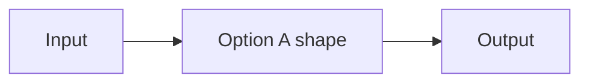
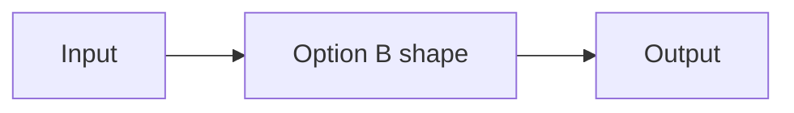
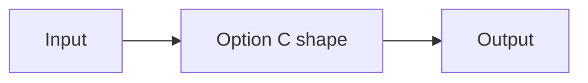

# Design Analysis — Feature <feature> / Iteration <NNN>

**Feature**: <feature-ref>
**Iteration**: <NNN>
**Date**: <YYYY-MM-DD>
**Spec**: <file:/// URL to spec.md>

<!--
  This artifact is the durable pre-plan design decision record. Plan generation is
  blocked until this file is valid AND the Human Decision section records a chosen
  option and commit hash. Replace every <placeholder> with real content.

  Validator contract (scripts/internal/design-analysis-gate.ps1):
  - Required sections: Problem Framing, Key Design Decision Points, Alternatives,
    Crew Recommendation, Human Decision.
  - Alternatives MUST include at least the Simplest and Reasonable options; the
    By-the-book option is conditional (include when meaningfully distinct, or state
    why it is not distinct enough).
  - Each option MUST include: Approach, Architectural pattern, Quality features
    considered, Effort estimate, Reversibility cost, Trade-offs, and a Mermaid
    diagram or a diagram link.
  - Crew Recommendation MUST name exactly one option.
  - Human Decision MUST record the chosen option, reason/modifications, and the
    commit hash, recorded after the human verdict.
-->

## Problem Framing

<One to two paragraphs distilled from the spec User Stories + clarify outcomes:
what is being solved and the key constraints.>

## Key Design Decision Points

<Numbered list of the substantive architectural decisions this iteration must make.>

1. <decision point one>
2. <decision point two>

## Alternatives

### Option A: Simplest — <approach name>

**Approach**: <how this option works, 1-2 paragraphs>
**Architectural pattern**: <pattern name>
**Quality features considered**: <which lenses apply, which are deferred>
**Effort estimate**: <relative or story-point estimate>
**Reversibility cost**: <Low | Medium | High — cost to switch later>
**Trade-offs**:

- (+) <upside>
- (−) <downside>

**Design principle / why this matters**: <the principle behind this option — e.g. dependency isolation, ports/adapters or layering, report-contract stability, reversibility cost; for Simplest, why it is cheaper but more coupled; for By-the-book, why it may be premature or overbuilt>

**Recommended for**: <context where this option fits>

**Diagram**:

### Option B: Reasonable — <approach name>

**Approach**: <how this option works>
**Architectural pattern**: <pattern name>
**Quality features considered**: <lenses considered>
**Effort estimate**: <estimate>
**Reversibility cost**: <Low | Medium | High>
**Trade-offs**:

- (+) <upside>
- (−) <downside>

**Design principle / why this matters**: <the principle behind this option — e.g. dependency isolation, ports/adapters or layering, report-contract stability, reversibility cost; for Simplest, why it is cheaper but more coupled; for By-the-book, why it may be premature or overbuilt>

**Recommended for**: <context>

**Diagram**:

### Option C: By-the-book — <approach name>

<Conditional. Include this option when it is meaningfully distinct from Reasonable.
If it is not meaningfully distinct, replace this option body with a short statement
that By-the-book is not meaningfully distinct for this problem and why.>

**Approach**: <how this option works>
**Architectural pattern**: <pattern name>
**Quality features considered**: <comprehensive lenses>
**Effort estimate**: <estimate>
**Reversibility cost**: <Low | Medium | High>
**Trade-offs**:

- (+) <upside>
- (−) <downside>

**Design principle / why this matters**: <the principle behind this option — e.g. dependency isolation, ports/adapters or layering, report-contract stability, reversibility cost; for Simplest, why it is cheaper but more coupled; for By-the-book, why it may be premature or overbuilt>

**Recommended for**: <context>

**Diagram**:

## Applicable Lenses

<!--
  FR-009/FR-010/FR-025 (Feature 141 Iteration 4): applicability is determined by a fixed
  questionnaire, NOT a hand-listed guess.
  1. Emit + answer the questionnaire: write `lens-applicability.json` in this iteration directory
     (questions from the decoupled sibling map
     `extensions/specrew-speckit/knowledge/design-lenses/applicability-map.json`; answer each
     true/false). Helper: New-SpecrewLensApplicabilityTemplate (scripts/internal/lens-applicability.ps1).
  2. Render this section from the answers: Format-SpecrewApplicableLensesSection -Map <map> -Answers <answers>
     (always-on foundational lenses + specialized lenses gated by a "yes"; deterministic, no network/LLM).
  The catalog `index.yml` stays pure (the gating map is the decoupled sibling). Degrades to
  "none available" when the catalog or answers are absent.
-->

None available - no recorded questionnaire answers yet (replace with the rendered selection).

## Crew Recommendation

**Recommended: Option <X>.**

<Two to three paragraphs naming exactly one option and the context-specific
rationale. Reference the decision points. Mentioning the other options
contextually is fine; name only one as recommended.>

## Human Decision

<Populated after the design-analysis verdict — left empty until then so the gate
blocks plan until a decision is recorded.>

- **Decision verdict**: approved for plan with Option <X>
- **Chosen option**: <Option X | modified-Option X>
- **Reason**: <human rationale>
- **Modifications**: <any scope tweaks to the chosen option, or None>
- **Design-analysis draft commit**: <the commit that first drafted these options>
- **Decision recorded in commit**: <the commit that contains THIS populated Human Decision — NOT the draft commit>
