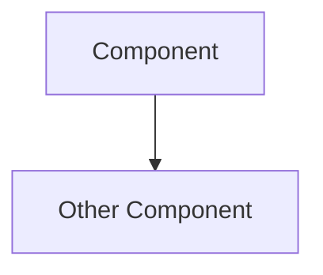
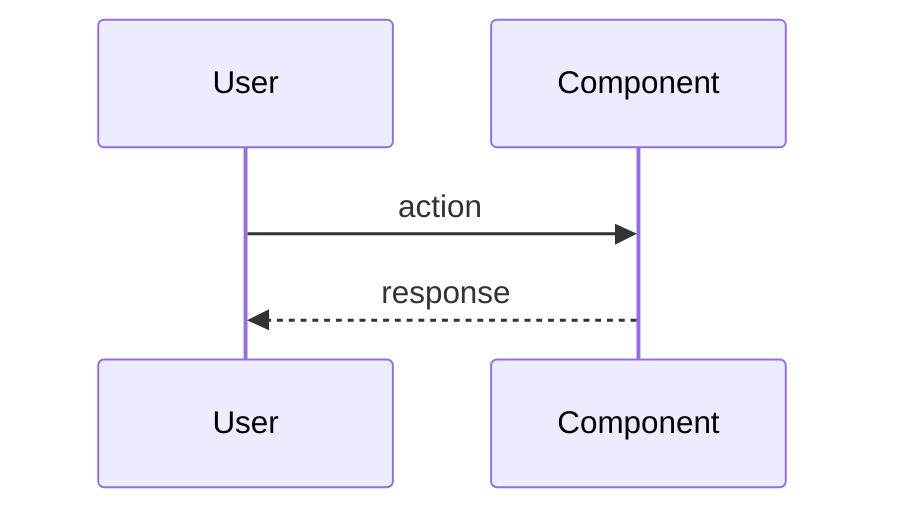

# Review-Diagrams Mermaid Template Hardening

## Why

`review-diagrams.md` is a canonical reviewer-artifact in the Specrew lifecycle. Its file name + standard section headers ("Structure Diagram", "Flow Diagram", etc.) imply machine-renderable diagrams (Mermaid, PlantUML). But the current scaffolder ships an empty template + Reviewer charter doesn't prescribe a format, so what arrives in practice is ` ```text` fence blocks containing hand-typed ASCII indented trees and arrows.

Empirical: 2026-05-25 PlanningPoC (`C:\Dev\SDGM\PlanningPoC`) iter-001 review. The user expected Mermaid; got ASCII text. The artifact passes markdownlint (` ```text` is a valid fence type) and passes the validator (no rule checks diagram content). User's intuition was right; mechanism didn't enforce it.

This is a form-vs-meaning bug ([[proposal-030]]): the form (file exists + lint passes) catches existence, but the meaning (this file should contain machine-renderable diagrams) is invisible to mechanism.

## What

Three composable fixes. Ship all three together (the cost is small and they reinforce each other).

### Pillar 1: Validator rule (~1 SP)

Add a soft WARN to `validate-governance.ps1` (mirror to `.specify/`):

- Check whether `review-diagrams.md` (when present) contains at least one ` ```mermaid` fenced block
- If not, emit `WARN [review-diagrams] no-mermaid-content: review-diagrams.md exists but contains no fenced ```mermaid block. Likely text-only ASCII; intent is machine-renderable diagrams.`
- Soft WARN — does not block boundary advancement
- Reviewer-side check; runs at the same boundary as other reviewer-artifact checks

### Pillar 2: Scaffolder template (~1 SP)

Update `scaffold-reviewer-artifacts.ps1` (mirror to `.specify/`) to ship `review-diagrams.md` with a Mermaid skeleton instead of empty fences:

```markdown
## Component Diagram



## Sequence: <key flow>


```

Default content makes Mermaid the path of least resistance; Implementer/Reviewer customizes rather than starting blank.

### Pillar 3: Reviewer charter directive (~0.5 SP)

Add a one-line directive to the Reviewer agent charter (`extensions/specrew-speckit/squad-templates/agents/reviewer.md` or equivalent):

> When authoring `review-diagrams.md`, use Mermaid syntax (`graph`, `flowchart`, `sequenceDiagram`, `classDiagram`, etc.) for all diagrams. ASCII trees in ` ```text` fences are not acceptable substitutes — they bypass the machine-renderable intent of the artifact.

Charter directive catches the case where the scaffolder isn't invoked (e.g., reviewer-artifacts written by hand or by a non-Squad host that doesn't read the template).

## How

| Step | File | Effort |
|---|---|---|
| Pillar 1 validator rule + helper | `extensions/specrew-speckit/scripts/validate-governance.ps1` (+ mirror) | 1 SP |
| Pillar 2 scaffolder template update | `extensions/specrew-speckit/scripts/scaffold-reviewer-artifacts.ps1` (+ mirror) | 1 SP |
| Pillar 3 Reviewer charter directive | per-host charter templates under `squad-templates/agents/` and `installed-instructions/` | 0.5 SP |
| Integration test | `tests/integration/review-diagrams-mermaid.tests.ps1` (new) | 0.5 SP |

Total ~2-3 SP small-fix slice (Proposal 067 shape).

## Acceptance criteria

- **AC1**: A `review-diagrams.md` containing only ` ```text` ASCII fence blocks emits WARN
- **AC2**: A `review-diagrams.md` containing at least one ` ```mermaid` fence block passes silently
- **AC3**: Fresh scaffolded `review-diagrams.md` contains Mermaid skeleton (graph TD + sequenceDiagram examples)
- **AC4**: Reviewer charter explicitly forbids ` ```text` substitute fences for diagrams
- **AC5**: Mirror parity preserved (extensions/ === .specify/extensions/)

## Out of scope

- **Other diagram formats** (PlantUML, Graphviz, D2) — Mermaid is GitHub-native + renders inline in PR previews; broader format support can be a follow-up
- **Diagram content quality** (e.g., does the Mermaid actually depict the system?) — that's a semantic check beyond validator scope; Reviewer human judgment owns
- **Auto-conversion of legacy text fences** — manual migration only; this is a forward-looking rule

## Composition

- **Proposal 012 (Visual Artifact Extension)** — directly adjacent. 012 is Pillar 4 of the interaction model and may already cover diagram-format specification. **Open question**: should this proposal be absorbed into 012, or stay as a separate small-fix slice that ships independently? Recommend: ship independently as small-fix; 012 can absorb the shipped behavior in its broader scope.
- **Proposal 030 (Quality Hardening Bundle — Form-vs-Meaning)** — this is a textbook form-vs-meaning fix (form passes, meaning empty)
- **Proposal 067 (Small-Fix Slice Type)** — natural fit; this is the canonical 2-3 SP slice shape

## Risks

- **Legacy iterations have text-fence review-diagrams** — Mitigation: WARN-only; do not retroactively fail; scope rule to iterations whose boundary timestamp is post-shipping date
- **Mermaid skeleton template assumes graph TD + sequenceDiagram are right** — Mitigation: skeleton is starting point, not constraint; Reviewer customizes per feature
- **Reviewer charter directive needs host-specific deployment** — Mitigation: covered by [[proposal-024]] / [[proposal-108]] per-host charter deployment work

## Empirical motivation

2026-05-25 PlanningPoC `C:\Dev\SDGM\PlanningPoC` iter-001 review surfaced this when the user inspected `specs/001-formwork-poc/iterations/001/review-diagrams.md` and found ASCII trees in ` ```text` fences. User direction: "probably contains not valid mermaid" — intuition was right; mechanism didn't catch it. Captured in memory `[[planning-poc-findings-2026-05-25]]`.

## Cross-references

- file:///C:/Dev/Specrew/proposals/012-visual-artifact-extension.md
- file:///C:/Dev/Specrew/proposals/030-quality-hardening-bundle.md
- file:///C:/Dev/Specrew/proposals/067-small-fix-slice-type.md
- Memory: [[planning-poc-findings-2026-05-25]]

## Status history

- 2026-05-25: gap surfaced during PlanningPoC iter-001 review.
- 2026-05-26: candidate proposal drafted as part of memory→proposal sweep.
