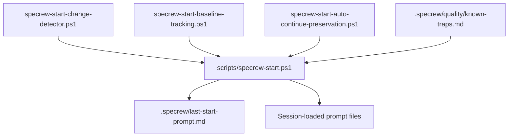
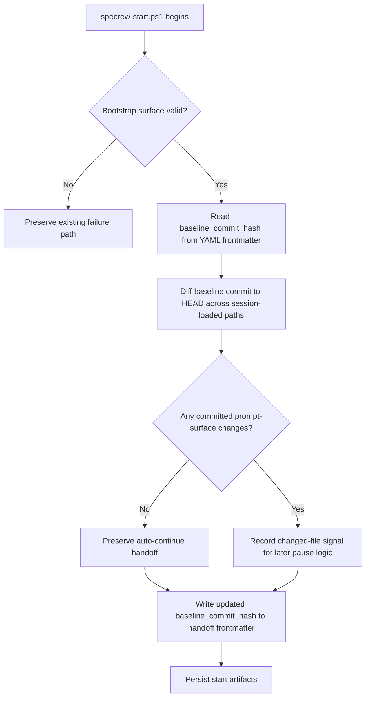

# Review Diagrams: Iteration 001

**Schema**: v1
**Diagram Format**: mermaid

## Structure Diagram

## Flow Diagram

## Omissions

- None.

## Local View Hints

- specs\011-specrew-start-conditional-pause\iterations\001\review-diagrams.md
