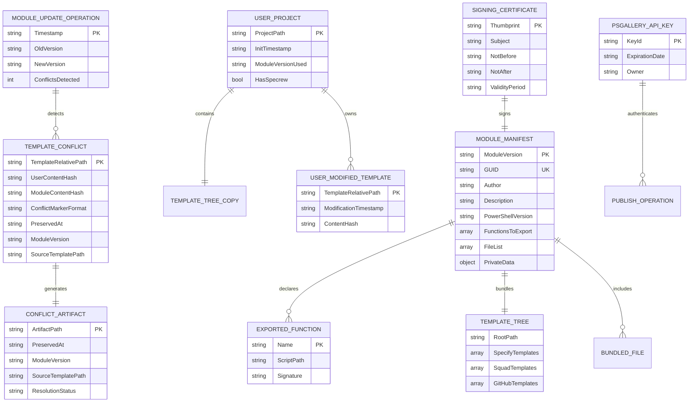

# Data Model: Specrew Distribution Module

**Feature**: 019-specrew-distribution-module  
**Date**: 2026-05-16  
**Purpose**: Document key entities and relationships for PowerShell module packaging and distribution

---

## Entity Diagram



---

## Entity Definitions

### 1. Module Manifest (`Specrew.psd1`)

**Purpose**: Declares module metadata, exported functions, dependencies, and bundled files. Central source of truth for module identity and versioning.

**Attributes**:
- **ModuleVersion** (string, PK): Semantic version (e.g., '0.18.0'); stamped from `.specrew/config.yml` `specrew_version` at build time
- **GUID** (string, UK): Unique identifier for module; generated once, never changes (e.g., 'a1b2c3d4-...')
- **Author** (string): Human-readable author name (e.g., 'Alon Fliess')
- **Description** (string): One-line summary for PSGallery listing (e.g., 'Specrew: Specification-driven development workflow for AI-augmented teams')
- **PowerShellVersion** (string): Minimum PowerShell version required (e.g., '7.0')
- **FunctionsToExport** (array): List of exported function names (e.g., ['specrew', 'specrew-init', 'specrew-update'])
- **FileList** (array): Explicit list of bundled files (e.g., ['scripts/*.ps1', 'templates/**/*'])
- **PrivateData** (object): PSGallery metadata (tags, project URL, license URL, release notes URL)

**State Transitions**:
- **Draft** → **Stamped** (via GitHub Actions: read version from config, update ModuleVersion field)
- **Stamped** → **Signed** (via GitHub Actions: apply self-signed certificate signature)
- **Signed** → **Published** (via `Publish-Module`: upload to PSGallery)

**Validation Rules**:
- ModuleVersion must match `.specrew/config.yml` `specrew_version` at publish time
- PowerShellVersion must be '7.0' or higher (cross-platform requirement)
- FunctionsToExport must match actual exported functions in `Specrew.psm1`
- FileList must not include specs/, proposals/, tests/, or repo metadata (CHANGELOG, LICENSE, README)

**Relationships**:
- Declares → Exported Functions (one-to-many)
- Bundles → Template Tree (one-to-one)
- Includes → Bundled Files (one-to-many)
- Signed By → Signing Certificate (one-to-one)

---

### 2. Template Tree

**Purpose**: The set of user-facing template files bundled in the module under `templates/` directory. Copied into user projects by `specrew init`.

**Attributes**:
- **RootPath** (string): Module-relative path to template root (e.g., 'templates/')
- **SpecifyTemplates** (array): Spec Kit templates (e.g., ['templates/specify/spec-template.md', 'templates/specify/plan-template.md'])
- **SquadTemplates** (array): Squad agent templates (e.g., ['templates/squad/copilot.md', 'templates/squad/identity/now.md'])
- **GitHubTemplates** (array): GitHub workflow templates (e.g., ['templates/github/specrew-review.yml'])

**Ownership Lifecycle**:
1. **Module-Owned** (before `specrew init`): Templates live in module installation directory; user has no copy
2. **User-Owned** (after `specrew init`): Templates copied to user project's `.specify/`, `.squad/`, `.github/` directories; user can modify freely
3. **Conflict State** (during `specrew update`): User-modified templates conflict with new module version; requires resolution

**Validation Rules**:
- All template paths must use forward slashes (cross-platform compatibility)
- Template files must be valid markdown, YAML, or PowerShell (no binary files)
- Template directory structure must match project bootstrap expectations (`.specify/templates/`, `.squad/agents/`, `.github/workflows/`)

**Relationships**:
- Bundled In → Module Manifest (one-to-one)
- Copied To → User Project (one-to-many)

---

### 3. User Project

**Purpose**: A directory where a user has run `specrew init`. Contains `.specify/`, `.squad/`, and `.github/` directories populated from the module's template tree.

**Attributes**:
- **ProjectPath** (string, PK): Absolute path to user's project directory (e.g., 'C:\Users\Alon\Projects\MyProject')
- **InitTimestamp** (string): ISO 8601 timestamp of `specrew init` execution (e.g., '2026-05-16T14:32:00Z')
- **ModuleVersionUsed** (string): Specrew module version used for initialization (e.g., '0.18.0')
- **HasSpecrew** (bool): True if `.specify/`, `.squad/`, `.github/` directories exist and are correctly structured

**State Transitions**:
- **Uninitialized** → **Initialized** (via `specrew init`: copy templates, generate per-project files)
- **Initialized** → **Updated** (via `specrew update`: refresh templates, detect conflicts)
- **Updated** → **Conflict** (if user-modified templates conflict with new module version)
- **Conflict** → **Resolved** (user manually resolves conflicts, deletes `.conflict` artifacts)

**Validation Rules**:
- ProjectPath must be a valid directory (not a file)
- InitTimestamp must be before ModuleVersionUsed publish date (temporal consistency)
- HasSpecrew = true requires `.specify/`, `.squad/`, `.github/` directories to exist

**Relationships**:
- Contains → Template Tree Copy (one-to-one)
- Owns → User Modified Templates (one-to-many)

---

### 4. User Modified Template

**Purpose**: A template file in a user project that has been modified by the user after `specrew init`. Tracked for conflict detection during `specrew update`.

**Attributes**:
- **TemplateRelativePath** (string, PK): Project-relative path to template file (e.g., '.specify/templates/spec-template.md')
- **ModificationTimestamp** (string): ISO 8601 timestamp of last user modification (e.g., '2026-05-16T15:45:00Z')
- **ContentHash** (string): SHA256 hash of file content at modification time (used for conflict detection)

**Conflict Detection Logic**:
1. **No Conflict**: User template hash matches module template hash → no action
2. **User Modified Only**: User template hash differs from module template hash, but module template unchanged → preserve user version
3. **Module Updated Only**: User template hash matches old module template hash, module template changed → update to new module version
4. **Both Modified**: User template hash differs from old module template hash, and module template changed → CONFLICT (preserve-and-flag)

**Validation Rules**:
- TemplateRelativePath must exist in user project
- ModificationTimestamp must be after project InitTimestamp (temporal consistency)
- ContentHash must be valid SHA256 hex string (64 characters)

**Relationships**:
- Owned By → User Project (many-to-one)
- Conflicts With → Template Conflict (one-to-one, when conflict detected)

---

### 5. Template Conflict

**Purpose**: Represents a detected conflict between a user-modified template and a new module template version during `specrew update`.

**Attributes**:
- **TemplateRelativePath** (string, PK): Project-relative path to conflicted template (e.g., '.specify/templates/spec-template.md')
- **UserContentHash** (string): SHA256 hash of user's modified template content
- **ModuleContentHash** (string): SHA256 hash of new module template content
- **ConflictMarkerFormat** (string): Format used for conflict markers (approved value: 'git-style')
- **PreservedAt** (string): ISO 8601 UTC timestamp recorded in the user-version marker label
- **ModuleVersion** (string): Specrew version recorded in the module-version marker label
- **SourceTemplatePath** (string): Module-relative template source path recorded in the module-version marker label (e.g., 'templates/specify/spec-template.md')

**Resolution Flow**:
1. **Detection** (`specrew update`): Compare user template vs. new module template
2. **Preserve-and-Flag**: Write `.specrew/template-conflicts/<filename>.conflict` as the canonical unresolved sidecar payload
3. **Artifact Payload**: Store both versions in plain text using the approved Git-style marker block
4. **User Resolution** (next `specrew start`): Squad parses the artifact and offers `accept-new`, `keep-user`, or `manual-resolve`
5. **Verification / Cleanup**: After the resolved file is written, remove the `.conflict` artifact

**Validation Rules**:
- TemplateRelativePath must match a User Modified Template
- UserContentHash and ModuleContentHash must differ (otherwise no conflict)
- ConflictMarkerFormat must be 'git-style' (per T002 approval)
- PreservedAt must be ISO 8601 UTC with seconds precision
- SourceTemplatePath must resolve under `templates/`

**Relationships**:
- Detected By → Module Update Operation (many-to-one)
- Generates → Conflict Artifact (one-to-one)

---

### 6. Conflict Artifact (`.specrew/template-conflicts/*.conflict`)

**Purpose**: A plain-text sidecar file written by `specrew update` to preserve both versions of a conflicted template for next-session crew-mediated resolution.

**Attributes**:
- **ArtifactPath** (string, PK): Absolute path to conflict artifact file (e.g., '.specrew/template-conflicts/spec-template.md.conflict')
- **PreservedAt** (string): ISO 8601 UTC timestamp captured in the user-version marker label
- **ModuleVersion** (string): Specrew version captured in the module-version marker label
- **SourceTemplatePath** (string): Template source path captured in the module-version marker label
- **ResolutionStatus** (string): `pending` while the artifact exists; `resolved` once `specrew start` writes the chosen merge result and removes the artifact

**Content Structure**:
```text
<<<<<<< user-version (preserved at: <iso8601-utc-timestamp>)
{user's modified content}
=======
{new module-template content}
>>>>>>> module-version (specrew_version: <module-version>, source: templates/<path>)
```

**Lifecycle**:
1. **Created** (during `specrew update` when conflict detected)
2. **Mediated** (next `specrew start` parses the artifact and offers `accept-new`, `keep-user`, or `manual-resolve`)
3. **Resolved** (chosen or manually merged content is written to the destination file and the artifact is removed)

**Validation Rules**:
- ArtifactPath must be under `.specrew/template-conflicts/` directory
- PreservedAt must match the conflict detection time
- ModuleVersion must match the installed Specrew version used for the update
- SourceTemplatePath must point at the originating file under `templates/`
- ResolutionStatus must be one of: `pending`, `resolved`

**Relationships**:
- Generated By → Template Conflict (one-to-one)

---

### 7. PSGallery API Key

**Purpose**: A secret credential stored as a GitHub Actions secret, used by `Publish-Module` to authenticate with PowerShell Gallery during automated releases.

**Attributes**:
- **KeyId** (string, PK): Unique identifier for API key (e.g., 'PSGALLERY_API_KEY')
- **ExpirationDate** (string): ISO 8601 date when key expires (e.g., '2027-05-16')
- **Owner** (string): Maintainer responsible for key rotation (e.g., 'Alon Fliess')

**Rotation Guidance** (documented in `docs/operations/psgallery-release-credentials.md`):
- **Routine rotation**: annual review/rotation at the calendar anniversary of key creation
- **Triggered rotation**: maintainer transition, suspected leak, unexplained publish-auth failure, or an annual review finding the key is older than 12 months

**Rotation Procedure**:
1. Generate a new API key on PowerShellGallery.com scoped to the Specrew module with an appropriate expiration
2. Update the GitHub Actions secret (`PSGALLERY_API_KEY` or equivalent)
3. Trigger the workflow's manual-dispatch dry-run path to confirm authentication without performing a real publish
4. Revoke the old key only after the dry run confirms the new key works

**Validation Rules**:
- KeyId must match GitHub Actions secret name
- ExpirationDate must be in future (key not expired)
- Owner must be a valid Specrew maintainer

**Relationships**:
- Authenticates → Publish Operation (one-to-many)

---

### 8. Signing Certificate

**Purpose**: A self-signed code signing certificate used to sign the module package, reducing trust warnings during installation.

**Attributes**:
- **Thumbprint** (string, PK): Unique certificate identifier (SHA1 hash, e.g., 'A1B2C3...')
- **Subject** (string): Certificate subject (e.g., 'CN=Specrew Module Signing')
- **NotBefore** (string): ISO 8601 date when certificate becomes valid (e.g., '2026-05-16')
- **NotAfter** (string): ISO 8601 date when certificate expires (e.g., '2031-05-16')
- **ValidityPeriod** (string): Human-readable validity period (e.g., '5 years')

**Storage**:
- **GitHub Actions Secret (Base64-encoded PFX)**: `SIGNING_CERT_BASE64`
- **GitHub Actions Secret (Password)**: `SIGNING_CERT_PASSWORD`
- **Not Stored**: Private key never committed to repository or exposed locally (only in GitHub Actions secrets)

**Renewal Procedure** (to be documented alongside the API-key guidance in `docs/operations/psgallery-release-credentials.md` once T006 is decided):
1. Generate new self-signed certificate (see research.md R6 for PowerShell commands)
2. Export to PFX, convert to Base64
3. Update GitHub Actions secrets (SIGNING_CERT_BASE64, SIGNING_CERT_PASSWORD)
4. Verify next module publish succeeds with new certificate
5. Document renewal date in runbook

**Validation Rules**:
- NotAfter must be after NotBefore (temporal consistency)
- ValidityPeriod must be 5 years (as per research decision)
- Thumbprint must be valid SHA1 hex string (40 characters)

**Relationships**:
- Signs → Module Manifest (one-to-one per publish operation)

---

### 9. Module Update Operation

**Purpose**: Represents a single execution of `specrew update` in a user project, refreshing templates from a new module version.

**Attributes**:
- **Timestamp** (string, PK): ISO 8601 timestamp of update operation (e.g., '2026-05-16T16:00:00Z')
- **OldVersion** (string): Specrew module version before update (e.g., '0.17.0')
- **NewVersion** (string): Specrew module version after update (e.g., '0.18.0')
- **ConflictsDetected** (int): Count of template conflicts detected (e.g., 3)

**Operation Flow**:
1. **Detect module version**: Compare user project's module version (from init) vs. current installed module version
2. **Scan templates**: Compare each user template vs. new module template
3. **Classify changes**:
   - **No change**: User template matches module template → skip
   - **User modified only**: User template differs, module template unchanged → preserve user version
   - **Module updated only**: User template matches old module template, module template changed → update to new version
   - **Both modified**: User template differs, module template changed → CONFLICT (preserve-and-flag)
4. **Apply updates**: Update non-conflicted templates and write plain-text `.conflict` sidecars for conflicted templates
5. **Generate artifacts**: Write `.specrew/template-conflicts/*.conflict` files for each conflict using the approved Git-style marker format
6. **Report results**: Log summary (templates updated, conflicts detected, artifacts written)

**Validation Rules**:
- Timestamp must be after project InitTimestamp (temporal consistency)
- NewVersion must be newer than OldVersion (semantic versioning comparison)
- ConflictsDetected must equal count of generated conflict artifacts

**Relationships**:
- Detects → Template Conflicts (one-to-many)

---

### 10. Exported Function

**Purpose**: A PowerShell function exported by the Specrew module, callable by users after module installation.

**Attributes**:
- **Name** (string, PK): Function name (e.g., 'specrew-init')
- **ScriptPath** (string): Module-relative path to script file (e.g., 'scripts/specrew-init.ps1')
- **Signature** (string): Function signature for help text (e.g., '[CmdletBinding()] param([string]$ProjectPath)')

**Exported Functions List** (from spec FR-002):
1. `specrew` — Main entry point (delegates to subcommands)
2. `specrew-init` — Bootstrap command (copy templates, generate per-project files)
3. `specrew-start` — Session start command (existing, no changes)
4. `specrew-update` — Template-refresh command (NEW: implement Template-Refresh pattern)
5. `specrew-review` — Review command (existing, no changes)
6. `specrew-team` — Team command (existing, no changes)
7. `specrew-where` — Path introspection command (existing, no changes)

**Validation Rules**:
- Name must match script file name (e.g., 'specrew-init' → 'specrew-init.ps1')
- ScriptPath must exist in bundled files
- Signature must be valid PowerShell syntax

**Relationships**:
- Declared By → Module Manifest (many-to-one)
- Implemented In → Script File (one-to-one)

---

### 11. Bundled File

**Purpose**: A file included in the module package distributed via PSGallery. Explicitly listed in module manifest FileList.

**Attributes**:
- **RelativePath** (string, PK): Module-relative path (e.g., 'scripts/specrew-init.ps1')
- **FileType** (string): 'script', 'template', 'extension', 'documentation', or 'manifest'
- **SizeBytes** (int): File size in bytes (for package size tracking)

**Inclusion Rules** (from spec FR-006 through FR-010):
- **Included**: scripts/, extensions/specrew-speckit/, templates/, docs/, Specrew.psd1, Specrew.psm1
- **Excluded**: specs/, proposals/, tests/, CHANGELOG.md, LICENSE, README.md, .git/, .vscode/, *.log

**Validation Rules**:
- RelativePath must be forward-slash-delimited (cross-platform compatibility)
- FileType must be one of allowed types
- SizeBytes must be accurate (used for package size tracking; total must be under 5 MB per FR-005)

**Relationships**:
- Included In → Module Manifest (many-to-one)

---

## Summary

**Core Entities**: Module Manifest, Template Tree, User Project, User Modified Template, Template Conflict, Conflict Artifact, PSGallery API Key, Signing Certificate, Module Update Operation, Exported Function, Bundled File

**Key Relationships**:
- Module Manifest **bundles** Template Tree and **declares** Exported Functions
- User Project **contains** Template Tree Copy and **owns** User Modified Templates
- Module Update Operation **detects** Template Conflicts and **generates** Conflict Artifacts
- PSGallery API Key **authenticates** Publish Operations
- Signing Certificate **signs** Module Manifest

**State Machines**:
- Module Manifest: Draft → Stamped → Signed → Published
- User Project: Uninitialized → Initialized → Updated → Conflict → Resolved
- Conflict Artifact: Created → Resolved/Ignored

**Next Phase**: Phase 1 Contracts — Define module manifest schema and exported function signatures in `contracts/Specrew.psd1.contract.md`.
