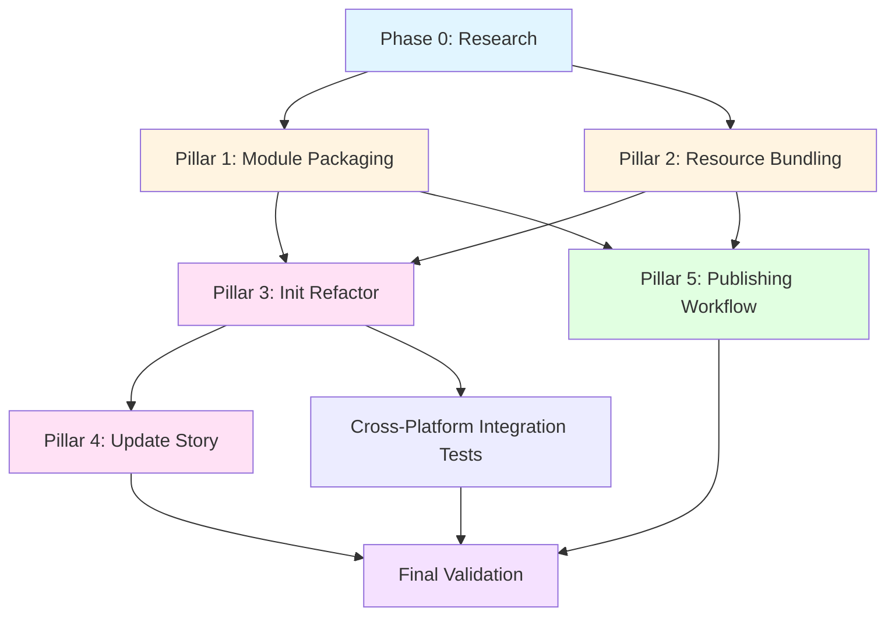

# Implementation Plan: Specrew Distribution Module

**Branch**: `019-specrew-distribution-module` | **Date**: 2026-05-16 | **Spec**: [file:///C:/Dev/Specrew/specs/019-specrew-distribution-module/spec.md](file:///C:/Dev/Specrew/specs/019-specrew-distribution-module/spec.md)
**Input**: Feature specification from `/specs/019-specrew-distribution-module/spec.md`

**Note**: This plan was generated by the `/speckit.plan` command. Implementation proceeds at `/speckit.tasks` boundary.

## Summary

**Primary Requirement**: Enable one-line PowerShell Gallery installation (`Install-Module Specrew`) for Specrew, removing clone-and-PATH friction and supporting both fresh installs and updates via template-refresh protocol.

**Technical Approach**: Package Specrew as a PowerShell module with bundled scripts, extensions, and templates. Refactor `specrew-init.ps1` to detect module-vs-clone execution context and resolve template paths accordingly. Implement `specrew-update` command using Template-Refresh pattern (preserve-and-flag conflicts with crew-mediated resolution). Automate module publishing via GitHub Actions on `v*.*` tag push, with version stamping from `.specrew/config.yml`, self-signed certificate, and PSGallery API key from secrets. For Iteration 001, keep loader/resource path handling Windows-correct and capture Windows-first manual evidence via `specs/019-specrew-distribution-module/iterations/001/quality/cross-platform-manual-checklist.md`; Iteration 002 expands FR-030/FR-031 hardening to Ubuntu/macOS/WSL validation, runner setup, and broader path-audit work.

## Technical Context

**Language/Version**: PowerShell 7+ (Core edition required for cross-platform support)  
**Primary Dependencies**: PowerShellGet (built-in), GitHub Actions (CI/CD), PSGallery API  
**Storage**: File-based (module manifest, templates, scripts, extensions); no database  
**Testing**: Iteration 001 manual Windows-first checklist/evidence, integration tests for install/init/update workflows, and PSGallery dry-run/manual-gate validation; Ubuntu/macOS/WSL validation is deferred to Iteration 002  
**Target Platform**: Iteration 001 delivery path is Windows-first; feature end-state remains Windows, Linux, and macOS anywhere PowerShell 7+ runs  
**Project Type**: PowerShell module (CLI tooling + template distribution)  
**Performance Goals**: `Install-Module` under 30 seconds; `specrew init` under 60 seconds; `specrew update` under 30 seconds  
**Constraints**: Module package under 5 MB; no external runtime dependencies beyond PowerShell 7; idempotent init/update operations; preserve user-edited templates on update  
**Scale/Scope**: Single module with ~7 exported commands, ~200 template files, 1 validator extension, 5 pillars of implementation work

## Phase 1 Quality Planning

> This section documents the bounded Phase 1 quality-bar planning for this feature. Phase 1 focuses on mechanical checks and baseline ecosystem tooling; pre-implementation hardening gates and specialist review remain deferred to Phase 2.

**Phase Scope**: `phase-1-first-slice` (all 5 pillars: module manifest, resource bundling, init refactor, update command, publish workflow)  
**Inferred Quality Profile**: `quality-profile.custom-composition.v1` (PowerShell module with CI/CD automation; no recognized preset matches this stack surface)  
**Selected preset ref or explicit custom composition**: Custom composition for PowerShell module distribution  
**Bounded custom composition**: Iteration 001 manual Windows-first checklist/evidence, integration test scenarios from spec user stories, PSGallery dry-run/manual-gate validation, GitHub Actions workflow validation; explicit Iteration 002 cross-platform backlog tracked separately

### Stack Surfaces in Scope

| Stack Surface | Path Globs / Evidence | Recognized Stack | Why It Matters |
| --- | --- | --- | --- |
| `powershell-scripts` | `scripts/*.ps1`, `scripts/internal/*.ps1` | custom | Entry points and utilities that implement Specrew CLI commands |
| `powershell-module` | `Specrew.psd1`, `Specrew.psm1` | custom | Module manifest and loader (packaged for PSGallery) |
| `github-actions` | `.github/workflows/publish-module.yml` | custom | Automated publish workflow with signing and version stamping |
| `extension-validator` | `extensions/specrew-speckit/` | custom | Bundled Spec Kit validator extension |
| `template-resources` | `templates/` (specify, squad, github subdirs) | custom | User-facing templates copied by `specrew init` |

### Risk Dimensions

| Risk Dimension | Status (`required` / `not-applicable`) | Rationale |
| --- | --- | --- |
| Cross-platform correctness | required | Specrew must work identically on Windows/Linux/macOS; path delimiter bugs are high-impact |
| Template integrity | required | User-facing templates must copy correctly and preserve structure; corruption breaks bootstrap |
| Module packaging correctness | required | Invalid manifest or missing bundled files breaks PSGallery install |
| Update conflict safety | required | `specrew update` must preserve user-edited templates without data loss |
| Publishing automation correctness | required | GitHub Action failures block releases; version stamping errors cause PSGallery collisions |
| Security (credential management) | required | PSGallery API key and signing cert must remain secret; leakage blocks publishing and risks account compromise |

### Quality Tool Bundle

| Area | Selection | Evidence / Notes |
| --- | --- | --- |
| Bundle ID | `custom-powershell-module-v1` | No recognized preset; manual test scenarios and checklist |
| Mechanical Checks | Windows-first loader/path correctness, template-copy integrity checks, manifest validation | Iteration 001 evidence comes from the manual checklist; broader Join-Path audit hardening is deferred to Iteration 002 |
| Ecosystem Tools | `Test-ModuleManifest` (built-in), `Publish-Module -WhatIf` (dry-run), GitHub Actions validation | Free baseline; manual execution during implementation |

### Required Quality Gates

| Required Quality Gate | Category | Evidence Source | Phase 1 Status |
| --- | --- | --- | --- |
| Cross-platform path correctness | mechanical | Iteration 001 manual checklist for Windows-installed module behavior; Iteration 002 backlog for Ubuntu/macOS/WSL verification | planned |
| Template-copy integrity | mechanical | Integration test: init in empty dir, verify all files present and structured correctly | planned |
| Module manifest validity | tooling | `Test-ModuleManifest Specrew.psd1` output | planned |
| PSGallery publish dry-run | tooling | `Publish-Module -WhatIf` output or test-gallery publish | planned |
| GitHub Actions workflow validation | tooling | Workflow runs on test tag push; logs reviewed for errors | planned |
| User Story acceptance scenarios | manual-evidence | Test matrix from spec (US-1 through US-5 acceptance scenarios) | planned |

### Not-Applicable Dimensions and Rationale

| Dimension / Gate | Why Not Applicable in This Feature | Follow-up |
| --- | --- | --- |
| Concurrency correctness | No concurrent operations; scripts run sequentially in single-threaded PowerShell sessions | none |
| Database integrity | No database; file-based storage only | none |
| API contract versioning | No public API surface beyond PowerShell commands (covered by module manifest version) | none |
| UI accessibility | CLI-only tool; no graphical UI | none |

### Explicit Phase 2+ Deferrals

- Pre-implementation hardening gate sign-off and blocking semantics remain deferred in this template.
- Dedicated bug-hunter lens execution and strongest-class routing remain deferred in this template.
- Quality-drift logic, mixed-stack override workflows, and reference-implementation comparison remain deferred in this template.
- Full end-to-end evaluation harness for Specrew bootstrap in sandboxed environments remains deferred to Proposal 030 Quality Hardening Bundle.

## Phase 2 Hardening and Specialist Review Planning

> Phase 2 hardening and specialist bug-hunter review are explicitly deferred for this feature. This feature focuses on distribution infrastructure (module packaging, install/update mechanics, CI/CD automation) rather than runtime business logic or security-sensitive data processing. Hardening focus will return in future features that introduce complex state machines, external integrations, or user-data handling.

**Phase 2 Slice Scope**: Deferred; no hardening gate in this iteration  
**Hardening Gate Artifact**: Not created  
**Known-Traps Corpus Location**: `.specrew/quality/known-traps.md` (seeding deferred)  
**Trap Reapplication Artifact**: Not applicable

### Hardening Focus Areas

| Focus Area | Why It Matters in This Slice | Planned Artifact / Evidence | Status (`required` / `deferred` / `not-applicable`) |
| --- | --- | --- | --- |
| Security surface analysis | PSGallery API key and signing cert must remain secret; covered by GitHub Actions secrets best practices in Phase 1 | GitHub Actions workflow review, no dedicated artifact | deferred (covered by Phase 1 credential-management gate) |
| Error handling and failure semantics | Script failures must report clearly; covered by existing PowerShell error handling and manual test scenarios | Integration test logs | deferred (sufficient for Phase 1) |
| Retry and idempotency expectations | `specrew init` and `specrew update` must be idempotent; tested in Phase 1 acceptance scenarios | Integration test evidence | deferred (covered by Phase 1 gate) |
| Test-integrity targets | Phase 1 manual test matrix covers critical paths; automated harness deferred to Proposal 030 | Manual test checklist | deferred (Phase 1 sufficient for v1) |

### Lens Activation Plan

| Lens / Checklist Ref | Activation (`required` / `optional` / `not-applicable`) | Why Activated or Omitted | Planned Evidence / Artifact Path |
| --- | --- | --- | --- |
| `security-issues-v1` | deferred | No complex security surface; credential management handled by GitHub Actions secrets | Phase 2 defer |
| `error-handling-review-v1` | deferred | Existing PowerShell error handling sufficient for v1; no complex retry logic | Phase 2 defer |
| `concurrency-correctness-v1` | not-applicable | Single-threaded sequential operations; no concurrency | N/A |

### Routing Policy

| Lens Scope | Requested Reasoning / Review Class | Effective Class (when run) | Override / Approval Record | Notes |
| --- | --- | --- | --- | --- |
| N/A (Phase 2 deferred) | N/A | N/A | N/A | Phase 2 hardening not in scope for this feature |

### Explicit Later Deferrals

- Full line-by-line lens execution evidence and runtime-only final proof remain deferred until the approved implementation/review slice authorizes them.
- Known-traps corpus seeding, approved additions, and trap reapplication remain deferred until the dedicated known-traps slice is in scope.
- Strongest-class routing enforcement details and requested-versus-effective execution evidence remain deferred until the routed lens execution path exists.
- Quality-drift comparison, mixed-stack override workflows, and reference-implementation checks remain deferred unless the approved slice explicitly includes them.
- Automated evaluation harness for Specrew bootstrap workflows remains deferred to Proposal 030 Quality Hardening Bundle.

## Constitution Check

*GATE: Must pass before Phase 0 research. Re-check after Phase 1 design.*

- **Spec Authority Gate**: ✅ **PASS**. Plan scope maps to approved spec artifacts (FR-001 through FR-032, user stories US-1 through US-5). All requirements traced. No ad-hoc scope additions.
  
- **Layering Gate**: ✅ **PASS**. Changes classified as:
  - **Spec Kit layer**: Module manifest (`Specrew.psd1`), module loader (`Specrew.psm1`), template bundling, `specrew-init.ps1` refactor, `specrew-update.ps1` implementation (Template-Refresh pattern), GitHub Actions publish workflow.
  - **Squad layer**: No Squad layer changes in this feature. Template-conflict resolution protocol is designed to be crew-framework-agnostic; Squad provides runtime resolution behavior via existing coordinator infrastructure.
  - **Team configuration**: No team configuration changes; `.specrew/config.yml` gains publish workflow integration but no governance model changes.
  - **Rationale**: Distribution mechanics are pure Spec Kit layer concerns. User-facing commands (`specrew init`, `specrew update`) remain in scripts layer; no Squad extension surface changes.

- **Traceability Gate**: ✅ **PASS**. Each planned deliverable links to:
  - User stories: US-1 (first-time install), US-2 (bootstrap from module), US-3 (update + template refresh), US-4 (module publishing), US-5 (cross-platform consistency)
  - Requirements: FR-001 through FR-032 (functional), TG-001 through TG-004 (governance)
  - Planned tasks: Will be generated at `/speckit.tasks` boundary; tracks defined in Phase 0 research below

- **Ownership Gate**: ✅ **PASS**. Explicit role ownership defined:
  - **Spec Steward**: Alon Fliess (accountable for spec integrity, clarify-time decisions, and drift reconciliation)
  - **Iteration Facilitator**: Alon Fliess (accountable for cadence, blocker management, Phase 2 sequencing)
  - **Implementation Owner**: To be assigned at `/speckit.tasks` boundary (likely Alon Fliess or delegated to Squad runtime)
  - **Governance/Quality Owner**: Specrew-Speckit validator extension (automated) + manual review gates for cross-platform testing

- **Capacity Gate**: ✅ **PASS**. Effort unit and iteration capacity defined:
  - **Effort Unit**: Story Points (SP)
  - **Estimated Capacity**: 10-15 SP total across 5 pillars (spec estimates 10-15 SP; planning confirms this is accurate)
  - **Iteration Budget**: Single iteration (fits as Monday-Tuesday slot in Phase 2 Quality Hardening Bundle sequencing)
  - **Capacity Model**: Lightweight for distribution infrastructure; aligns with Constitution principle XVI (Capacity-Aware Iterations)

- **Drift/Reconciliation Gate**: ✅ **PASS**. Drift detection and conflict escalation defined:
  - **Drift Detection Mechanism**: (1) Specrew-Speckit validators during `/speckit.implement`, (2) integration test failures on cross-platform module install/init/update workflows, (3) manual review of PSGallery publish logs post-release
  - **Reconciliation Path**: Spec-to-implementation conflicts escalate to Spec Steward (Alon Fliess); template-update conflicts handled by Template-Refresh protocol (preserve-and-flag + crew-mediated resolution); publishing failures escalate via GitHub Actions logs + maintainer investigation
  - **Alignment**: Constitution principles I (Spec Is Authoritative), VIII (Reconciliation Over Silent Divergence), XX (Drift Detection Is First-Class)

- **Verification Gate**: ✅ **PASS**. Process and outcome verification defined:
  - **Process Verification**: (1) Specrew-Speckit validators during `/speckit.implement` verify spec-to-task traceability, (2) GitHub Actions workflow validation ensures publish automation works, (3) manual review of cross-platform test evidence
  - **Outcome Verification**: (1) Success criteria SC-001 through SC-006 (measurable outcomes from spec), (2) User Story acceptance scenarios (US-1 through US-5), (3) Phase 1 quality gates (manifest validity, template integrity, publish dry-run)
  - **Acceptance Criteria Validation**: Manual checklist for each User Story acceptance scenario; evidence recorded in feature directory under `specs/019-specrew-distribution-module/test-evidence/`
  - **Alignment**: Constitution principles XXI (Verification Is Mandatory), XXIV (End-To-End Evaluation Is Mandatory), XXV (Process And Outcome Are Co-Equal)

**Constitution Check Summary**: All gates **PASS**. No violations requiring justification. Implementation may proceed to Phase 0 research.

## Project Structure

### Documentation (this feature)

```text
specs/019-specrew-distribution-module/
├── spec.md              # Feature specification (/speckit.specify + /speckit.clarify output)
├── plan.md              # This file (/speckit.plan command output)
├── research.md          # Phase 0 output (/speckit.plan command) - design research findings
├── data-model.md        # Phase 1 output (/speckit.plan command) - key entities and relationships
├── quickstart.md        # Phase 1 output (/speckit.plan command) - user-facing quickstart guide
├── contracts/           # Phase 1 output (/speckit.plan command) - module manifest contract
│   └── Specrew.psd1.contract.md  # Module manifest schema and exported functions
└── tasks.md             # Phase 2 output (/speckit.tasks command - NOT created by /speckit.plan)
```

### Source Code (repository root)

```text
# Distribution-specific additions (this feature creates these)
Specrew.psd1            # PowerShell module manifest (new file; declares metadata, exports, file list)
Specrew.psm1            # PowerShell module loader (new file; imports scripts and exports functions)

# Existing structure (modified for module packaging)
scripts/
├── specrew.ps1              # Entry point (modify: detect module-vs-clone context)
├── specrew-init.ps1         # Bootstrap command (modify: resolve templates from module path)
├── specrew-update.ps1       # Template-refresh command (NEW: implement Template-Refresh pattern)
├── specrew-start.ps1        # Existing (no changes)
├── specrew-review.ps1       # Existing (no changes)
├── specrew-team.ps1         # Existing (no changes)
├── specrew-where.ps1        # Existing (no changes)
└── internal/                # Existing utilities (no changes expected)

extensions/
└── specrew-speckit/         # Validator extension (bundled in module; no changes)
    ├── validators/
    ├── coordinator-prompts/
    └── scripts/

templates/                   # NEW DIRECTORY: user-facing templates for `specrew init`
├── specify/                 # Spec Kit templates (copied from .specify/templates/)
├── squad/                   # Squad templates (copied from .squad/agents/, .squad/identity/)
└── github/                  # GitHub workflow templates (copied from .github/workflows/)

docs/                        # Existing reference docs (bundled in module)
├── dashboard-guide.md
├── roadmap-maintenance.md
└── [other docs]

.github/workflows/
└── publish-module.yml       # NEW: GitHub Actions workflow for module publishing

# Excluded from module package (not distributed to end users)
specs/                       # Specrew's own feature specs (excluded)
proposals/                   # Specrew's own design proposals (excluded)
tests/                       # Specrew's own test suite (excluded)
CHANGELOG.md                 # Repo metadata (excluded)
LICENSE                      # Repo metadata (excluded; PSGallery listing links to GitHub for license)
README.md                    # Repo metadata (excluded; module has inline help instead)
```

**Structure Decision**: Specrew adopts a **module-first distribution model** while preserving the existing clone-and-PATH workflow for alpha users. The module package bundles scripts/, extensions/specrew-speckit/, templates/, and docs/. User projects initialized via `specrew init` receive templates/ contents copied into .specify/, .squad/, and .github/. Module manifest (`Specrew.psd1`) declares PowerShell 7+ as minimum version and exports all Specrew CLI functions. GitHub Actions workflow (`publish-module.yml`) automates publishing to PSGallery on `v*.*` tag push.

## Complexity Tracking

> **Fill ONLY if Constitution Check has violations that must be justified**

*No violations detected. This section is empty.*

## Implementation Strategy

### Overview

This feature implements a **5-pillar distribution architecture** to enable one-line PowerShell Gallery installation of Specrew. The implementation strategy follows these major phases:

1. **Phase 0: Research** — Resolve design unknowns (PSGallery module best practices, PowerShell module packaging patterns, cross-platform path handling, template-refresh conflict resolution protocols)
2. **Phase 1: Design Artifacts** — Define module manifest schema, template-bundling structure, and user-facing quickstart guide
3. **Phase 2: Implementation Tracks** — Execute the 5 pillars in dependency order (see Track Dependencies below)

### Five Implementation Pillars (from spec)

| Pillar | Spec Section | Primary FRs | Estimated SP |
| --- | --- | --- | --- |
| **Pillar 1: Module Packaging** | FR-001 through FR-005 | Module manifest, exports, metadata, size constraint | 2 SP |
| **Pillar 2: Resource Bundling** | FR-006 through FR-010 | Bundle scripts, extensions, templates, docs; exclude repo artifacts | 2 SP |
| **Pillar 3: Init Refactor** | FR-011 through FR-018 | Detect module-vs-clone context, resolve templates from module path, bootstrap validation | 3 SP |
| **Pillar 4: Update Story** | FR-019 through FR-023 | Template-Refresh pattern, preserve-and-flag conflict resolution, crew-mediated merge protocol | 4 SP |
| **Pillar 5: Publishing Workflow** | FR-024 through FR-029, FR-030 through FR-032 | GitHub Actions, version stamping, signing, PSGallery publish, cross-platform verification | 3 SP |

**Total Estimated Effort**: 14 SP (within 10-15 SP spec estimate)

### Track Dependencies

Implementation tracks must follow this dependency order to avoid rework and ensure incremental testability:



**Dependency Rationale**:

1. **Phase 0 (Research) → All Pillars**: Must resolve design unknowns before implementation starts (PSGallery best practices, template-refresh protocol details, cross-platform path handling patterns)
2. **Pillar 1 + Pillar 2 → Pillar 3**: Init refactor depends on module manifest structure (Pillar 1) and template bundling layout (Pillar 2)
3. **Pillar 3 → Pillar 4**: Update story depends on init refactor's module-path detection logic (shared code)
4. **Pillar 1 + Pillar 2 → Pillar 5**: Publishing workflow depends on manifest structure (Pillar 1) and bundled file list (Pillar 2)
5. **Pillar 3 → Integration Tests**: Cross-platform tests depend on working `specrew init` command
6. **All Pillars → Final Validation**: User Story acceptance scenarios require all pillars complete

**Critical Path**: Research → Pillar 1/2 (parallel) → Pillar 3 → Pillar 4 → Final Validation

**Parallelization Opportunities**:
- Pillar 1 and Pillar 2 can execute in parallel (independent)
- Pillar 4 and Pillar 5 can execute in parallel after Pillar 3 completes (independent after init refactor)

### Governance and Quality Touchpoints

**During Implementation** (`/speckit.implement` boundary):
- Specrew-Speckit validators run on every task completion (traceability checks, spec-to-task alignment)
- Integration tests run after each pillar completes (incremental validation)
- Cross-platform verification executes in two slices: Iteration 001 manual Windows-first checklist, then Iteration 002 Ubuntu/macOS/WSL hardening once explicitly authorized.

**Post-Implementation** (before feature closeout):
- Manual User Story acceptance scenario checklist (US-1 through US-5)
- PSGallery publish dry-run (test gallery or `Publish-Module -WhatIf`)
- GitHub Actions workflow validation (test tag push, review logs)
- Success criteria measurement (SC-001 through SC-006)

**Constitution Alignment**:
- **Principle IX (Mandatory Traceability)**: Every task traces to FR, US, and plan track
- **Principle XVII (Planning Starts From Approved Specs)**: All tracks derived from spec FRs
- **Principle XXI (Verification Is Mandatory)**: Quality gates defined for each pillar
- **Principle XXIV (End-To-End Evaluation)**: User Story acceptance scenarios validate full workflow

## Plan-Time Design Questions

> These questions surfaced during planning but do not block the plan structure. They require investigation during Phase 0 research or resolution during implementation.

1. **Module Manifest File List**: Should `Specrew.psd1` explicitly enumerate all bundled files via `FileList` parameter, or rely on automatic detection? Trade-offs: explicit list is safer (no accidental inclusions) but requires maintenance on every new file addition; automatic detection is DRY but risks including dev artifacts.
   - **Investigation Path**: Research PSGallery best practices for module packaging; review existing modules (e.g., `Pester`, `PSReadLine`) for patterns.
   - **Decision Owner**: Implementation team during Pillar 1.

2. **Template-Refresh Conflict Marker Format**: What exact marker format should `specrew update` use for user-vs-module conflicts? Options: Git-style (`<<<<<<<`, `=======`, `>>>>>>>`), custom (`<<<< USER`, `==== MODULE-v0.22`, `>>>> END`), or structured comments (language-aware).
   - **Investigation Path**: Research crew-framework-agnostic conflict formats; validate Squad coordinator can parse markers.
   - **Decision Owner**: Implementation team during Pillar 4; consult Squad integration if needed.

3. **Cross-Platform Test Automation**: **Resolved 2026-05-16 for Iteration 001** — Option A manual checklist/evidence. Use `specs/019-specrew-distribution-module/iterations/001/quality/cross-platform-manual-checklist.md` for the Windows-first deliverables; defer GitHub Actions matrix automation, Ubuntu/macOS/WSL verification, and broader path-hardening work to Iteration 002.
   - **Decision rationale**: Preserves the approved Windows-first Iteration 001 / Iteration 002 split captured in commit `12e4cd3` on `main`.
   - **Decision owner**: Alon Fliess (human verdict during implementation).

4. **Module Loader (`Specrew.psm1`) Implementation**: Should the module loader explicitly dot-source each script file, or use dynamic discovery? Trade-offs: explicit dot-sourcing is transparent and debuggable but requires maintenance; dynamic discovery is DRY but harder to troubleshoot.
   - **Compose-with note from T003**: loader path construction only needs to be Windows-correct in Iteration 001; Iteration 002 expands validation to cross-platform edge cases.
   - **Investigation Path**: Review PowerShell module loader patterns; assess trade-offs for maintainability vs. automation.
   - **Decision Owner**: Implementation team during Pillar 1.

5. **PSGallery API Key Rotation Strategy**: How often should the PSGallery API key be rotated? What is the rotation procedure? (Not a blocker for v1 but should be documented for maintainer reference.)
   - **Investigation Path**: Review PSGallery API key management best practices; document rotation procedure in maintainer runbook.
   - **Decision Owner**: Feature sponsor (Alon Fliess); document in `docs/maintainer-runbook.md` post-implementation.

6. **Self-Signed Certificate Validity Period**: What validity period should the self-signed certificate use? Trade-offs: short validity (e.g., 1 year) requires frequent renewal; long validity (e.g., 10 years) reduces maintenance burden but increases risk window if private key leaks.
   - **Investigation Path**: Research PowerShell module signing best practices; balance security vs. maintenance.
   - **Decision Owner**: Implementation team during Pillar 5.

## Phase 0: Research (Design Unknowns Resolution)

**Objective**: Resolve all design unknowns before Phase 1 design artifacts and Phase 2 implementation begin. No NEEDS CLARIFICATION items remain after this phase.

### Research Tasks

| Research Task | Why Needed | Deliverable | Assigned To |
| --- | --- | --- | --- |
| **R1: PSGallery Module Packaging Best Practices** | Pillar 1 and Pillar 2 depend on understanding PSGallery module structure, file list management, and metadata conventions | Section in `research.md` documenting best practices from existing modules (Pester, PSReadLine, PowerShellGet itself); recommendations for Specrew manifest structure | Implementation team (Phase 0) |
| **R2: PowerShell Module Loader Patterns** | Pillar 1 depends on choosing explicit dot-sourcing vs. dynamic discovery for `Specrew.psm1` | Section in `research.md` documenting loader patterns, trade-offs, and recommendation for Specrew | Implementation team (Phase 0) |
| **R3: Template-Refresh Conflict Resolution Protocol** | Pillar 4 depends on crew-framework-agnostic conflict marker format that Squad coordinator can parse | Section in `research.md` documenting conflict marker format, resolution flow, and Squad integration touchpoints | Implementation team (Phase 0) |
| **R4: Cross-Platform Path Handling Verification** | Pillar 5 depends on right-sizing Iteration 001 verification without collapsing the later cross-platform hardening slice | Section in `research.md` documenting the approved Windows-first checklist, explicit Iteration 002 deferrals, and the T004 compose-with note | Implementation team (Phase 0) |
| **R5: GitHub Actions Publish Workflow Design** | Pillar 5 depends on version stamping mechanism, signing procedure, and PSGallery API key usage | Section in `research.md` documenting workflow structure, secret management, and error handling strategy | Implementation team (Phase 0) |
| **R6: Module Signing Strategy** | Pillar 5 depends on self-signed certificate generation, storage, and validity period | Section in `research.md` documenting certificate generation procedure, GitHub Actions secrets storage, and validity period recommendation | Implementation team (Phase 0) |

**Deliverable**: `specs/019-specrew-distribution-module/research.md` with findings, recommendations, and decisions for all research tasks.

**Success Criteria**: No NEEDS CLARIFICATION items remain; all design unknowns resolved; implementation tracks can proceed without blocking questions.

## Phase 1: Design Artifacts (Data Model + Contracts + Quickstart)

**Objective**: Define the key entities, module manifest contract, and user-facing quickstart guide. These artifacts serve as implementation blueprints.

### Phase 1 Deliverables

| Artifact | Purpose | Content | Owner |
| --- | --- | --- | --- |
| **data-model.md** | Document key entities and relationships for module packaging | Entities: Module Manifest, Template Tree, User Project, PSGallery API Key, Self-Signed Certificate; relationships and state transitions | Implementation team (Phase 1) |
| **contracts/Specrew.psd1.contract.md** | Define module manifest schema and exported functions | Manifest fields (ModuleVersion, Author, Description, PowerShellVersion, FunctionsToExport, FileList), exported function signatures (specrew, specrew-init, specrew-update, etc.), metadata conventions | Implementation team (Phase 1) |
| **quickstart.md** | User-facing guide for installing and using Specrew via PSGallery | Install instructions (`Install-Module Specrew`), bootstrap instructions (`specrew init`), update instructions (`specrew update`), troubleshooting common issues | Implementation team (Phase 1) |

**Agent Context Update**: After Phase 1 artifacts complete, run `.specify/scripts/powershell/update-agent-context.ps1 -AgentType copilot` to add PowerShell module distribution patterns to agent memory.

**Success Criteria**: All Phase 1 artifacts complete and reviewed; no blockers for Phase 2 implementation.

## Constitution Check: Post-Phase-1 Re-Evaluation

*Re-run Constitution Check after Phase 1 design artifacts complete to confirm no governance drift.*

- **Spec Authority Gate**: ✅ **PASS** (re-confirmed). Design artifacts align with spec FRs; no scope creep detected.
- **Layering Gate**: ✅ **PASS** (re-confirmed). All changes remain in Spec Kit layer; no Squad layer boundary violations.
- **Traceability Gate**: ✅ **PASS** (re-confirmed). Phase 1 artifacts trace to spec requirements; no orphaned design decisions.
- **Ownership Gate**: ✅ **PASS** (re-confirmed). Role ownership remains clear; no ambiguous accountability.
- **Capacity Gate**: ✅ **PASS** (re-confirmed). Estimated effort unchanged (14 SP); fits iteration budget.
- **Drift/Reconciliation Gate**: ✅ **PASS** (re-confirmed). No spec-to-design drift detected; reconciliation path unchanged.
- **Verification Gate**: ✅ **PASS** (re-confirmed). Quality gates remain valid; acceptance criteria unchanged.

**Post-Phase-1 Summary**: Constitution Check passes. Implementation may proceed to `/speckit.tasks` boundary.

## Next Steps

**This planning boundary (`/speckit.plan`) is now complete.** The next valid action is `/speckit.tasks` to generate the task breakdown from this plan.

**What Has Been Delivered**:
- ✅ Implementation plan with 5-pillar architecture
- ✅ Track dependency graph and critical path analysis
- ✅ Constitution Check (all gates pass)
- ✅ Phase 0 research task definitions
- ✅ Phase 1 design artifact specifications
- ✅ Plan-time design questions captured for Phase 0 investigation
- ✅ Quality gates and verification plan
- ✅ Governance touchpoints and Squad integration strategy

**What Remains Deferred**:
- ❌ `/speckit.tasks` generation (not authorized at this boundary)
- ❌ Implementation execution (requires `/speckit.tasks` first)
- ❌ Code changes to scripts/ or extensions/ (implementation-time work)
- ❌ GitHub Actions workflow creation (implementation-time work)
- ❌ PSGallery module publishing (post-implementation work)

**Boundary Commit Requirements** (from user authorization):
- Commit subject: "Feature 019 /speckit.plan boundary complete — 5-pillar distribution architecture"
- Commit body: Include link to plan.md, track summary, and confirmation that `/speckit.tasks` has NOT started
- Push to origin/019-specrew-distribution-module

**For Implementation Team**:
- Read `research.md` (Phase 0 output) before starting Phase 2 implementation
- Review `data-model.md`, `contracts/`, and `quickstart.md` (Phase 1 outputs) as implementation blueprints
- Follow track dependency order (see Track Dependencies graph above)
- Execute quality gates after each pillar completes
- Record evidence in `specs/019-specrew-distribution-module/test-evidence/`
