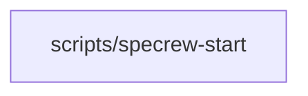

# Review Diagrams: Iteration 002

**Schema**: v1
**Diagram Format**: mermaid

## Structure Diagram

_omitted_

## Flow Diagram

## Omissions

- Structure diagram omitted: inter-module edges (0) below threshold (2).

## Local View Hints

- specs\020-session-state-durability\iterations\002\review-diagrams.md
