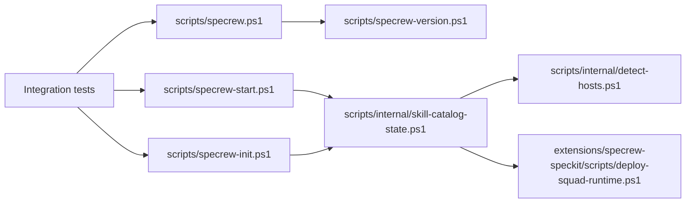
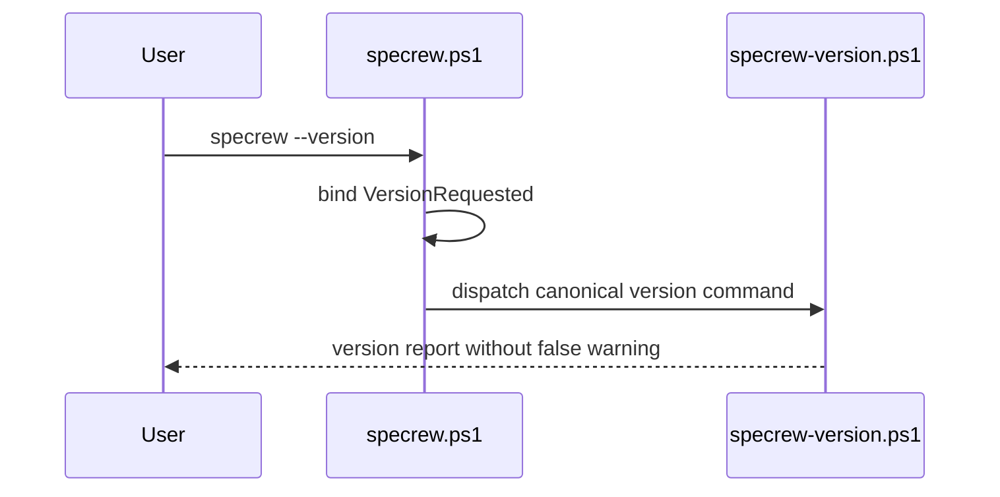
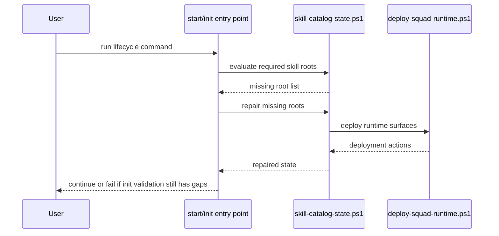

# Review Diagrams: Iteration 001

**Schema**: v1
**Diagram Format**: mermaid

## Component Diagram

```mermaid
flowchart LR
  CLI[scripts/specrew.ps1] --> Version[scripts/specrew-version.ps1]
  Start[scripts/specrew-start.ps1] --> Catalog[scripts/internal/skill-catalog-state.ps1]
  Init[scripts/specrew-init.ps1] --> Catalog
  Catalog --> Hosts[scripts/internal/detect-hosts.ps1]
  Catalog --> Deploy[extensions/specrew-speckit/scripts/deploy-squad-runtime.ps1]
  Tests[Integration tests] --> CLI
  Tests --> Start
  Tests --> Init
```

## Sequence: Version Alias

```mermaid
sequenceDiagram
  participant User
  participant CLI as specrew.ps1
  participant Version as specrew-version.ps1
  User->>CLI: specrew --version
  CLI->>CLI: bind VersionRequested
  CLI->>Version: dispatch canonical version command
  Version-->>User: version report without false warning
```

## Sequence: Skill Catalog Repair

```mermaid
sequenceDiagram
  participant User
  participant Entry as start/init entry point
  participant Catalog as skill-catalog-state.ps1
  participant Deploy as deploy-squad-runtime.ps1
  User->>Entry: run lifecycle command
  Entry->>Catalog: evaluate required skill roots
  Catalog-->>Entry: missing root list
  Entry->>Catalog: repair missing roots
  Catalog->>Deploy: deploy runtime surfaces
  Deploy-->>Catalog: deployment actions
  Catalog-->>Entry: repaired state
  Entry-->>User: continue or fail if init validation still has gaps
```
