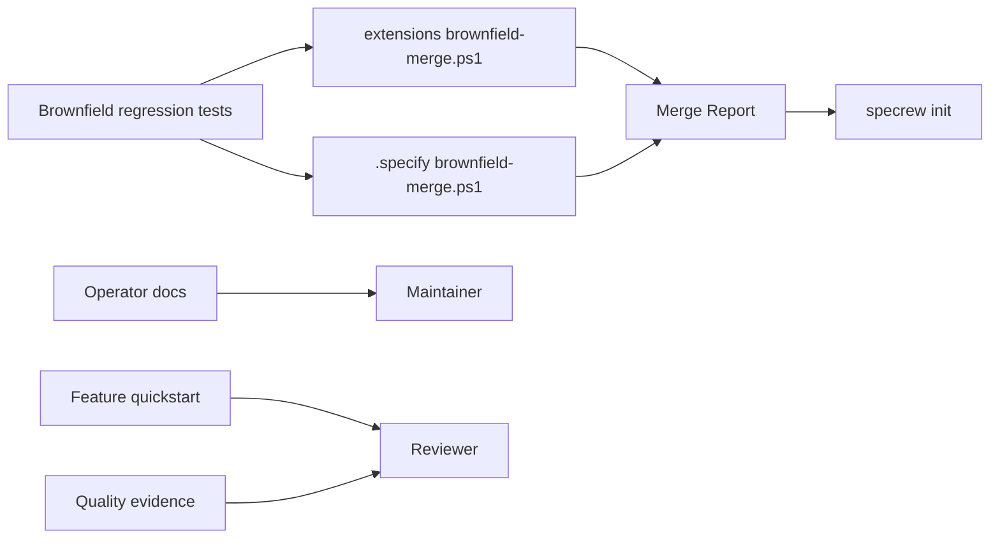
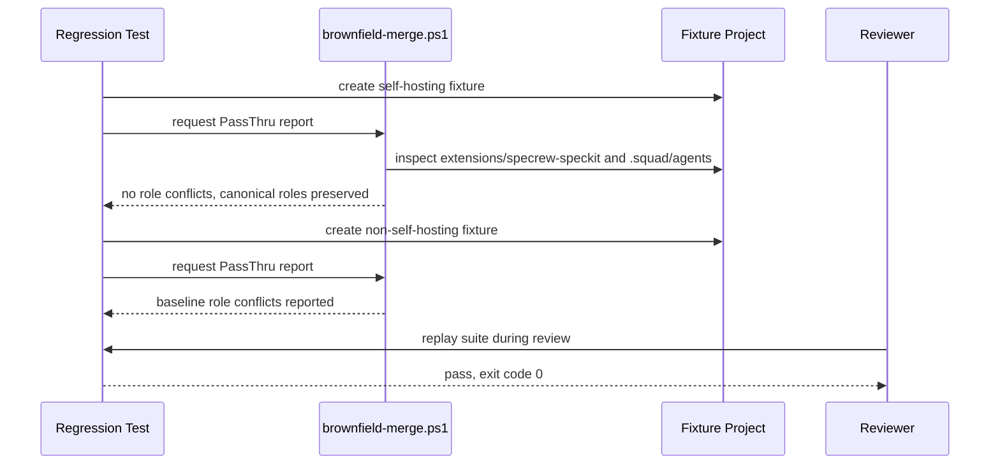

# Review Diagrams: Iteration 002

**Schema**: v1
**Reviewed**: 2026-05-25
**Diagram Format**: mermaid
**Overall Verdict**: accepted

## Structure Diagram

## Flow Diagram

## Omissions

- No dependency graph is shown because no package dependencies changed.
- No browser or service topology is shown because this patch changes CLI/governance behavior and documentation only.
