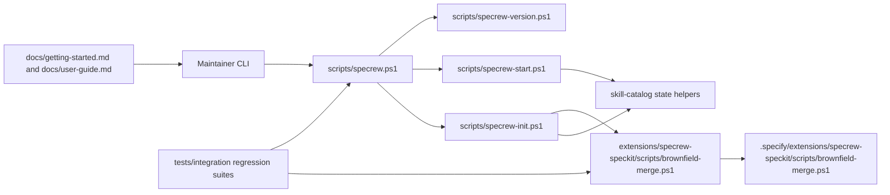
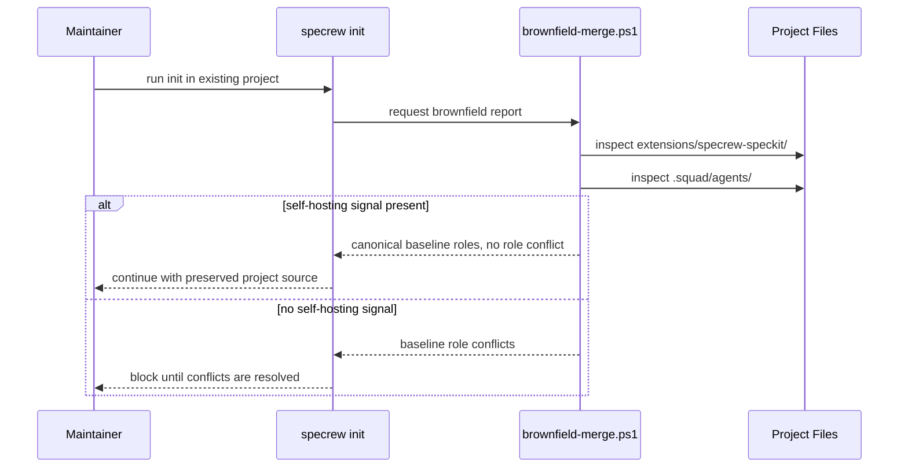
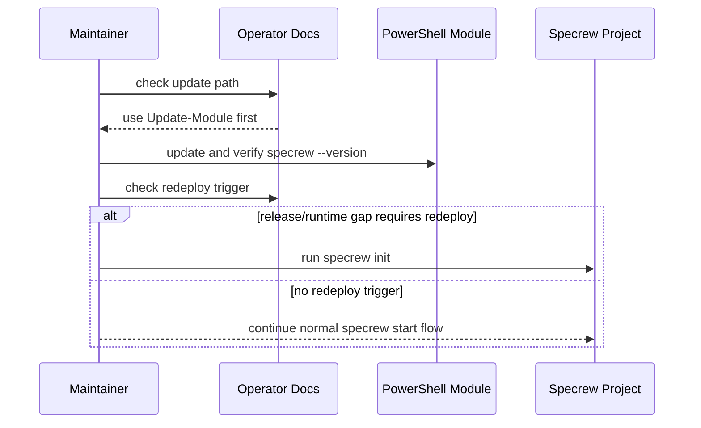

# Review Diagrams: Specrew v0.27.1 Bug-Fix Bundle

**Feature**: `045-v0271-bugfix-bundle`
**Phase**: pre-implementation planning artifact, repaired during iteration 002 review

## Component Diagram

## Sequence: Self-Hosting Brownfield Classification

## Sequence: Operator Update Decision

