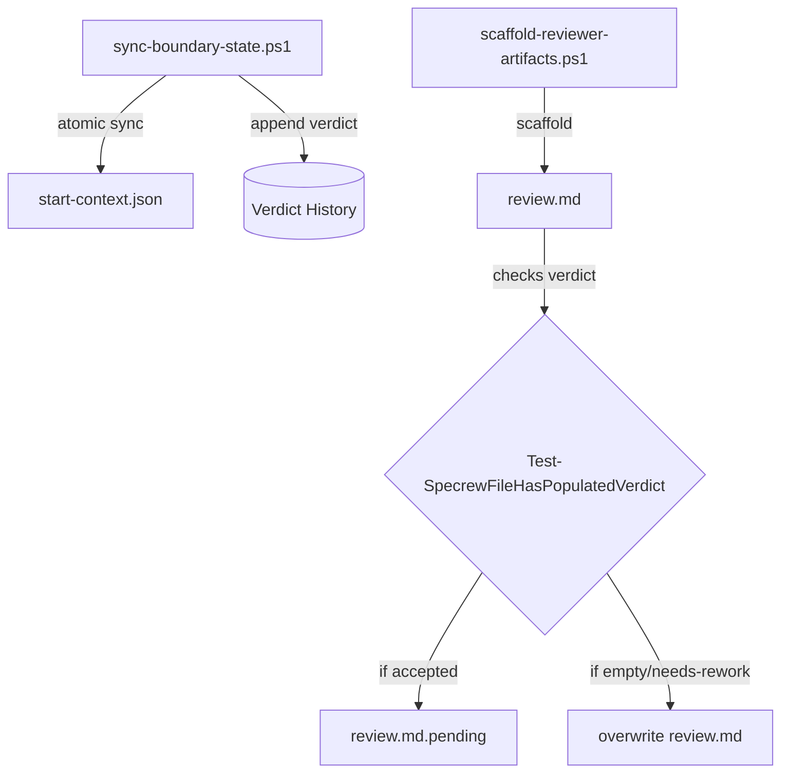
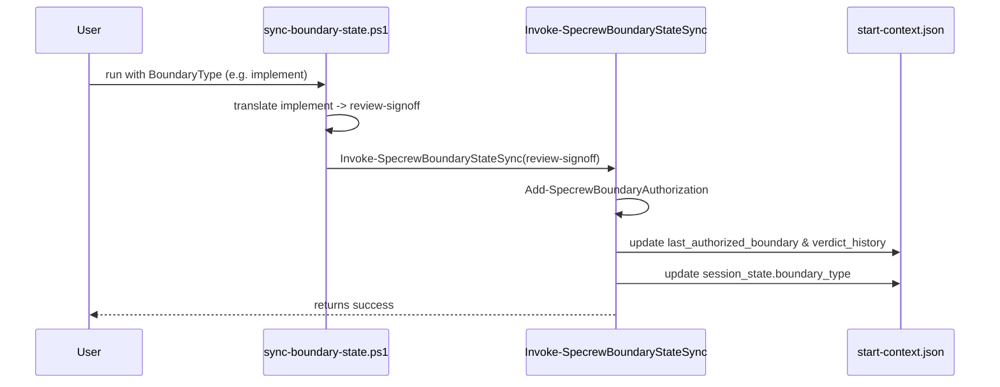

# Review Diagrams: F-046 Bug-Bash Bundle

**Feature**: `046-046-bug-bash`  
**Phase**: pre-implementation (planning artifact for reviewer)

## Component Diagram

## Sequence: Atomic Boundary Sync and Protected Scaffolding

