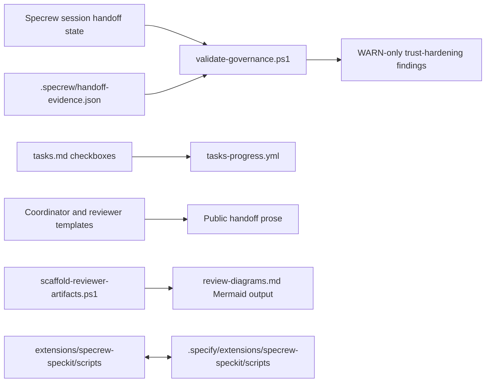
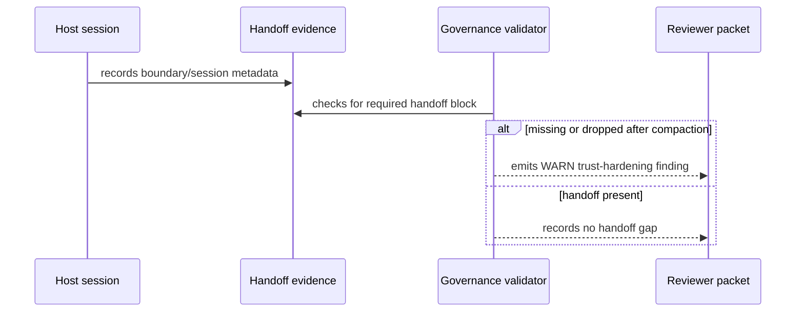
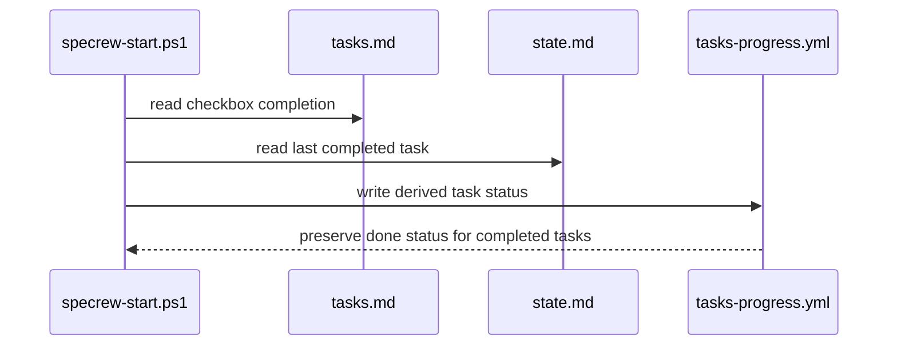

# Review Diagrams: Iteration 001

**Schema**: v1
**Diagram Format**: mermaid
**Reviewed**: 2026-05-26

## Component Diagram

## Sequence: Missing Handoff Detection

## Sequence: Task Progress Regeneration

