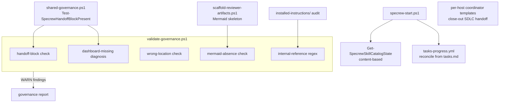
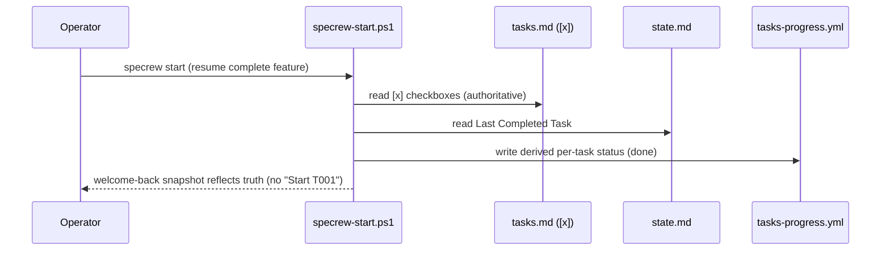

# Review Diagrams: F-047 Trust-Hardening Bug-Bash Bundle

**Feature**: `047-bug-bash-trust-hardening`
**Phase**: pre-implementation (planning artifact for reviewer)

## Component diagram



## Sequence: handoff-block detection at a boundary commit (Item 1 + Item 2)

```mermaid
sequenceDiagram
  participant Op as Operator/Agent
  participant V as validate-governance.ps1
  participant H as Test-SpecrewHandoffBlockPresent
  participant R as Governance report
  Op->>V: validate iteration (boundary commit)
  V->>H: handoff block present? (commit window + session metadata)
  H-->>V: false (no block; compaction_marker=true)
  V->>R: emit WARN (post-compaction handoff-drop, sub-trigger 3c)
  R-->>Op: WARN finding (not FAIL)
```

## Sequence: resume reconciliation (Item 7)


