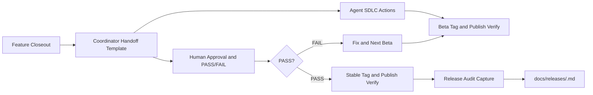
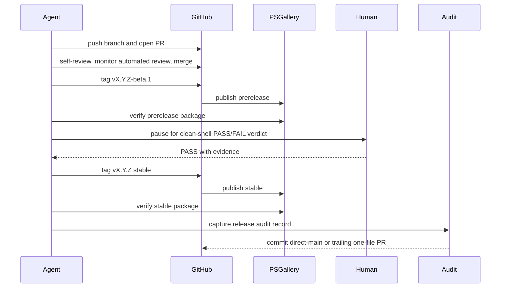
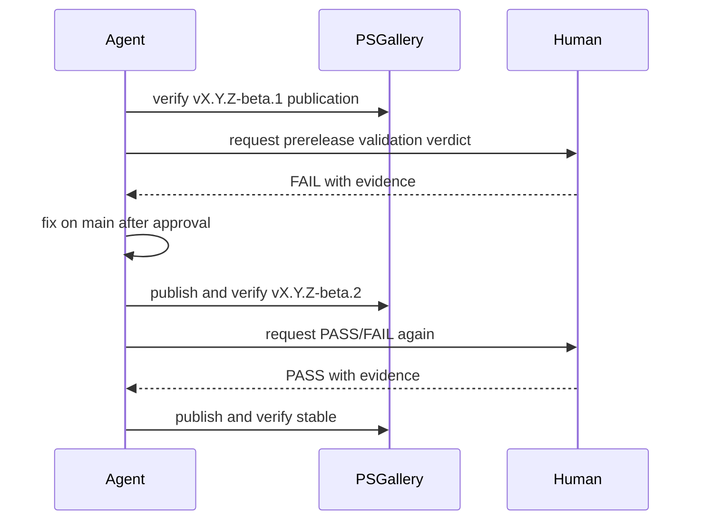

# Review Diagrams: Beta-Before-Stable SDLC Discipline

**Feature**: `048-beta-before-stable-sdlc`  
**Phase**: pre-implementation (planning artifact for reviewer)

## Component diagram

## Sequence: PASS promotion flow

## Sequence: FAIL beta loop

