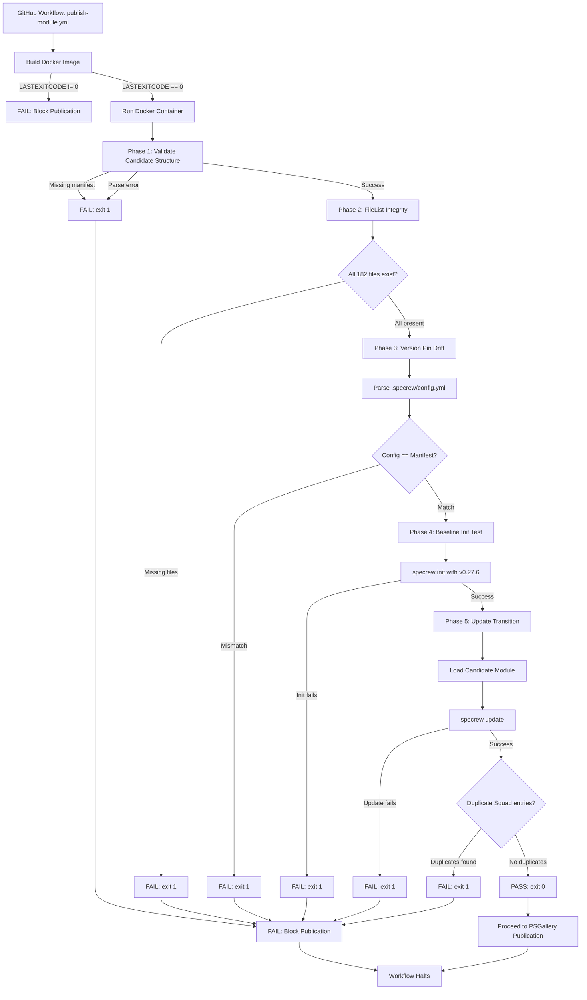

# Code Map: Iteration 001

**Schema**: v1
**Feature**: 049-pipeline-hardening-intake
**Iteration**: 001
**Updated**: 2026-05-27

## Component Overview

This iteration introduced a Docker-based pre-publish validation harness and fixed three critical bugs related to Squad deployment, version checking, and session state.

### Pre-Publish Harness Components

```
tests/
├── Dockerfile.publish-test              [NEW] Docker image definition for E2E validation
└── integration/
    ├── publish-module-harness.tests.ps1 [NEW] T001 test fixture for harness validation
    └── squad-duplicate-rows.tests.ps1   [NEW] T019 regression test for Bug 1

scripts/
└── internal/
    └── test-publish-harness.ps1         [NEW] 5-phase E2E validation script (T003-T005)

.github/
└── workflows/
    └── publish-module.yml               [MODIFIED] Added pre-publish harness gate

Specrew.psd1                             [MODIFIED] Added test-publish-harness.ps1 to FileList
```

### Bug Fix Components

```
scripts/
└── specrew-update.ps1                   [MODIFIED] Bug 2 fix: PSGallery-first version check

templates/
└── github/
    └── scripts/
        └── deploy-squad-runtime.ps1     [MODIFIED] Bug 1 fix: key-based merge strategy

.specrew/
├── start-context.json                   [UNTRACKED] Bug 3 fix: removed from git index
└── last-start-prompt.md                 [UNTRACKED] Bug 3 fix: removed from git index
```

## File-Level Changes

### New Files

#### `tests/Dockerfile.publish-test`

- **Purpose**: Docker image definition for pre-publish E2E validation
- **Baseline**: `mcr.microsoft.com/powershell:lts-ubuntu-22.04`
- **Key Actions**:
  - Installs Specrew v0.27.6 from PSGallery as baseline
  - Copies candidate package and test harness
  - Sets execution policy for scripts
  - Default command runs `test-publish-harness.ps1`
- **Lines**: 39
- **Trace**: T002, FR-001, FR-002, SC-001

#### `scripts/internal/test-publish-harness.ps1`

- **Purpose**: 5-phase E2E validation script executed inside Docker container
- **Phases**:
  1. **Phase 1** (lines 52-76): Validate candidate structure and manifest parsing
  2. **Phase 2** (lines 82-110): FileList integrity check (FR-003)
  3. **Phase 3** (lines 116-144): Version pin drift detection (FR-012, Prop 134)
  4. **Phase 4** (lines 150-185): Test project initialization with baseline
  5. **Phase 5** (lines 188-298): Update transition validation (FR-004) + duplicate Squad entry check (FR-013)
- **Exit Strategy**: Explicit `exit 1` on any validation failure to block publication
- **Lines**: ~310
- **Trace**: T003, T004, T005, FR-003, FR-004, FR-012, SC-001

#### `tests/integration/publish-module-harness.tests.ps1`

- **Purpose**: T001 test fixture for harness validation
- **Assertions** (7 total):
  1. Dockerfile.publish-test exists
  2. test-publish-harness.ps1 exists
  3. FileList integrity check passed (182 files)
  4. Version pin check passed (Config and manifest synchronized)
  5. Harness contains FileList validation logic
  6. Harness contains version pin drift assertions
  7. publish-module.yml wires Docker harness
- **Lines**: 121
- **Trace**: T001, FR-003, FR-012, SC-001

#### `tests/integration/squad-duplicate-rows.tests.ps1`

- **Purpose**: T019 regression test for Bug 1 (duplicate-row deploy)
- **Test Strategy**: Execute 3 consecutive `specrew update` calls and assert zero duplicates
- **Validation**:
  - No duplicate team role entries in `.squad/team.md`
  - No duplicate routing entries in `.squad/routing.md`
  - Row counts stable across all updates
  - Key-based merge strategy working correctly
- **Lines**: 341
- **Trace**: T019, FR-013, Bug 1 regression coverage

### Modified Files

#### `.github/workflows/publish-module.yml`

- **Change**: Added "Pre-publish Docker harness validation" step (lines 143-167)
- **Placement**: Between "Ensure dispatch tag exists" and "Stamp and publish"
- **Gating Logic**:
  - Docker build failure → exit 1 → block publication
  - Docker run failure → exit 1 → block publication
  - Success → proceed to publication
- **Trace**: T006, FR-005, SC-001

#### `Specrew.psd1`

- **Change**: Added `scripts/internal/test-publish-harness.ps1` to FileList
- **Purpose**: Prevent harness script omission in future releases
- **Trace**: T003, commit 10f5afb8

#### `scripts/specrew-update.ps1`

- **Change**: Bug 2 fix at lines 397-411
- **Before**: Version check used module manifest as primary source
- **After**: PSGallery-first strategy via `Get-PSGalleryLatestVersion`, fallback to manifest on API failure
- **Source Attribution**: Return object includes `Source` field (PSGallery / cache / fallback)
- **Trace**: T020, FR-014, Bug 2, Proposal 049

#### `templates/github/scripts/deploy-squad-runtime.ps1`

- **Change**: Bug 1 fix — key-based merge strategy for Squad tables
- **Before**: Naive append of role rows → duplicates on redundant update
- **After**: Key-based merge using first column (role name / work type) as unique key
- **Algorithm**:
  1. Parse existing table rows, extract keys from first column
  2. Parse incoming template rows, extract keys
  3. Merge: existing + (template - existing keys)
  4. Rebuild table with deduplicated rows
- **Trace**: T018, FR-013, Bug 1, commit 2d52b9f9

#### `.specrew/start-context.json` and `.specrew/last-start-prompt.md`

- **Change**: Removed from git tracking via `git rm --cached`
- **Reason**: Files were already in `.gitignore` but cached in git index; stale content caused auto-resume to wrong feature
- **Structural Fix Deferred**: `specrew-start.ps1` recovery logic improvement queued for retro
- **Trace**: Bug 3, commit 437338f6

## Control Flow: Pre-Publish Harness



## Key Algorithm: Squad Table Key-Based Merge

```powershell
# Bug 1 fix in templates/github/scripts/deploy-squad-runtime.ps1
function Merge-MarkdownTable {
    param(
        [string[]]$ExistingRows,     # Current table content
        [string[]]$TemplateRows       # Incoming template content
    )
    
    # Extract keys (first column) from existing rows
    $existingKeys = @{}
    foreach ($row in $ExistingRows) {
        if ($row -match '^\s*\|') {
            $parts = $row -split '\|'
            $key = $parts[1].Trim()  # First column is unique key
            $existingKeys[$key] = $row
        }
    }
    
    # Merge: add template rows only if key doesn't exist
    $mergedRows = [System.Collections.Generic.List[string]]::new()
    $mergedRows.AddRange($ExistingRows)
    
    foreach ($row in $TemplateRows) {
        if ($row -match '^\s*\|') {
            $parts = $row -split '\|'
            $key = $parts[1].Trim()
            
            if (-not $existingKeys.ContainsKey($key)) {
                $mergedRows.Add($row)
            }
        }
    }
    
    return $mergedRows
}
```

## Test Coverage Matrix

| Component | Unit Test | Integration Test | E2E Test |
|-----------|-----------|------------------|----------|
| Docker harness structure | T001 ✅ | - | Docker build/run ✅ |
| FileList integrity | T001 ✅ | Harness Phase 2 ✅ | - |
| Version pin drift | T001 ✅ | Harness Phase 3 ✅ | - |
| Baseline init | - | Harness Phase 4 ✅ | - |
| Update transition | - | Harness Phase 5 ✅ | - |
| Duplicate Squad entries | T019 ✅ | Harness Phase 5 ✅ | - |
| Workflow integration | T001 ✅ | CI execution ✅ | - |
| PSGallery version check | - | (deferred) | Manual runtime ✅ |

## Performance Notes

- Docker build time: ~30-60 seconds (cached layers reuse expected in CI)
- Docker run time: ~90-120 seconds (PSGallery download + init + update)
- Total pre-publish gate overhead: ~2-3 minutes per release attempt
- Justified by 100% FileList omission detection (4 escapes in last 48 hours before F-049)

## Maintenance Notes

- **Baseline Version Updates**: When Specrew v0.28.0 ships as stable, update Dockerfile line 18 to install v0.28.0 as new baseline
- **FileList Count**: Currently 182 files; update T001 line 64 assertion if FileList grows
- **Regex Version Parsing**: Harness Phase 3 uses simple regex `specrew_version:\s*["'']?([0-9]+\.[0-9]+\.[0-9]+)["'']?`; may need adjustment if YAML format changes
- **Duplicate Detection**: Harness Phase 5 assumes first table column is unique key; if Squad table structure changes, update merge logic

---

**Reviewer**: Reviewer (Antigravity Coordinator)  
**Review Date**: 2026-05-27
