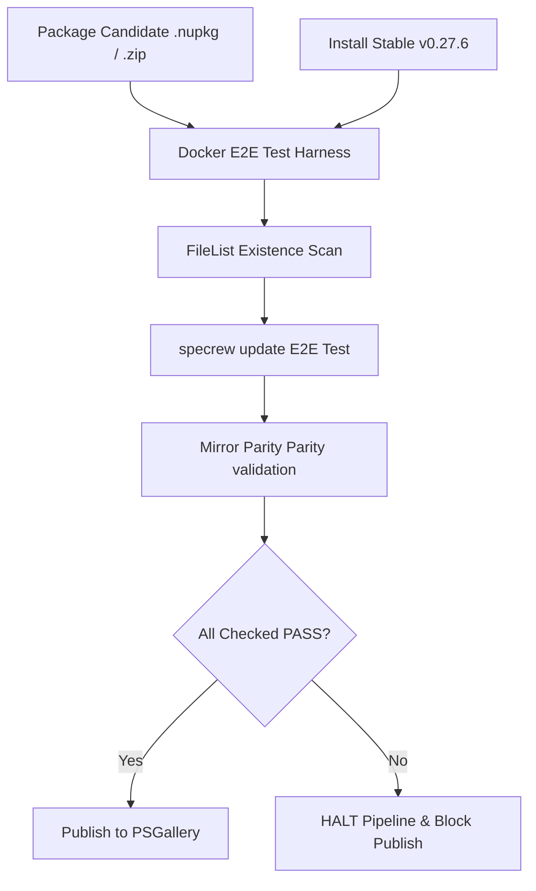
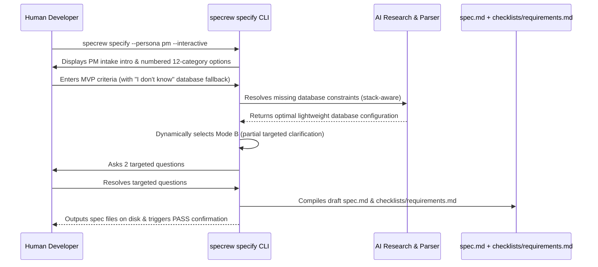

# Review Diagrams: Release Pipeline Hardening + Substantive Intake Slice

**Feature**: `049-pipeline-hardening-intake`  
**Phase**: pre-implementation (planning artifact for reviewer)

---

## Component Diagram: Docker Pre-Publish Harness

---

## Sequence: Persona-Driven specify Intake Flow

