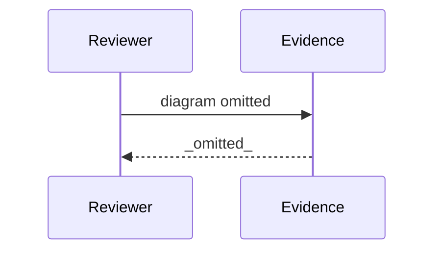

# Review Diagrams: Iteration 002

**Schema**: v1
**Diagram Format**: mermaid

> **Review Evidence Disposition** _(Form-vs-Meaning heuristic — DISPOSITIONED, not a gap)_
>
> The heuristic flags **3 completed task(s)** vs **10 file(s)** in the iter-002 baseline→HEAD diff.
> Expected over-delivery, NOT a gap: the 3 tasks deliver 3 test files (host-cursor / host-cursor-launch /
> host-detection-ux), and the remaining ~7 are iteration-002 governance artifacts (plan/state/drift-log/
> quality + reviewer artifacts). All 3 tasks committed (d53f6a4e) with green tests; no uncommitted work.

---

## Structure Diagram

## Flow Diagram

## Omissions

- Structure diagram omitted: modules touched (0) below threshold (3).
- Flow diagram omitted: entrypoints changed (0) below threshold (1).

## Local View Hints

- specs\050-cursor-host-support\iterations\002\review-diagrams.md