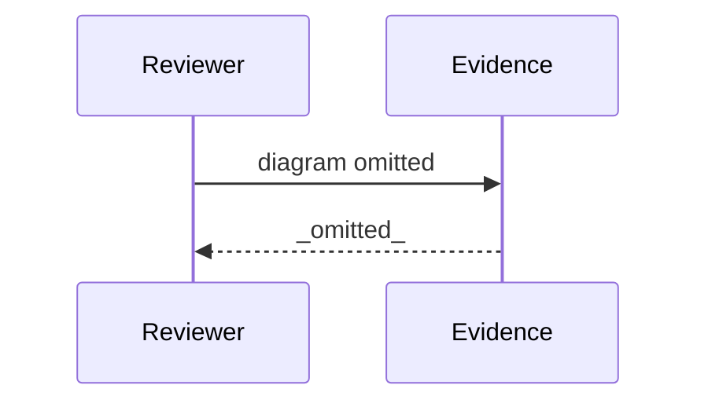

# Review Diagrams: Iteration 003

**Schema**: v1
**Diagram Format**: mermaid

> **Review Evidence Disposition** _(Form-vs-Meaning heuristic — DISPOSITIONED)_
>
> 3 tasks vs the diff's file count is expected: T014/T015 are 2 doc files, T016 is a HUMAN-verified
> live smoke (no file), and the remainder are iter-003 governance artifacts. Docs committed 5826696e
> (markdownlint clean); no uncommitted work.

---

## Structure Diagram

## Flow Diagram

## Omissions

- Structure diagram omitted: modules touched (0) below threshold (3).
- Flow diagram omitted: entrypoints changed (0) below threshold (1).

## Local View Hints

- specs\050-cursor-host-support\iterations\003\review-diagrams.md
