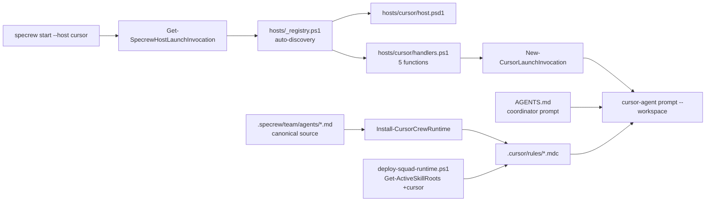
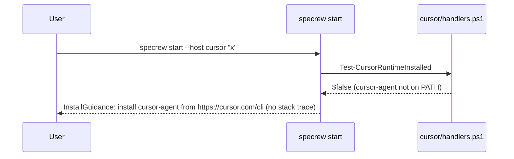

# Review Diagrams: Cursor Host Package

**Feature**: `050-cursor-host-support`
**Phase**: pre-implementation (planning artifact for reviewer)

## Component diagram



## Sequence: launch a feature in Cursor (US1 canonical flow)

```mermaid
sequenceDiagram
  participant User
  participant Specrew as specrew start
  participant Registry as hosts/_registry.ps1
  participant Handlers as cursor/handlers.ps1
  participant Cursor as cursor-agent

  User->>Specrew: specrew start --host cursor "Add OAuth login"
  Specrew->>Registry: Get-HostManifest -Kind cursor
  Registry-->>Specrew: manifest (Binary=cursor-agent, Status=supported)
  Specrew->>Handlers: Test-CursorRuntimeInstalled
  Handlers-->>Specrew: $true
  Specrew->>Handlers: Install-CursorCrewRuntime (sync .cursor/rules/*.mdc)
  Handlers-->>Specrew: Actions[], CrewRuntimePath=.cursor/rules
  Specrew->>Handlers: New-CursorLaunchInvocation -Prompt "..." [-AllowAll]
  Handlers-->>Specrew: {Binary=cursor-agent; Args=["...",--workspace,<proj>]}
  Specrew->>Cursor: spawn cursor-agent "..." --workspace <proj> (interactive)
  Cursor-->>User: Agent reads AGENTS.md + .cursor/rules, begins specify phase
```

## Sequence: binary missing (US1 scenario 2/3 — graceful guidance)


