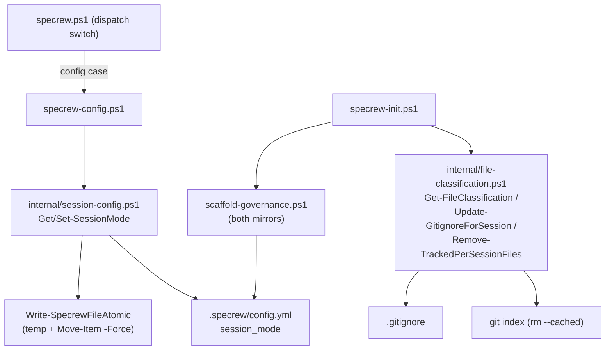
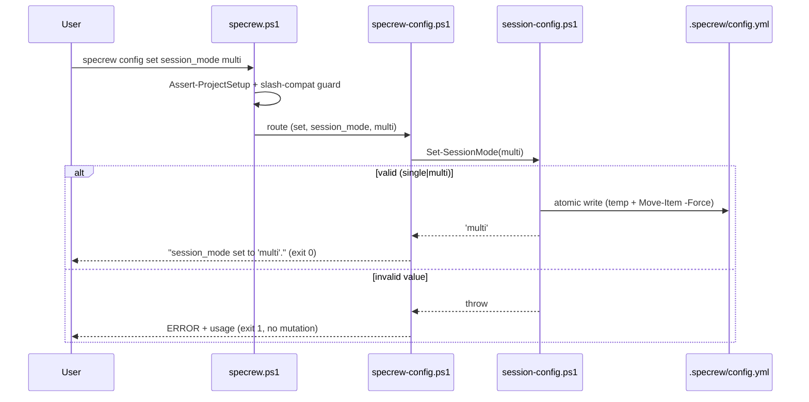

# Review Diagrams: Iteration 001 — Session Mode Configuration & File Classification

**Schema**: v1
**Diagram Format**: mermaid

> **Review-evidence integrity note:** the scaffolder's Form-vs-Meaning warning (19 tasks vs 20 files) is a verified false positive — all work is committed (HEAD `4141a892` == origin). The auto-omitted placeholder diagrams have been replaced with substantive ones below.

## Structure Diagram (Iteration-1 modules)



## Flow: `specrew config set session_mode multi` (FR-001/002)



## Flow: `specrew init` per-session file classification (FR-005/006)

```mermaid
sequenceDiagram
  participant Init as specrew-init.ps1
  participant Scaffold as scaffold-governance.ps1
  participant FC as file-classification.ps1
  participant GI as .gitignore
  participant Git as git index
  Init->>Scaffold: scaffold governance
  Scaffold->>Scaffold: write config.yml (session_mode: single, FR-003)
  Init->>FC: Update-GitignoreForSession (FR-005)
  FC->>GI: merge missing per-session patterns (idempotent, preserve existing)
  Init->>FC: Remove-TrackedPerSessionFiles (FR-006)
  FC->>Git: git rm --cached <tracked per-session paths>
  Note over FC,Git: working-tree copies kept; no-op outside a git repo
```
