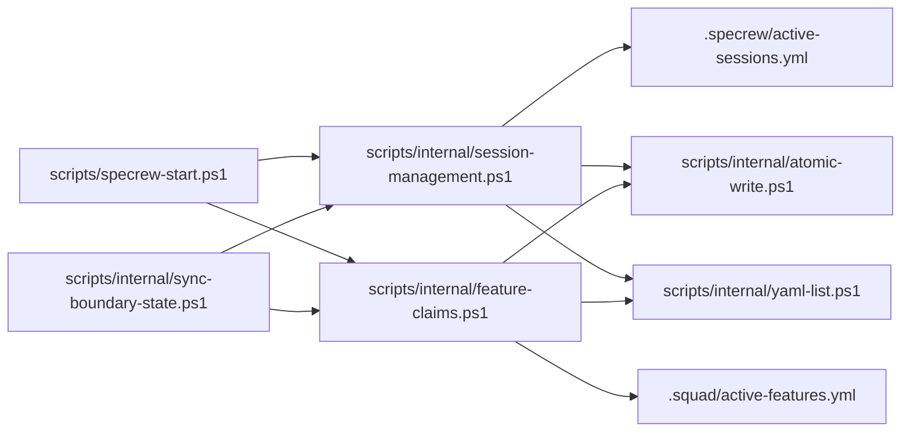
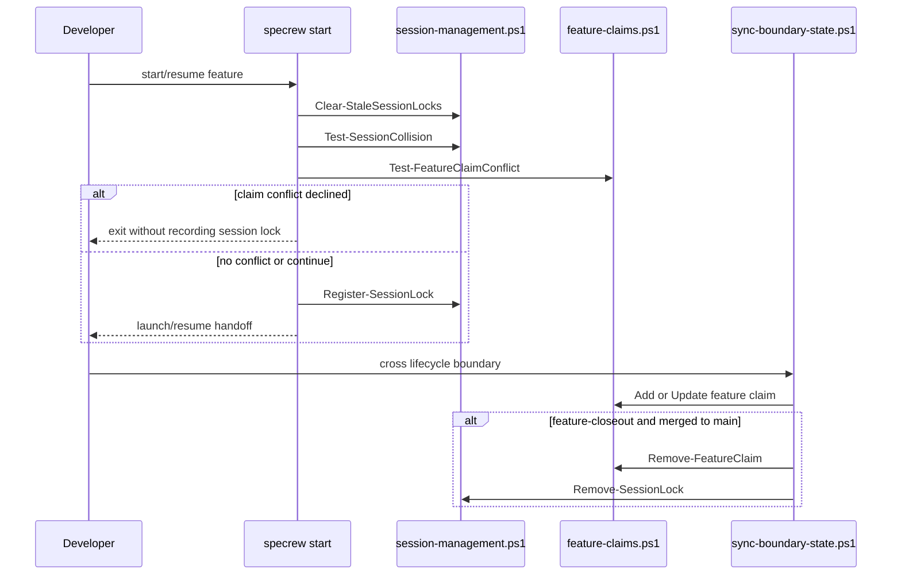

# Review Diagrams: Iteration 002 — Iteration 2a: Collision Detection & Feature Claims

**Schema**: v1
**Diagram Format**: mermaid

## Structure Diagram

## Flow Diagram

## Local View Hints

- [scripts/specrew-start.ps1](../../../scripts/specrew-start.ps1)
- [scripts/internal/sync-boundary-state.ps1](../../../scripts/internal/sync-boundary-state.ps1)
- [scripts/internal/session-management.ps1](../../../scripts/internal/session-management.ps1)
- [scripts/internal/feature-claims.ps1](../../../scripts/internal/feature-claims.ps1)
