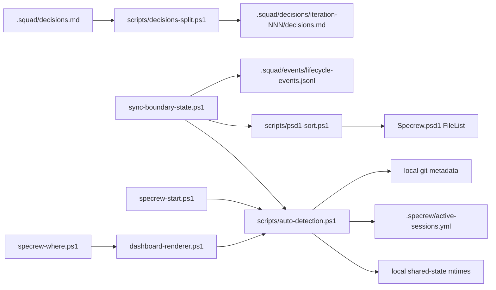
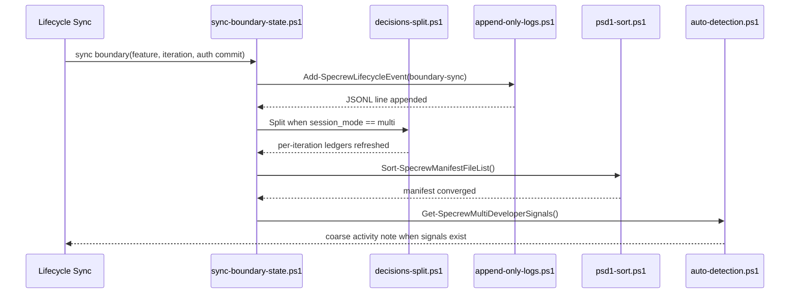
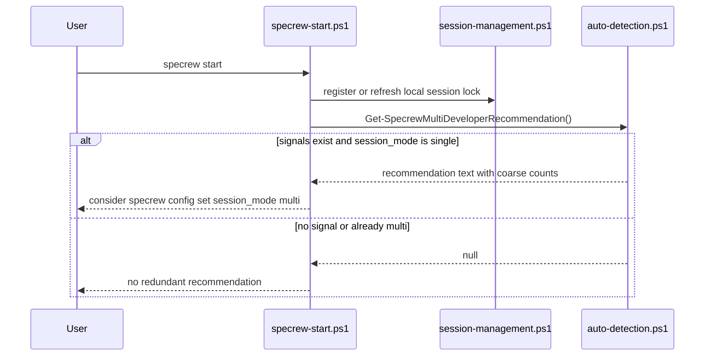

# Review Diagrams: Iteration 003 — Iteration 2b: Conflict Reduction & Multi-Developer Auto-Detection

**Schema**: v1
**Diagram Format**: mermaid

## Component Diagram

## Sequence: Boundary Sync Conflict-Reduction Path

## Sequence: Welcome Recommendation

## Omissions

- True two-clone merge choreography is not diagrammed; the implemented control is deterministic file-surface reduction plus append-only event logging.
