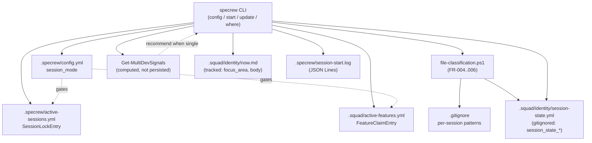
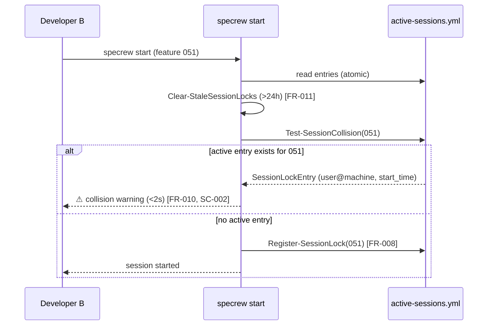
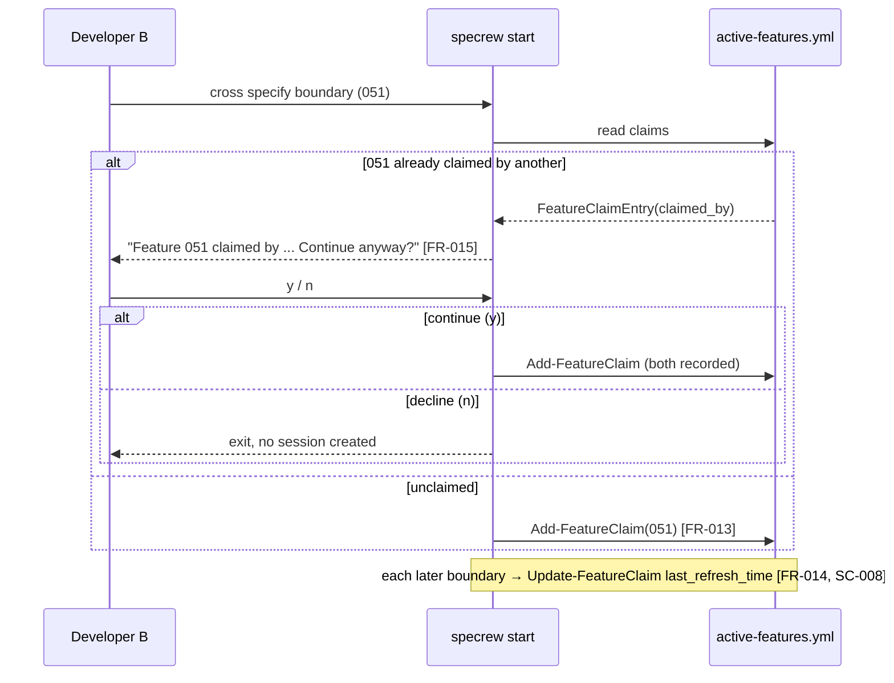
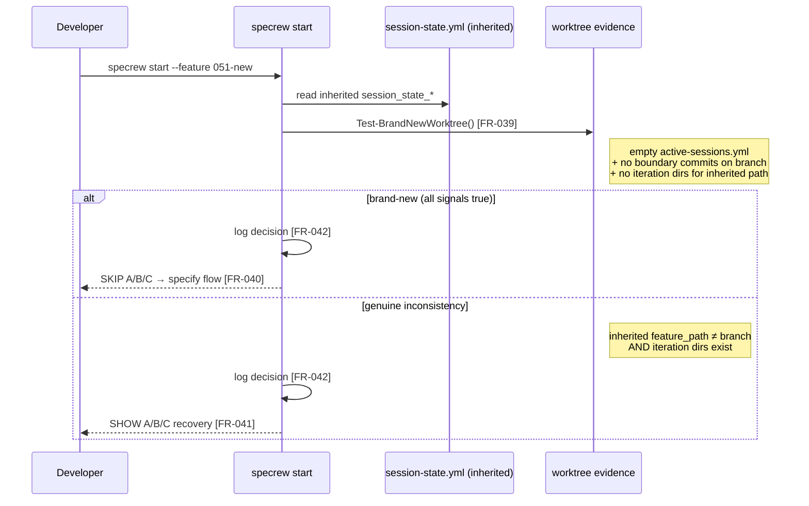

# Review Diagrams: Multi-Session Foundation

**Feature**: 051-multi-session-foundation
**Phase**: pre-implementation (planning artifact for reviewer)

## Component diagram

## Sequence: concurrent-session collision detection (US3 → FR-008/010/011)

## Sequence: feature claim warning (US4 → FR-013/014/015)

## Sequence: brand-new worktree detection (US9/US10 → FR-039/040/041)

