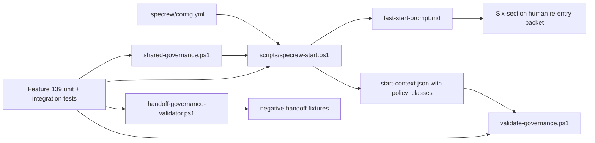
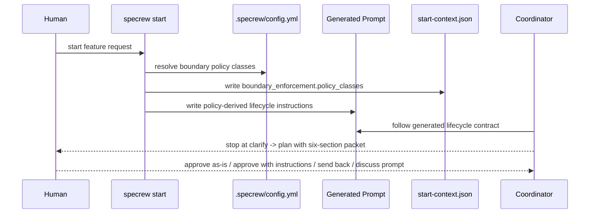
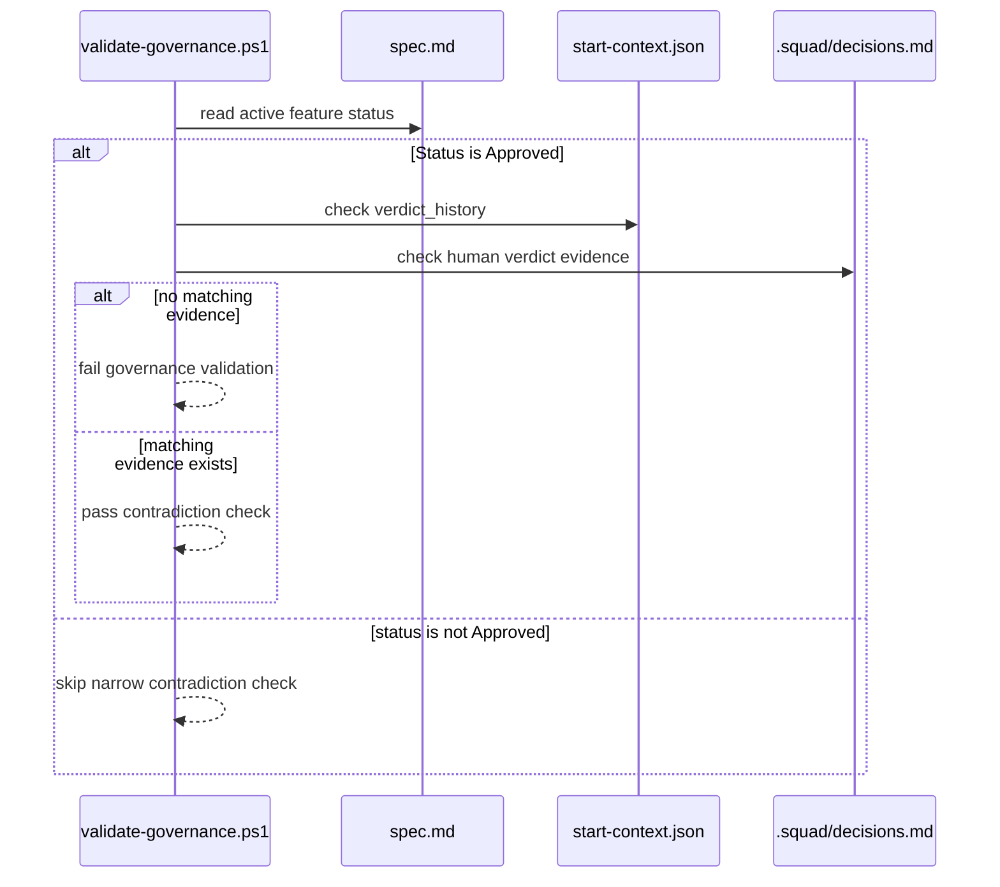

# Review Diagrams: Iteration 001

**Schema**: v1
**Diagram Format**: mermaid
**Reviewed**: 2026-06-01

## Component Diagram

## Sequence: Fresh Start Stop Contract

## Sequence: Status Approved Validator Check

## Local View Hints

- [review.md](file:///C:/tmp/Specrew-main-boundary-auth/specs/139-boundary-authorization-prompt-truth/iterations/001/review.md)
- [code-map.md](file:///C:/tmp/Specrew-main-boundary-auth/specs/139-boundary-authorization-prompt-truth/iterations/001/code-map.md)
- [coverage-evidence.md](file:///C:/tmp/Specrew-main-boundary-auth/specs/139-boundary-authorization-prompt-truth/iterations/001/coverage-evidence.md)
