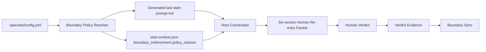
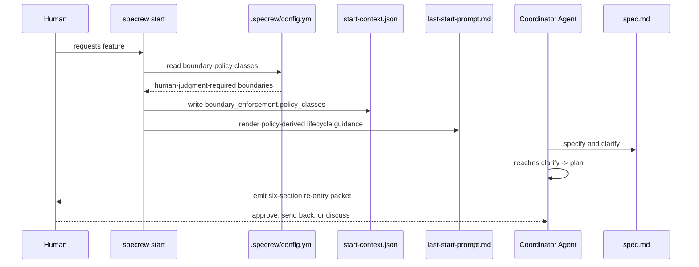
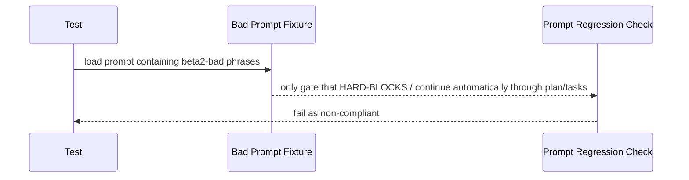
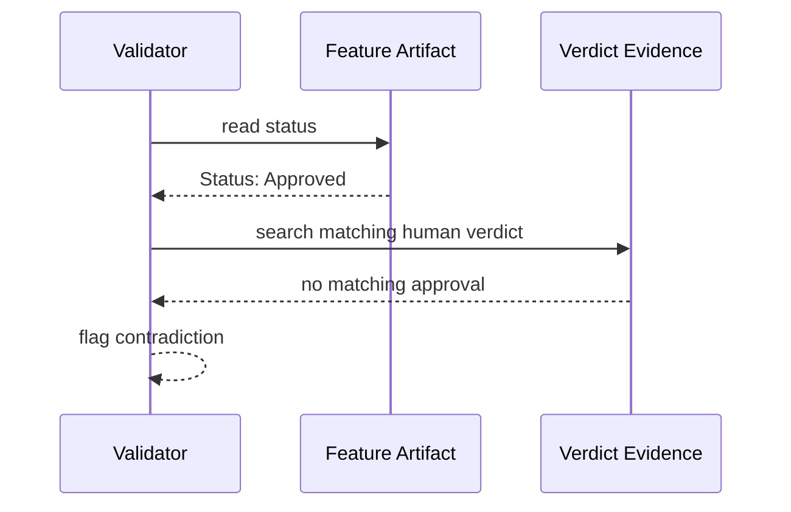

# Review Diagrams: Boundary Authorization Prompt Truth + Human Re-entry Packet

**Feature**: 139-boundary-authorization-prompt-truth
**Phase**: pre-implementation (planning artifact for reviewer)

## Component diagram

## Sequence: clarify-to-plan stop

## Sequence: beta2-bad prompt regression

## Sequence: status-approved contradiction check

