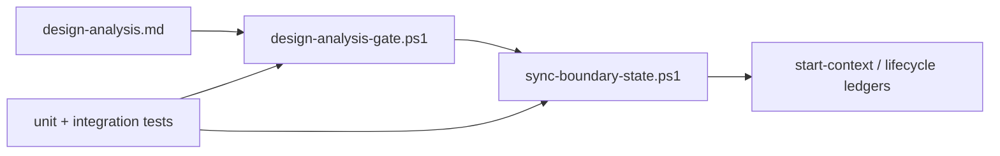
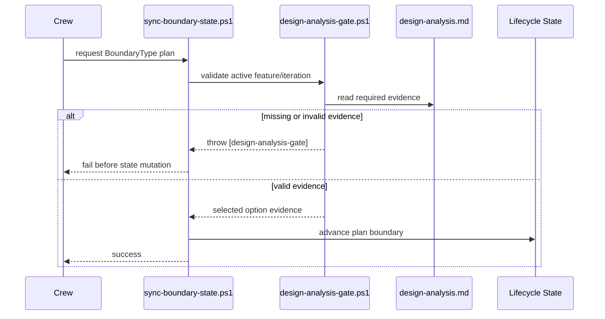

# Review Diagrams: Iteration 001

**Schema**: v1
**Diagram Format**: mermaid

## Component Diagram

```mermaid
flowchart LR
  Artifact["design-analysis.md"]
  Helper["design-analysis-gate.ps1"]
  Sync["sync-boundary-state.ps1"]
  State["start-context / lifecycle ledgers"]
  Tests["unit + integration tests"]

  Artifact --> Helper
  Helper --> Sync
  Sync --> State
  Tests --> Helper
  Tests --> Sync
```

## Sequence: Active Plan Boundary

```mermaid
sequenceDiagram
  participant Crew
  participant Sync as sync-boundary-state.ps1
  participant Gate as design-analysis-gate.ps1
  participant Artifact as design-analysis.md
  participant State as Lifecycle State

  Crew->>Sync: request BoundaryType plan
  Sync->>Gate: validate active feature/iteration
  Gate->>Artifact: read required evidence
  alt missing or invalid evidence
    Gate-->>Sync: throw [design-analysis-gate]
    Sync-->>Crew: fail before state mutation
  else valid evidence
    Gate-->>Sync: selected option evidence
    Sync->>State: advance plan boundary
    Sync-->>Crew: success
  end
```
