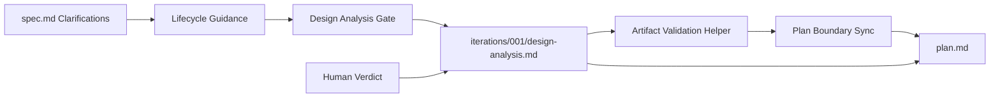
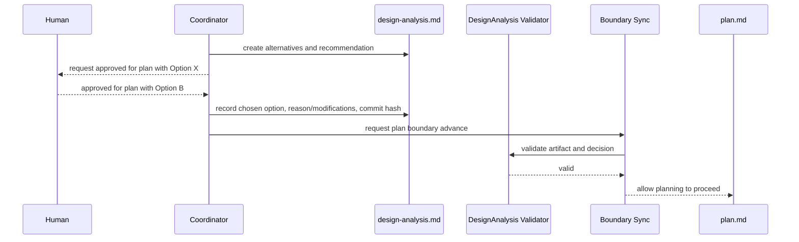
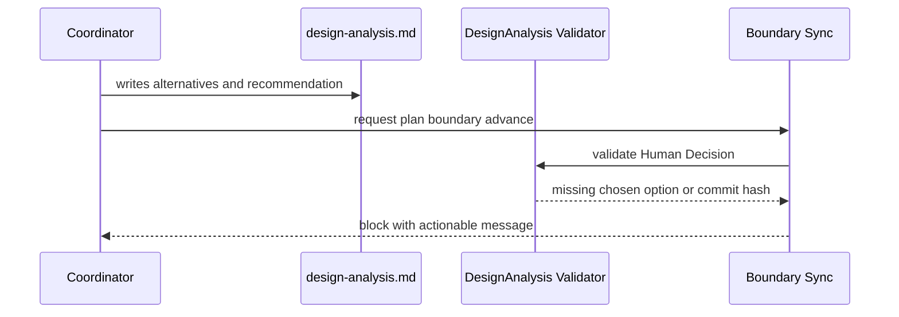
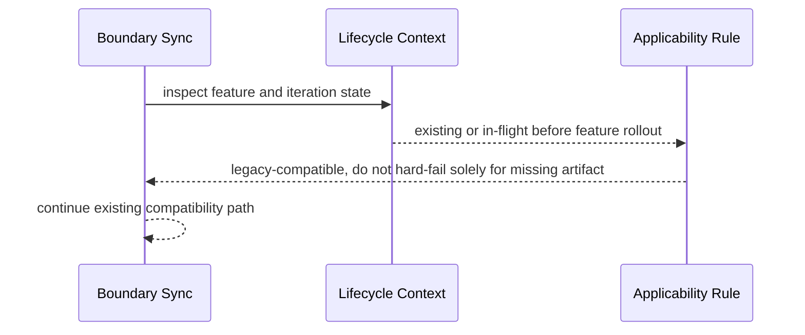

# Review Diagrams: Minimal Design Alternatives / Architecture Intake Gate

**Feature**: 140-design-analysis-gate  
**Phase**: pre-implementation (planning artifact for reviewer)

## Component Diagram

## Sequence: Active Substantive Feature

## Sequence: Missing Human Decision Blocks Plan

## Sequence: Compatibility for Existing In-Flight Feature

