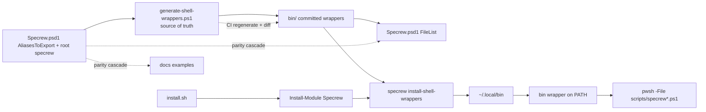
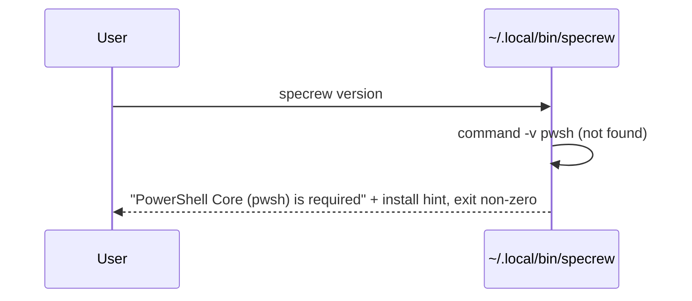

# Review Diagrams: Unix-Native Install & Command Surface

**Feature**: 140-unix-native-install
**Phase**: pre-implementation (planning artifact for reviewer)

## Component diagram



## Sequence: end-user bootstrap then native command

```mermaid
sequenceDiagram
  participant User
  participant Bootstrap as install.sh
  participant Pwsh as pwsh
  participant Installer as install-shell-wrappers
  participant Wrapper as ~/.local/bin/specrew
  User->>Bootstrap: curl ... | sh
  Bootstrap->>Bootstrap: verify pwsh present (else abort + hint)
  Bootstrap->>Pwsh: Install-Module Specrew
  Bootstrap->>Installer: specrew install-shell-wrappers
  Installer->>Wrapper: copy committed bin/ wrappers (warn if not on PATH)
  User->>Wrapper: specrew version
  Wrapper->>Wrapper: resolve module root (follow symlinks); verify pwsh
  Wrapper->>Pwsh: exec pwsh -File scripts/specrew.ps1 version "$@"
  Pwsh-->>User: version output (exit 0)
```

## Sequence: pwsh missing (failure path)


