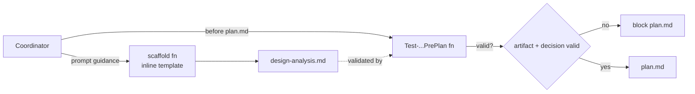
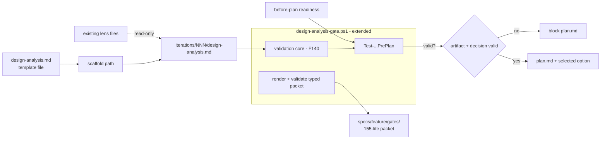
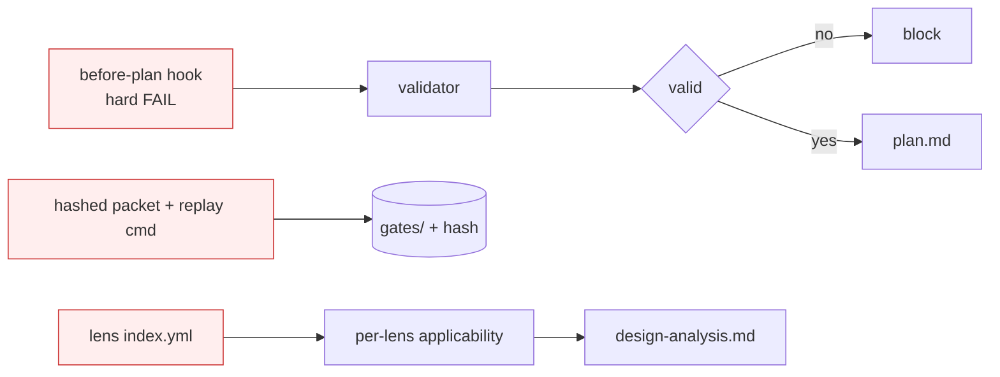

# Design Analysis — Feature 141 / Iteration 001

**Feature**: 141-design-gate-runtime-hardening  
**Iteration**: 001 (design-gate runtime path)  
**Date**: 2026-06-02  
**Spec**: file:///C:/Dev/Specrew-design-analysis/specs/141-design-gate-runtime-hardening/spec.md  
**Builds on**: Feature 140 helper `scripts/internal/design-analysis-gate.ps1` + `sync-boundary-state.ps1` plan-boundary enforcement.

## Problem framing

Feature 140 shipped a design-analysis *validator* and wired it into the `plan`
boundary-sync path — enforcement that fires after plan artifacts already exist
and that never scaffolds the artifact the Crew is supposed to fill. Iteration 1
of this feature must make the gate *felt before plan*: a conformant
`design-analysis.md` is scaffolded, it is validated before `plan.md` is authored,
the human approval object is rendered from typed fields, and `plan.md` cannot be
written until the artifact and the human design-gate decision are valid. The
clarify decisions fixed the *mechanism* (coordinator-prompt enforcement + a
callable pre-plan validator; no Proposal 105 hooks) and the *packet preference*
(render-and-validate minimum; durable 155-lite packet preferred if narrow and
cheap, scoped to the design-analysis gate only). What remains open is the
**structural realization**: where the scaffold, pre-plan validator, and packet
live, and how they integrate with the Feature 140 helper without rewriting it.

Constraints carried in: stay within one iteration's story-point cap; extend (not
rewrite) the Feature 140 helper; keep scaffold and validator contract reconciled
(TG-007); no release publishing; no Unix-install/wrapper/bootstrap edits; lens
inclusion stays lightweight read-only.

## Decision points

1. **Artifact scaffold source** — a versioned template *file* under the extension
   templates directory (reconciled with the validator) vs. an inline here-string
   inside the helper.
2. **Pre-plan validator placement** — a new function in the existing
   `design-analysis-gate.ps1` invoked by generated coordinator guidance and by the
   before-plan readiness path, vs. a brand-new standalone script.
3. **Typed packet** — render-and-validate transiently vs. also persist a narrow
   155-lite packet under `specs/<feature>/gates/`.
4. **Applicable Lenses** — render a read-only section referencing existing lens
   files now, vs. defer.

## Alternatives

### Option A: Simplest — Minimal prompt-enforced hardening

**Approach**: Extend `design-analysis-gate.ps1` with a `Test-...PrePlan` function
and a scaffold function whose template is an inline here-string. Enforcement is
purely coordinator-prompt (updated generated start guidance) plus the existing
Feature 140 boundary-sync check. The typed packet is rendered and validated in
memory only — no durable storage. The "Applicable Lenses" section is authored by
coordinator judgment with no lens-file plumbing.

**Architectural pattern**: Single-helper extension; prompt-enforced gate; no new
files beyond tests.

**Quality features considered**: Robustness baseline (validator covers the
failure cases). Defers durable audit evidence and deeper test-integrity; security
lens is not applicable (no auth/secrets/network).

**Effort estimate**: ~8–12 SP (fits the cap with margin).

**Reversibility cost**: High — easy to add a template file or durable packet
later; nothing entrenched.

**Trade-offs**:

- (+) Smallest surface, fastest, lowest risk; clearly under the cap.
- (+) No drift risk between a separate template file and the validator.
- (−) No durable packet evidence — the approval object is not auditable later.
- (−) Inline here-string template is harder to diff/review than a file and can
  drift from the validator over time.
- (−) Prompt-only enforcement is advisory; a coordinator that ignores guidance is
  only caught at the later boundary-sync check.

**Recommended for**: Tight time pressure or throwaway validation of the flow.

**Diagram**:

### Option B: Reasonable — Template-file + callable validator + scoped durable packet

**Approach**: Add a versioned `design-analysis.md` **template file** under the
extension templates directory and a scaffold path that emits the per-iteration
artifact from it, so scaffold and the Feature 140 validator contract stay
reconciled (TG-007). Add a callable **pre-plan validator** function in
`design-analysis-gate.ps1` (reusing the existing validation core) invoked both by
generated coordinator guidance and by the before-plan readiness path, so the
"don't author plan.md before valid artifact + decision" requirement is checkable,
not just narrated. Render the typed design-analysis packet from typed fields **and
persist a narrow 155-lite packet** under `specs/<feature>/gates/` — design-analysis
gate only, no generalization to other boundaries. Render the lightweight
read-only **Applicable Lenses** section referencing the existing lens files.
Cover it with focused unit + integration tests (block/pass, scaffold conformance,
packet render/validate, compatibility skip).

**Architectural pattern**: Template-file + helper-function extension + scoped
durable packet; prompt + callable-validator enforcement.

**Quality features considered**: Robustness baseline (fail-closed validator) +
test-integrity baseline (tests exercise real block/pass behavior, not
file-presence) + durable audit evidence. Defers host-native hooks (Proposal 105),
packet hashing/replay, and broad lens automation. Security lens not applicable.

**Effort estimate**: ~13–18 SP (within the cap).

**Reversibility cost**: Medium — the template file and gates/ packet are additive
and removable, but downstream consumers (plan input, tests) start to depend on
them.

**Trade-offs**:

- (+) Scaffold/validator reconciliation (TG-007) is structural, not a promise.
- (+) Durable, scoped packet satisfies your FR-020 preference and gives auditable
  approval evidence without adopting full Proposal 155.
- (+) Callable validator makes enforcement verifiable and testable.
- (+) Real block/pass + render/validate tests (avoids the file-presence ≠ runtime
  trap).
- (−) Larger surface than A; the `gates/` storage edges toward 155 territory
  (mitigated by explicit design-analysis-only scoping).

**Recommended for**: Production hardening whose entire purpose is trust and
enforced correctness — i.e., this feature.

**Diagram**:

### Option C: By-the-book — Hook-enforced, hashed/replayable, lens-index-driven

**Approach**: Everything in B, plus integrate the pre-plan validator into the
before-plan extension hook as a hard readiness FAIL, add packet hashing + a
replay/inspection command (toward full Proposal 155), drive the Applicable Lenses
section from a lens `index.yml` with per-lens rationale (toward Proposal 156
automation), and add broad compatibility fixtures.

**Architectural pattern**: Hook-integrated readiness gate, hashed durable packet,
and lens-index-driven section.

**Quality features considered**: Comprehensive — robustness + test-integrity +
durable+replayable audit + hook enforcement.

**Effort estimate**: ~22+ SP — **exceeds the per-iteration cap** and would force a
split or pull deferred scope forward.

**Reversibility cost**: Low — hook integration and hashing/replay are entrenched
surfaces.

**Trade-offs**:

- (+) Most robust and auditable; strongest enforcement.
- (−) **Its distinguishing elements (Proposal 105 hooks, packet hashing/replay,
  lens-index automation) were explicitly deferred by the clarify decisions and the
  spec scope limits.** It also breaks the iteration cap.
- (−) Contradicts the locked scope, so it is documented for completeness rather
  than offered as a genuine Iteration 1 candidate.

**Recommended for**: A future iteration/feature once the deferred scope (105
hooks, full 155 packets, 156 lens automation) is approved on its own.

**Diagram**:

## Applicable Lenses

*(Dogfooding FR-009 — read-only references to existing repo-local lens files at
`extensions/specrew-speckit/templates/quality/lenses/`.)*

- **robustness-baseline-v1** — Applicable. The pre-plan validator and packet
  validator MUST fail closed on missing/invalid artifact, missing recommendation,
  or missing human decision, with actionable messages.
- **test-integrity-v1** — Applicable. Tests MUST exercise real block/pass and
  render/validate behavior (not file-presence), directly addressing the
  form-vs-runtime trap this project has hit before.
- **security-baseline-v1** — Not applicable. No authentication, secrets,
  permissions, or network surfaces are introduced; the gate only reads/validates
  local lifecycle artifacts.

## Crew recommendation

**Recommended: Option B.**

Rationale: This feature's entire purpose is to make the design gate *trustworthy
and enforced*, which argues for durable, verifiable evidence over the smallest
possible change. Option B delivers exactly the clarify-decided preferences — a
narrow, design-analysis-scoped durable 155-lite packet (FR-020), a callable
pre-plan validator with coordinator-prompt enforcement and no host hooks (FR-021),
a template-file scaffold that stays reconciled with the validator contract
(TG-007), the lightweight read-only Applicable Lenses section (FR-009), and real
block/pass tests — all within the iteration cap. The minimal prompt-only
alternative is cheaper but leaves the approval object unauditable and risks
scaffold/validator drift, undercutting the trust goal. The fuller hook-based
alternative is the right *eventual* shape, but its distinguishing features are
exactly the deferred scope and it breaks the cap, so it is not an Iteration 1
candidate.

This recommendation would flip toward the minimal alternative only under hard time
pressure where shipping a minimal prompt-enforced gate now and adding durability
later is explicitly acceptable.

## Human Decision

- **Chosen option**: Option B
- **Reason**: Selected the recommended balanced approach. The feature's purpose is
  a trustworthy, enforced design gate, which justifies durable, verifiable evidence
  over the smallest possible change. Option B delivers every clarify decision — a
  narrow design-analysis-scoped durable 155-lite packet (FR-020), a callable
  pre-plan validator with coordinator-prompt enforcement and no host hooks
  (FR-021), a template-file scaffold reconciled with the validator contract
  (TG-007), the lightweight read-only Applicable Lenses section (FR-009), and real
  block/pass tests — within the iteration cap.
- **Modifications**: None. The durable 155-lite packet stays scoped to the
  design-analysis gate only (`specs/<feature>/gates/`); no generalization to other
  boundaries.
- **Decided at commit**: `337e2523` (reviewed design-analysis state; verdict
  `approved for plan with Option B`).
