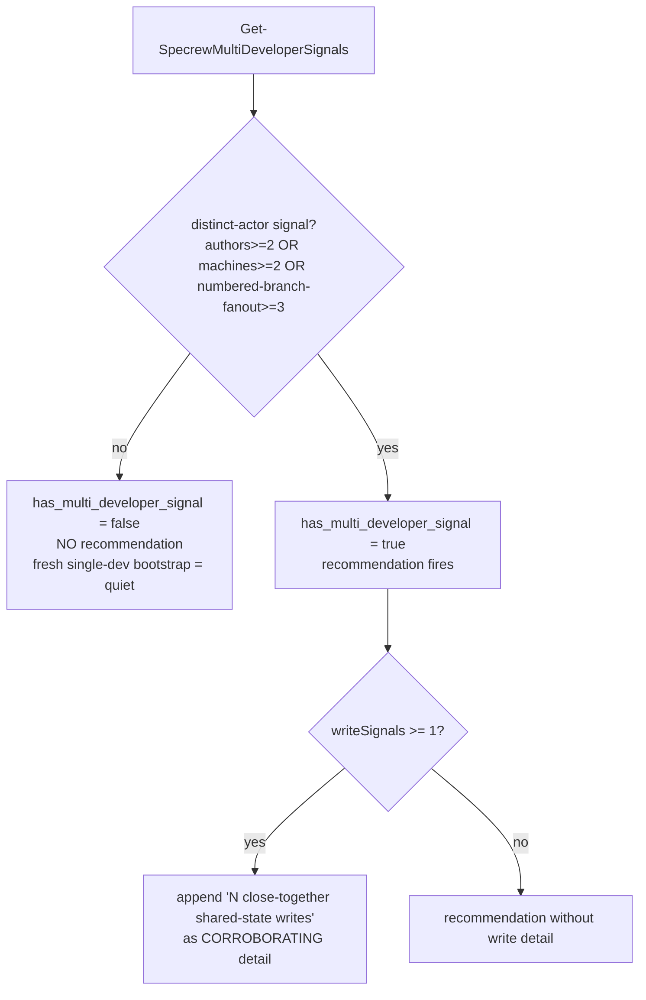
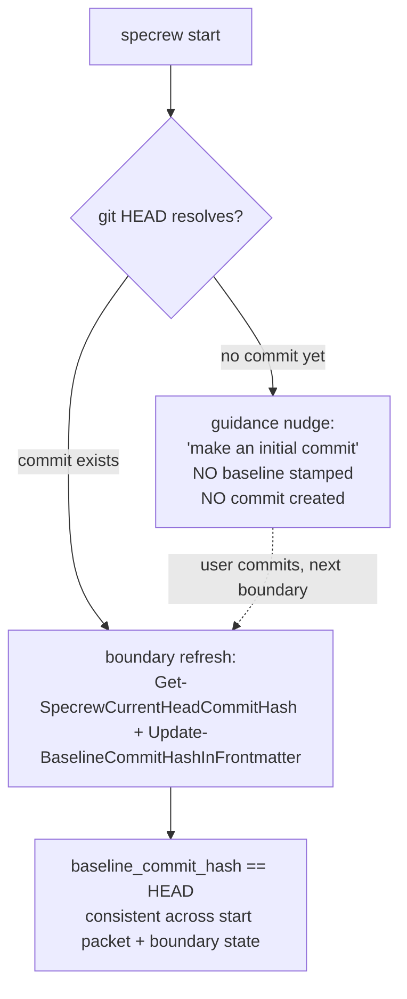

# Review Diagrams: Iteration 003

**Schema**: v1
**Reviewed**: 2026-06-03

## FR-012 — multi-developer signal: write-signals corroborate, never trigger alone

## FR-013 — fresh-greenfield baseline (C+nudge, no auto-commit)

## Notes

- Both diagrams reflect the as-built behavior verified by SC-008 (`feature-051-iteration2b`) and
  SC-009 (`design-gate-runtime-hardening-greenfield-baseline`). The dashed edge in the FR-013 diagram
  is the Feature-029 fail-safe path: the baseline self-heals at the next boundary once the user makes
  a commit — Specrew never creates one on their behalf.
