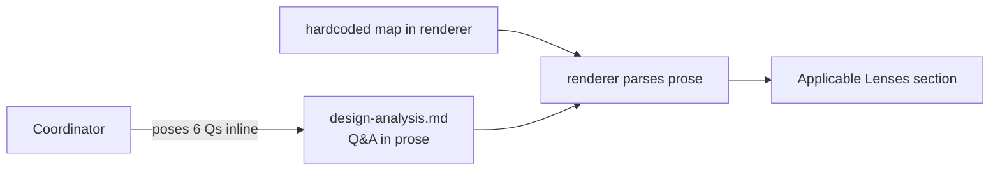
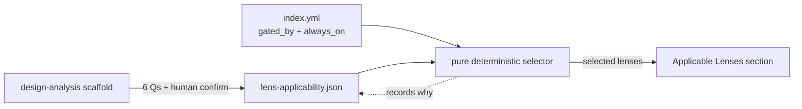
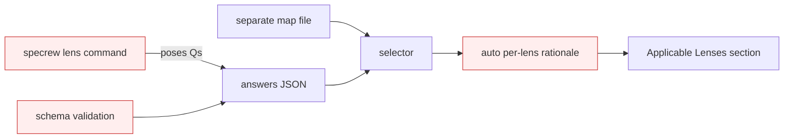

# Design Analysis — Feature 141 / Iteration 004

**Feature**: 141-design-gate-runtime-hardening  
**Iteration**: 004 (Applicable Lenses + questionnaire-driven selection — FR-009/FR-010/FR-025, Amendment A1)  
**Date**: 2026-06-03  
**Spec**: file:///C:/Dev/Specrew-design-analysis/specs/141-design-gate-runtime-hardening/spec.md  
**Builds on**: Iteration 1 design-analysis gate (`scripts/internal/design-analysis-gate.ps1` + the `design-analysis.md` scaffold/template) and the merged Proposal 156 catalog (`extensions/specrew-speckit/knowledge/design-lenses/`).

## Problem framing

Amendment A1 un-deferred FR-009/FR-010 into this iteration and added FR-025:
the "Applicable Lenses" section in `design-analysis.md` must list the lenses that
actually apply to the feature, chosen by a small **applicability questionnaire**
("UI? auth/secrets/PII? persistent data? external API? deploy/release? perf/resilience?"),
recorded as JSON, with selection a **deterministic** function of the answers and a
question→lens map (foundational lenses always-on; specialized lenses gated by their
answer). The judgment is in *answering* the questions (Crew + human confirmation); the
JSON→selection step must be mechanical (no network/LLM) and must degrade gracefully when
the catalog or answers are absent.

What is open is the **structural realization**: where the question→lens map lives, where
the answers are recorded and when selection runs, and how far to push the surrounding
machinery without crossing FR-010's remaining deferral (no overrides, no schema-validation
enforcement, no broad cross-phase automation).

Constraints carried in: stay within one iteration's 20 SP cap (~12–15 SP target); keep the
Proposal 156 catalog usable read-only; selection deterministic + testable (SC-015); render
read-only into `design-analysis.md`; no truly-deep 156 automation; no release/Unix/wrapper surfaces.

## Decision points

1. **Question→lens map location** — a `gated_by`/`always_on` field added to the catalog's
   `index.yml` (self-describing catalog) vs. a separate mapping file kept beside the catalog
   (keeps `index.yml` pure) vs. a map hardcoded in the renderer.
2. **Answer recording + selection timing** — pose questions at design-analysis scaffold time and
   write a machine-readable `lens-applicability.json` artifact, then a deterministic selector
   renders the section, vs. record answers inline inside `design-analysis.md` prose, vs. a
   discrete `specrew lens` command run out of band.
3. **Question set + always-on lenses** — fixed 6-question set mapped to the specialized lenses;
   foundational lenses (architecture-core, component-design, requirements-nfr) always-on.
4. **How far the machinery goes** — render-only vs. add schema validation / standalone command /
   per-lens rationale automation (the deferred 156 scope).

## Alternatives

### Option A: Simplest — answers-in-prose, hardcoded map

**Approach**: Hardcode the question→lens map and the always-on set inside the renderer. The
coordinator poses the 6 questions inline and records the answers as a small Q&A subsection inside
`design-analysis.md` itself (no separate JSON). The renderer parses those answers and lists the
selected lenses. No `index.yml` change, no new artifact file.

**Architectural pattern**: Single-renderer extension; answers-as-prose; map embedded in code.

**Quality features considered**: Robustness baseline (graceful when no answers). Weak on
test-integrity (selection determinism is hard to assert against parsed prose) and on audit (no
machine-readable artifact). Security not applicable.

**Effort estimate**: ~8–10 SP.

**Reversibility cost**: Medium — moving the map to `index.yml` or adding a JSON artifact later is
additive, but the prose-answer format would have to be migrated.

**Trade-offs**:

- (+) Smallest surface; no catalog/schema change; fastest.
- (−) Selection determinism (SC-015) is hard to test against prose; weak audit trail.
- (−) Hardcoded map drifts from the catalog; the catalog is not self-describing.
- (−) Does not cleanly satisfy FR-025's "recorded as a JSON artifact / deterministic function."

**Diagram**:

### Option B: Reasonable — `gated_by` in `index.yml` + JSON artifact + deterministic selector

**Approach**: Add an additive `gated_by` (and `always_on: true`) field per lens in the catalog's
`index.yml` (self-describing). The design-analysis scaffold poses the 6 questions (Crew + human
confirmation) and writes `iterations/<NNN>/lens-applicability.json` (`{answers, selected}`). A
**pure deterministic selector** reads the JSON answers + the `index.yml` gates and computes the
selected set (always-on ∪ {lens whose gate is "yes"}); the renderer writes the "Applicable Lenses"
section from `selected`. Graceful degradation: absent catalog/answers → "none available". Focused
tests assert determinism (same answers → same set), the JSON audit, the gating map, and the
absent-degradation path.

**Architectural pattern**: Self-describing catalog (`gated_by`), a machine-readable answer artifact, a pure deterministic selector function, and a read-only render. Reuses the Iteration-1 scaffold/gate seam.

**Quality features considered**: Robustness (fail-safe degradation) + test-integrity (the selector
is a pure function → deterministic unit tests, SC-015) + audit (the JSON explains every
include/exclude). Defers overrides/schema-enforcement/automation. Security not applicable.

**Effort estimate**: ~12–15 SP (within the 20 cap).

**Reversibility cost**: Medium — `gated_by` is additive to `index.yml`; the JSON artifact and
selector are removable, but the design-analysis render path begins to depend on them.

**Trade-offs**:

- (+) Matches FR-025/SC-015 exactly: JSON artifact + deterministic, testable selection.
- (+) Self-describing catalog — the gate lives with the lens it gates; no hidden code map.
- (+) Pure selector avoids the file-presence-≠-runtime trap (real determinism tests).
- (−) Touches the 156 `index.yml` schema (additive only) — a shared, on-main artifact.

**Recommended for**: Exactly this iteration — tailored, deterministic, auditable lens selection
within the cap and within Amendment A1's scope.

**Diagram**:

### Option C: By-the-book — separate map file + standalone command + schema validation + rationale

**Approach**: Everything in B, but keep `index.yml` pure by putting the gates in a **separate
mapping file**, add a standalone `specrew lens` command to run the questionnaire and re-render out
of band, enforce **JSON schema validation** on the answers/selection, and auto-generate per-lens
"why selected" rationale text.

**Architectural pattern**: Decoupled map file, a standalone CLI surface, a schema-validated artifact, and rationale automation.

**Quality features considered**: Comprehensive audit + decoupling, but the standalone command,
schema-validation enforcement, and rationale automation are precisely the deferred 156 deeper scope.

**Effort estimate**: ~22+ SP — **exceeds the per-iteration cap** and pulls deferred scope forward.

**Reversibility cost**: Low — a standalone command + schema enforcement are entrenched surfaces.

**Trade-offs**:

- (+) Most decoupled and auditable; `index.yml` stays pure.
- (−) **Its distinguishing elements (standalone command, schema-validation enforcement, rationale
  automation) are exactly what FR-010 still defers, and it breaks the cap.**
- (−) A separate map file adds indirection (the gate is not co-located with the lens).

**Recommended for**: A future iteration once the deferred 156 deeper scope is approved on its own.

**Diagram**:

## Applicable Lenses

*(Dogfooding the lightweight read-only surface for this iteration — selection here is hand-judged
against each lens's "Applicability Signals" because FR-025's questionnaire is what this iteration
builds. Catalog: `extensions/specrew-speckit/knowledge/design-lenses/`.)*

- **architecture-core** — Applicable. The map-location and selection-timing choices are
  costly-to-reverse structural decisions about a new mechanism + artifact.
- **component-design** — Applicable. The selector/scaffold/render seam and where the pure function
  lives are component-boundary decisions.
- **data-storage** — Applicable. A new persistent artifact (`lens-applicability.json`) and an
  additive `index.yml` schema field are data/state + migration-compatibility decisions.
- **requirements-nfr** — Applicable. Determinism + testability (SC-015) and graceful degradation
  are the binding NFRs.
- **security-compliance** — Not applicable. No auth/secrets/PII/network; reads local lens files and
  writes a local JSON.
- **ui-ux**, **integration-api**, **devops-operations**, **observability-resilience** — Not
  applicable. No user-facing UI, no external API, no deploy/release change, no runtime
  perf/resilience surface.

## Crew recommendation

**Recommended: Option B.**

Rationale: B is the only option that satisfies FR-025/SC-015 as written — a machine-readable JSON
answer artifact and a **deterministic, unit-testable** selector — while staying within the cap and
within Amendment A1's scope. A (`answers-in-prose, hardcoded map`) is cheaper but makes determinism
hard to test, gives a weak audit trail, and lets the map drift from the catalog. C is the right
*eventual* shape but its distinguishing pieces (standalone command, schema-validation enforcement,
rationale automation) are exactly FR-010's remaining deferral and it breaks the cap.

On the one fork you raised — **map location** — B places the gate **inside `index.yml`** (`gated_by`),
keeping the catalog self-describing and the gate co-located with the lens; C's separate-file approach
keeps `index.yml` pure at the cost of indirection and is bundled with the deferred machinery. If you
prefer `index.yml` to stay strictly pure, the clean variant is "B with the map in a sibling file" —
say so in the decision and I'll carry it as a B-modification rather than adopting C wholesale.

## Human Decision

- **Decision verdict**: (pending human decision)
- **Chosen option**: (pending)
- **Reason**: (pending)
- **Modifications**: (pending)
- **Design-analysis draft commit**: (pending)
- **Decision recorded in commit**: (pending)
