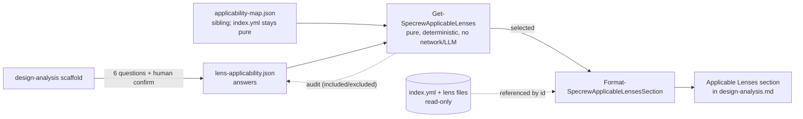
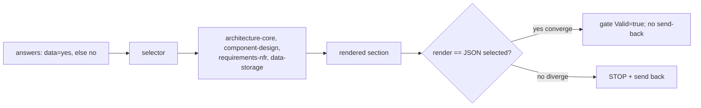

# Review Diagrams: Iteration 004

**Schema**: v1
**Reviewed**: 2026-06-03

## Questionnaire-driven lens selection (FR-025, Option B decoupled)

## Dogfood (iteration-4's own design analysis)

## Notes

- The `index.yml` catalog is read-only (referenced by lens id for links); the gating lives in the
  decoupled sibling `applicability-map.json`. The dogfood converged (CONVERGE=True), so the
  send-back branch was not taken.
