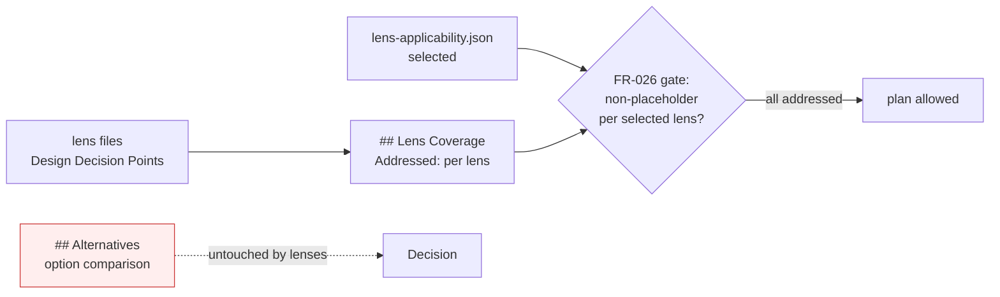
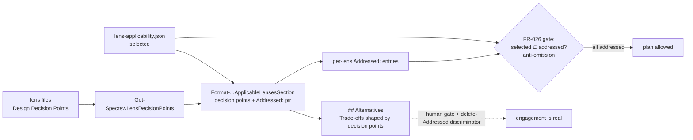
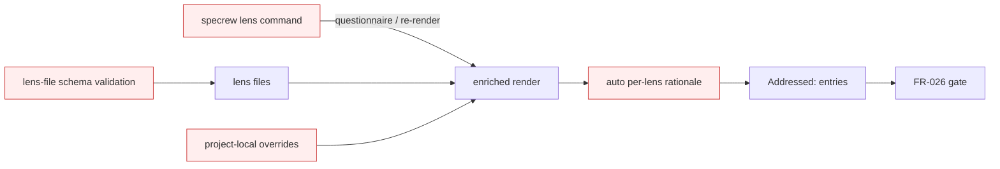

# Design Analysis — Feature 141 / Iteration 005

**Feature**: 141-design-gate-runtime-hardening  
**Iteration**: 005 (Lens-informed analysis + FR-026 lens-coverage gate — FR-009/FR-010/FR-026, Amendment A2)  
**Date**: 2026-06-03  
**Spec**: file:///C:/Dev/Specrew-design-analysis/specs/141-design-gate-runtime-hardening/spec.md  
**Builds on**: Iteration 4 (the FR-025 questionnaire, the sibling `applicability-map.json`, and the pure deterministic selector in `scripts/internal/lens-applicability.ps1`) and the Iteration 1 design-analysis gate (`scripts/internal/design-analysis-gate.ps1`).

## Problem Framing

Iteration 4 shipped the selection plumbing — a deterministic questionnaire→lens selector and a read-only "Applicable Lenses" section that **names** the selected lenses. The maintainer's verdict on a follow-up was blunt: *"No point in a followup, the user will not see any improvement."* That is correct, and it names the real gap. FR-009's stated intent is "the option comparison **informed by** the lens knowledge" — Iteration 4 delivered a list of names, which is form without the value. This is the same failure class the maintainer's memory is full of (file-presence ≠ runtime behavior; form-correct-but-substance-absent): the lenses existed in an artifact but never shaped the decision a human reads.

Amendment A2 un-defers the rest as the complete, state-of-the-art package: (1) **FR-009** must surface each selected lens's **Design Decision Points** so the option comparison is genuinely shaped by them, and (2) **FR-026** must make the pre-plan gate **enforce lens coverage** — block `plan.md` when a selected lens is unaddressed.

What is open — and is genuinely a fork, not a foregone conclusion — is **where lens engagement lives and what the gate can honestly enforce**. A deterministic, LLM/network-free gate *cannot judge whether engagement is genuine*; it can only check structure. So the load-bearing risk is that FR-026, built naively, becomes a checkbox that passes on `Addressed: yes` — reproducing Iteration 4's disappointment one layer up. The design must put the value where a human will see it and frame the gate honestly as what it is.

Constraints carried in (binding): stay within the 20 SP cap; keep selection **deterministic + LLM/network-free**; keep the Proposal 156 catalog `index.yml` **pure** (the gating map stays in the sibling file); do **not** pull deferred Proposal 156 deep automation (lens-file schema validation, project-local overrides, broad cross-phase automation, a standalone command); no release/Unix/wrapper surfaces; no push/PR while Feature 141 is in progress.

## Key Design Decision Points

1. **Where lens engagement lives** — in a standalone coverage checklist the gate scans (engagement disconnected from the decision), vs. **fed into the option comparison itself** (each option's Trade-offs/Quality-features shaped by the relevant decision points), vs. fully automated with machine-written rationale.
2. **What FR-026 can honestly enforce** — a deterministic gate can verify *presence* (a non-placeholder coverage entry per selected lens = anti-omission) but **cannot** verify *engagement quality*. The design must not overclaim the gate as a quality guarantee.
3. **How genuine engagement is actually guaranteed** — by the human design-analysis gate reading the artifact, plus a **delete-the-`Addressed:`-lines discriminator** at review-signoff: if removing the coverage entries leaves the option comparison still visibly shaped by the lenses, engagement is real; if the analysis goes blank, it was theater → send back.
4. **The data contract for coverage** — what owns the decision-point text (the lens files), the selection (`lens-applicability.json`), and the coverage entries (`design-analysis.md`), and the consistency invariant the gate enforces between them.
5. **How far the machinery goes** — extractor + enriched render + anti-omission gate (this iteration) vs. the deferred 156 deep automation (schema validation, standalone command, auto-rationale, overrides).

## Alternatives

### Option A: Simplest — standalone coverage checklist the gate keys off

**Approach**: Add a separate `## Lens Coverage` section to the template with one `Addressed: <text>` line per selected lens. FR-026 scans only that section: every lens in `lens-applicability.json`'s `selected` must have a non-placeholder `Addressed:` line, else block `plan`. The decision points (FR-009) are surfaced in that section, but the `## Alternatives` option comparison is left untouched — the lenses live only in the checklist.

**Architectural pattern**: Checklist-as-artifact; the gate keys off a dedicated section; decision points are *not* fed into the option comparison.

**Quality features considered**: *(architecture-core — "which option balances simplicity/reversibility/future cost?")* cheapest and most reversible, but the lenses do **not** touch the decision the option comparison records. *(data-storage — "consistency model")* the selected⊆addressed invariant is still enforceable (json `selected` vs. checklist entries). *(requirements-nfr — "acceptance criteria that prove quality, not the happy path")* this is the option's fatal weakness: a one-word `Addressed: considered` passes, and **deleting the checklist leaves the analysis showing zero lens influence** — the Iteration-4 form-without-value gap, relocated. *(component-design)* gate↔selector coupling is clean (gate reads the checklist section), but the engagement is decoupled from the decision it should inform.

**Effort estimate**: ~6–8 SP.

**Reversibility cost**: High — an additive section plus a presence check; trivially removable.

**Trade-offs**:

- (+) Cheapest; the deterministic check is trivial (section present + non-placeholder per selected lens).
- (+) Enforces the data-consistency invariant (selected ⊆ addressed).
- (−) **Theater by construction**: engagement lives only in a checkbox the option comparison never reads; `Addressed: yes` passes. Fails the delete-the-`Addressed:`-lines discriminator outright.
- (−) FR-009's decision points are surfaced but disconnected from the decision they are meant to inform — exactly the gap the maintainer rejected.

**Diagram**:

### Option B: Reasonable — decision points feed the option comparison; the gate is an anti-omission backstop

**Approach**: `Get-SpecrewLensDecisionPoints` extracts each selected lens's `## Design Decision Points` from its catalog file (pure, read-only). `Format-SpecrewApplicableLensesSection` renders, per selected lens, its decision points **plus** an `Addressed:` entry that *points into* the option comparison (e.g. "Addressed: see Option B Trade-offs — eventual-consistency invariant"). The option Trade-offs/Quality-features are authored to engage the relevant decision points. FR-026 (in `design-analysis-gate.ps1`) deterministically checks: for each lens in `lens-applicability.json`'s `selected`, a non-placeholder `Addressed:` entry exists → else block `plan`, **naming** the unaddressed lens. **Honest scope, stated in the gate output and docs**: FR-026 prevents a selected lens being silently *omitted*; it does not and cannot judge engagement *quality*. Genuine engagement is guaranteed by the human design-analysis gate + the delete-the-`Addressed:`-lines discriminator at review-signoff.

**Architectural pattern**: A pure decision-point extractor + an enriched renderer + a deterministic **anti-omission** gate keyed off the per-lens coverage entry; the quality bar is human + dogfood, not machine. The gate↔renderer contract is the artifact's coverage entries, not the selector's internals (decoupled).

**Quality features considered**: *(requirements-nfr — "which NFRs are design drivers / acceptance criteria that prove quality not the happy path")* determinism (SC-015 holds — the gate is a structural check), fail-safe degradation (no json / no lenses → gate no-ops, SC-006), and the new SC-016 (block on an unaddressed selected lens); the acceptance criterion that *proves* quality is the delete-the-`Addressed:`-lines discriminator + a negative test that a placeholder entry FAILS. *(data-storage — "consistency model / what owns each data type")* the gate's core check is the invariant selected(json) ⊆ addressed(md); lens files own the decision-point text, the json owns answers/selection, the md owns the coverage entries — additive to the existing artifacts, no migration. *(component-design — "what stays separate / where schemas decouple from internal models")* extractor, renderer, and gate are separate pure units coupled only through the artifact coverage contract. *(architecture-core — "which constraints are binding")* deterministic + LLM/network-free + `index.yml` pure + no deferred 156 scope, all honored; the volatile question→lens map stays in the sibling data file.

**Effort estimate**: ~14–18 SP (within the 20 cap).

**Reversibility cost**: Medium — extractor + enriched render + gate check are additive, but the design-analysis render and the gate now depend on the coverage contract.

**Trade-offs**:

- (+) The value is in the analysis a human reads: the options are visibly shaped by the lenses (architecture-core's "which option balances…", the data-storage consistency invariant, etc.). **Delete the `Addressed:` lines and the option Trade-offs still show lens influence** — the discriminator passes.
- (+) Honest gate framing: FR-026 is an anti-omission backstop with a measurable threshold (a non-placeholder entry per selected lens), **not** a quality guarantee — said plainly, no overclaim.
- (+) Enforces the data-consistency invariant (selected ⊆ addressed) and keeps the gate↔renderer contract decoupled.
- (−) More moving parts than A: an extractor, an enriched renderer, a gate check, and a discriminator test.
- (−) The genuine-engagement bar still depends on human judgment + the dogfood discriminator; the gate alone cannot guarantee it (stated honestly rather than hidden).

**Recommended for**: Exactly this iteration — it delivers FR-009's actual intent and FR-026's enforcement while keeping the gate honest about what determinism can and cannot prove.

**Diagram**:

### Option C: By-the-book — Option B plus the deferred Proposal 156 deep automation

**Approach**: Everything in B, plus: validate each lens **file** against a schema (Design Decision Points present + well-formed), add a standalone `specrew lens` command to run the questionnaire / re-render / re-check out of band, auto-generate per-lens "how addressed" rationale text, and support project-local lens overrides.

**Architectural pattern**: Schema-validated lens catalog + standalone CLI + rationale automation + override layer — the full Proposal 156 deep automation.

**Quality features considered**: *(architecture-core — "what is deliberately out of scope for this iteration?")* the most auditable shape, but the schema-validation enforcement, standalone command, rationale automation, and overrides are **exactly** FR-010's still-deferred 156 scope. *(requirements-nfr)* auto-generated rationale risks re-introducing engagement theater — machine-written `Addressed:` text that no human engaged — which is the precise failure Option B is built to prevent. *(component-design)* a standalone command and override layer are entrenched, low-reversibility surfaces.

**Effort estimate**: ~28+ SP — **exceeds the per-iteration cap** and pulls deferred scope forward.

**Reversibility cost**: Low — a standalone command + schema enforcement + override layer are entrenched.

**Trade-offs**:

- (+) Most complete and auditable; lens files validated; downstream overrides.
- (−) **Its distinguishing pieces (lens-file schema-validation enforcement, standalone command, auto-rationale, overrides) are exactly what FR-010 still defers, and it breaks the cap.**
- (−) Auto-rationale would re-introduce the engagement theater Option B exists to prevent.

**Recommended for**: A future iteration, once the deferred Proposal 156 deep automation is approved on its own merits.

**Diagram**:

## Applicable Lenses

*(Dogfood: selection via the implemented FR-025 selector — `lens-applicability.json` answers `data=yes`, all others `no` → the deterministic selector returns the set below, confirmed reproducible. The decision points are surfaced here by hand from the lens files because the Iteration-5 enrichment that automates this is what this analysis decides; the review-signoff dogfood will confirm the implemented enriched render reproduces this section. Each `Addressed:` entry points into the option comparison above — delete them and the option Trade-offs still show the lens influence, which is the Option B discriminator, satisfied on this very artifact.)*

Selected by the applicability questionnaire (recorded in `lens-applicability.json`):

- **architecture-core** — `extensions/specrew-speckit/knowledge/design-lenses/architecture-core.md`
  - Decision points: major building blocks + responsibilities; which volatile areas to isolate behind data/interfaces; binding constraints vs. preferences; what is out of scope; which option balances simplicity/reversibility/future cost.
  - Addressed: the building blocks are the extractor / renderer / gate (each option states them); the volatile question→lens map is isolated in the sibling data file; binding constraints (deterministic, LLM/network-free, `index.yml` pure, no deferred 156) gate the option choice and rule C out of scope; the simplicity/reversibility/future-cost balance **is** the A/B/C decision — see each option's Quality-features and the Crew Recommendation.
- **component-design** — `extensions/specrew-speckit/knowledge/design-lenses/component-design.md`
  - Decision points: what belongs together vs. separate; dependency direction; the right abstraction (function/helper/data file/…); where schemas decouple from internal models; extension mechanism.
  - Addressed: Option B keeps the extractor, renderer, and gate as separate pure units; the gate depends *inward* on the artifact coverage contract, not on renderer/selector internals (the decoupling Option A only partially achieves); the abstractions are pure functions + data files; extension is data-file-driven (add a lens + a map entry, no code change) — see Option B Architectural pattern.
- **requirements-nfr** — `extensions/specrew-speckit/knowledge/design-lenses/requirements-nfr.md`
  - Decision points: which NFRs drive the design; mandatory vs. preference; measurable thresholds; what needs clarification; acceptance criteria that prove quality, not the happy path.
  - Addressed: the design-driver NFRs are determinism (SC-015), fail-safe degradation (SC-006), and the new SC-016; the measurable threshold the gate checks is "non-placeholder coverage entry per selected lens" (mandatory), with the honest caveat that engagement *quality* is **not** machine-measurable; the acceptance criterion that proves quality is the delete-the-`Addressed:`-lines discriminator + a placeholder-fails-gate negative test — see Option B Quality-features and Trade-offs.
- **data-storage** — `extensions/specrew-speckit/knowledge/design-lenses/data-storage.md`
  - Decision points: persistent vs. transient; what owns each data type; storage model; consistency model; schema change/migration; avoid reaching into another component's private store.
  - Addressed: storage is flat files (md + json), no DB; lens files own the decision-point text, the json owns answers/selection, the md owns the coverage entries; the **consistency model is the FR-026 invariant** — selected(json) ⊆ addressed(md), enforced by the gate; the contract is additive (no migration); the gate reads the artifact coverage contract rather than reaching into the selector's internal model — see Option B Quality-features (the consistency invariant is the gate's core check).

*Not selected: ui-ux (ui=no), security-compliance (security=no), integration-api (integration=no), devops-operations (ops=no), observability-resilience (perf=no).*

## Crew Recommendation

**Recommended: Option B.**

Rationale: Option B is the only option that delivers FR-009's actual intent — the option comparison genuinely shaped by the lens knowledge (the delete-the-`Addressed:`-lines discriminator passes, demonstrably, on this very artifact) — while keeping FR-026 **honest**: an anti-omission backstop with a measurable threshold, not a quality guarantee. Option A (standalone checklist) reproduces exactly the Iteration-4 form-without-value gap the maintainer rejected — engagement lives in a checkbox the decision never reads, and deleting the checklist leaves the analysis showing zero lens influence. Option C is the right *eventual* shape, but its distinguishing pieces (lens-file schema-validation enforcement, a standalone command, auto-rationale, overrides) are exactly FR-010's still-deferred Proposal 156 deep automation, it breaks the cap, and its auto-rationale would re-introduce the very engagement theater Option B is built to prevent.

The honest limit, stated plainly so it is not silently lost once the gate goes green: **a deterministic, LLM/network-free gate cannot guarantee genuine lens engagement.** FR-026 guarantees only that no selected lens is silently omitted. The genuine-engagement quality bar is enforced by two human-facing controls, not the gate: (1) the human reads the option comparison at the design-analysis gate, and (2) at review-signoff the implementer applies the **delete-the-`Addressed:`-lines discriminator** — if removing the coverage entries leaves the options still visibly shaped by the lenses, engagement is real; if the analysis goes blank, it was theater and the iteration is sent back to itself. This discriminator is a binding review-signoff step for Option B, carried into the plan.

## Human Decision

- **Decision verdict**: *awaiting human decision at the design-analysis gate*
- **Chosen option**: *pending*
- **Reason**: *pending*
- **Modifications**: *pending*
- **Design-analysis draft commit**: *(this draft; the decision will be recorded in a later commit that differs from the draft commit)*
- **Decision recorded in commit**: *pending*
