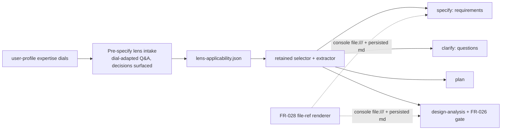
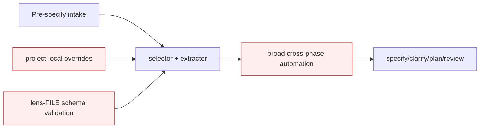

# Design Analysis — Feature 141 / Iteration 006

**Feature**: 141-design-gate-runtime-hardening
**Iteration**: 006 (interactive, pre-clarify lens intake — FR-009/FR-025/FR-027/FR-028/FR-029, Amendment A3)
**Date**: 2026-06-04
**Spec**: file:///C:/Dev/Specrew-design-analysis/specs/141-design-gate-runtime-hardening/spec.md
**Builds on**: Iterations 4-5 (the deterministic selector, sibling `applicability-map.json`, decision-point extractor, and FR-026 coverage gate — all retained as the engine).

## Problem Framing

A maintainer manual end-to-end test showed the Iteration 4-5 lens feature missed its core intent: the questionnaire was **auto-answered by the agent at the design-analysis stop** (post-clarify). Amendment A3 re-scopes it: lens selection MUST be an **interactive, expertise-adapted human intake** (FR-025) run **before clarify** (FR-027) so its answers shape the requirements, clarify questions, design, and plan (FR-009). The engine (selector/map/extractor/FR-026 gate) is sound and retained; what changes is **when** it runs, **who** answers, and **how** the answers flow. Two adjacent fixes ride along: the file-reference context model (FR-028 — console `file:///` vs persisted markdown links) and the downstream `Specrew.psd1` FileList-sort guard (FR-029); the handoff bare-path false-positive is part of FR-028.

The open HOW: **where** in the lifecycle the intake sits and **how** the interaction adapts to the human's expertise.

## Key Design Decision Points

1. **Placement** — at session intake before `specify` (lenses shape the spec itself), vs. between `specify` and `clarify` (spec drafted first, lenses shape clarify + plan). FR-027 requires "before clarify"; the fork is before-vs-after `specify`.
2. **Interaction model** — how the 6 material questions are posed and adapted: a flat one-shot prompt vs. depth-adapted by the user-profile expertise dials (F-016: terse expert questions where a dial is high; explain + recommend where low), with each lens decision surfaced for confirmation.
3. **Answer flow** — how the selected lenses' decision points reach `specify`, `clarify`, and `plan` (a recorded early artifact the later phases consume).
4. **File-reference context model (FR-028)** — one render helper that emits `file:///` for console and markdown links for persisted artifacts; the handoff bare-path rule stops flagging `token/token` prose.
5. **Scope discipline** — reuse the F-016 interaction model + user-profile dials and the Iteration 4-5 engine; keep deep Proposal 156 automation deferred (FR-010).

## Alternatives

### Option A: Simplest — run the existing questionnaire earlier, flat

**Approach**: Move the existing questionnaire to session intake (before `specify`) and pose the 6 questions once via a single flat structured prompt (no dial adaptation); record `lens-applicability.json`; feed the selected lenses to `specify`. The selection engine is unchanged.
**Architectural pattern**: Relocate-in-place; one flat prompt; no interaction-model integration.
**Quality features considered**: *(requirements-nfr)* delivers "early" (FR-027/SC-017) cheaply, but only **partially** "expertise-adapted" (FR-025/SC-018) — a flat prompt ignores the dials. *(ui-ux)* one journey, no depth adaptation. *(architecture-core)* smallest change.
**Effort estimate**: Small (~50% of B).
**Reversibility cost**: Medium — adding dial-adaptation later reworks the prompt layer.
**Trade-offs**:

- (+) Cheapest; delivers the before-clarify placement.
- (−) Misses FR-025's "expertise-adapted" intent — the exact gap #2 raised; a flat prompt is the autopilot's cousin.
- (−) SC-018 (dial-adapted, no silent auto-resolve) only half-met.

**Diagram**:

### Option B: Reasonable — dedicated pre-clarify, dial-adapted lens-intake step (recommended)

**Approach**: A dedicated **pre-`specify` lens-intake lifecycle step** that interactively poses the 6 material questions via the host structured prompt, **depth-adapted by the user-profile expertise dials** per the F-016 interaction model (terse expert questions where a dial is high — e.g. architect 10; explain + recommend a default where low), surfaces each resulting lens decision for confirmation, and records `lens-applicability.json` early. The selected lenses' **decision points feed `specify` (requirements), `clarify` (questions), and `plan`** — not only `design-analysis.md`. The Iteration 4-5 engine (selector, sibling map, extractor, FR-026 gate) is reused unchanged. Ships with the **FR-028 file-reference render helper** (console `file:///` + persisted markdown links; handoff bare-path rule no longer flags `token/token` prose) and the **FR-029 FileList-sort guard**.
**Architectural pattern**: A new pre-`specify` lifecycle step + a dial-adapter over the F-016 interaction model; the retained selection engine; a flow-injector that hands selected lenses' decision points to the downstream phases; a context-aware file-reference renderer.
**Quality features considered**: *(requirements-nfr)* SC-017 (before clarify), SC-018 (interactive + dial-adapted + no silent auto-resolve), SC-019 (file-ref context) are the design drivers and each is observable/testable. *(ui-ux)* the primary journey is "the human answers lens questions adapted to their expertise"; the **expertise dials are the source of UX truth**; decisions are surfaced (no silent state); interruption = re-ask/confirm. *(component-design)* intake-step / dial-adapter / selector(retained) / flow-injector / renderer are separate units; the intake **reuses** F-016 + the user-profile dials rather than reinventing. *(data-storage)* `lens-applicability.json` is the early single source the later phases consume; additive, no migration. *(architecture-core)* binding constraints (before-clarify, deterministic engine retained, no deferred 156) make B the balance point.
**Effort estimate**: Medium (baseline) — likely a 2-part iteration (intake+flow; then FR-028/FR-029).
**Reversibility cost**: Low-Medium — the intake step is additive; the engine is untouched.
**Trade-offs**:

- (+) Delivers FR-025 + FR-027 + FR-009 as intended: interactive, early, expertise-adapted, lifecycle-shaping.
- (+) Reuses F-016 + the dials + the Iteration 4-5 engine — no reinvention.
- (+) The value is the human experience the maintainer asked for, not a checkbox.
- (−) Larger than A; touches the lifecycle sequence (a new pre-`specify` step) + the coordinator prompt.
- (−) The dial→depth mapping is a new judgment surface that needs its own tests.

**Recommended for**: exactly this re-scope — it is the faithful encoding of the maintainer's #2/#3 intent.

**Diagram**:

### Option C: By-the-book — Option B plus the deferred Proposal 156 deep automation

**Approach**: B plus project-local lens overrides, lens-FILE schema validation, and broad cross-phase lens automation.
**Architectural pattern**: B + the full Proposal 156 automation layer.
**Quality features considered**: *(architecture-core "out of scope?")* the override/schema/broad-automation pieces are exactly FR-010's still-deferred 156 scope; *(requirements-nfr)* no current FR/SC requires them.
**Effort estimate**: Large (~2× B) — exceeds the iteration cap.
**Reversibility cost**: High — overrides + schema enforcement are entrenched surfaces.
**Trade-offs**:

- (+) Most complete; downstream overrides.
- (−) **Its distinguishing pieces are FR-010's deferred 156 automation and break the cap.**

**Recommended for**: a future iteration once the deferred 156 scope is approved on its own.

**Diagram**:

## Applicable Lenses

*(Dogfood: rendered via the implemented enriched path for this iteration's answers — `ui=yes` (this feature IS a human-interaction surface), `data=yes`, rest no → the five lenses below; decision points verbatim from the lens files. Each `Addressed:` entry points into the option comparison above; delete them and the option Trade-offs still engage the lenses — the discriminator. This iteration is FR-026-era (not grandfathered), so the gate enforces these entries.)*

Selected by the applicability questionnaire (recorded in `lens-applicability.json`):

- **architecture-core** - `extensions/specrew-speckit/knowledge/design-lenses/architecture-core.md`
  - Decision points: major building blocks + responsibilities; volatile areas isolated behind data/interfaces; binding constraints vs. preferences; out of scope; which option balances simplicity/reversibility/future cost.
  - Addressed: the building blocks are the pre-specify intake step / dial-adapter / retained selection engine / flow-injector / file-ref renderer (Option B Approach); the volatile interaction-depth is isolated behind the F-016 dial mapping; binding constraints (before-clarify FR-027, engine retained, no deferred 156) rule Option A partial and Option C out; the balance is Option B — see Crew Recommendation.
- **component-design** - `extensions/specrew-speckit/knowledge/design-lenses/component-design.md`
  - Decision points: responsibilities together vs. separate; dependency direction; right abstraction; where schemas decouple; extension mechanism.
  - Addressed: Option B keeps intake/dial-adapter/selector/flow-injector/renderer as separate units; the intake depends inward on the F-016 interaction model + user-profile dials (reused, not reinvented); the Iteration 4-5 engine is retained; extension stays data-file-driven — see Option B Architectural pattern.
- **requirements-nfr** - `extensions/specrew-speckit/knowledge/design-lenses/requirements-nfr.md`
  - Decision points: which NFRs drive design; mandatory vs. preference; measurable thresholds; what needs clarification; acceptance criteria beyond the happy path.
  - Addressed: the design-driver NFRs are SC-017 (runs before clarify), SC-018 (interactive + dial-adapted + no silent auto-resolve), SC-019 (file-ref context); each is the measurable threshold the iteration must prove — see Option B Quality features. Option C is rejected NFR-wise (no SC needs 156 automation).
- **ui-ux** - `extensions/specrew-speckit/knowledge/design-lenses/ui-ux.md`
  - Decision points: source of UX truth; primary journeys + interruption/recovery; client/server/streamed state; loading/empty/error/disabled states; which state lives where; accessibility/localization constraints.
  - Addressed: the **source of UX truth is the user-profile expertise dials** (they drive question depth); the primary journey is the dial-adapted lens Q&A with each decision surfaced for confirmation (Option B); interruption/recovery = re-ask/confirm; the answer state lives in `lens-applicability.json` (durable). This lens most directly shapes the feature, which is why Option A (flat prompt) under-serves it.
- **data-storage** - `extensions/specrew-speckit/knowledge/design-lenses/data-storage.md`
  - Decision points: persistent vs. transient; what owns each data type; storage model; consistency model; schema change/migration; avoid reaching into another component's store.
  - Addressed: `lens-applicability.json` is the **early single source** the downstream phases (specify/clarify/plan) consume (Option B answer-flow); the intake step owns the write, later phases read; storage is a flat file; additive, no migration — see Option B data-storage notes.

*Not selected: security-compliance (security=no), integration-api (integration=no), devops-operations (ops=no), observability-resilience (perf=no).*

## Crew Recommendation

**Recommended: Option B.**

Option B is the faithful encoding of the maintainer's re-scope: an interactive, expertise-adapted lens intake that runs before clarify and shapes the lifecycle, reusing the F-016 interaction model + the user-profile expertise dials + the Iteration 4-5 engine — no reinvention. Option A delivers the *early* placement but keeps a flat prompt, leaving FR-025/SC-018's "expertise-adapted, no silent auto-resolve" only half-met — the precise gap #2 raised. Option C pulls FR-010's still-deferred Proposal 156 automation forward and breaks the cap. On the open forks: decision point #1 (placement) resolves to **before `specify`** so the lenses shape the requirements themselves (your #3); decision point #2 (interaction) resolves to **dial-adapted** depth.

The honest scope note: Option B is likely a **2-part iteration** (intake + lifecycle flow first; FR-028 file-reference model + FR-029 guard second) — the plan will propose the split.

## Human Decision

- **Decision verdict**: approved for plan with Option B
- **Chosen option**: Option B
- **Reason**: Option B faithfully encodes the A3 re-scope — an interactive, expertise-adapted lens intake that shapes the lifecycle, reusing the F-016 interaction model + user-profile dials + the Iteration 4-5 engine. Option A's flat prompt half-meets the expertise-adapted intent; Option C pulls deferred Proposal 156 automation.
- **Modifications (PLACEMENT CLARIFIED — binding)**: The lens intake is **part of the `specify` phase** and MUST complete **before the `specify` boundary is finalized/synced** (and therefore before `clarify`), so the **accepted specify output is lens-informed**. Implementation rule, in priority order: **(a)** if the Crew can ask the lens questions *before* invoking `/speckit.specify`, do that; **(b)** otherwise it is acceptable for Spec Kit to scaffold the initial spec draft first — then immediately run the interactive lens intake, record `lens-applicability.json`, **amend `spec.md` + the requirements checklist with the lens-informed requirements, validate, and only then run sync-specify**; **(c)** "between specify-sync and clarify" is **NOT** acceptable, because then the accepted specify output was not lens-informed. Keep Option B's **dial-adapted interaction model**: ask the human about the material areas (e.g. UI, performance/resilience), adapt depth to the user profile, explain/recommend where useful, and **surface the final lens decisions before writing them into artifacts**. **FR-028 and FR-029 are included** in this iteration's scope. (This is a stricter satisfaction of FR-027's "before clarify" — specify-sync precedes clarify.)
- **Design-analysis draft commit**: `92286c76`
- **Decision recorded in commit**: `3e610c4a` (the commit that recorded this populated decision; differs from the draft commit `92286c76`)
