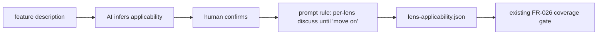
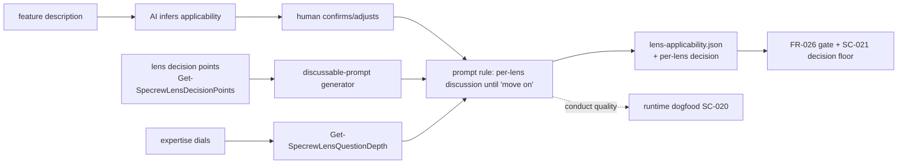
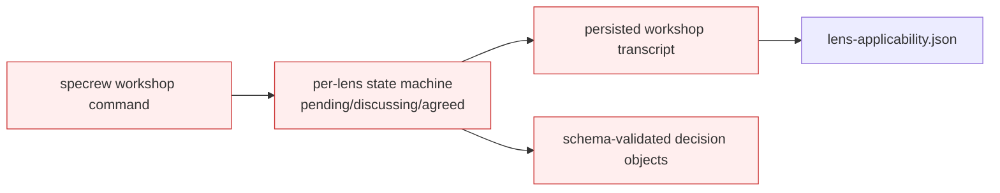

# Design Analysis — Feature 141 / Iteration 007

**Feature**: 141-design-gate-runtime-hardening
**Iteration**: 007 (lens intake becomes a per-lens facilitated design workshop — FR-025/FR-009, Amendment A4)
**Date**: 2026-06-04
**Spec**: [spec.md](../../spec.md)
**Builds on**: Iterations 4-6 (the deterministic selector, sibling `applicability-map.json`, decision-point extractor `Get-SpecrewLensDecisionPoints`, the FR-026 coverage gate, the enforced specify-boundary lens gate, and the dial→depth helper — all retained as the engine beneath the workshop).

## Problem Framing

A second maintainer end-to-end test (downstream greenfield, Claude host) confirmed the Iteration 6 intake is interactive, early, and expertise-adapted — but still a **binary applicability questionnaire** ("which apply: UI? data?"). The maintainer rejects it: it asks the human to confirm *obvious* applicability the AI already infers, and it never *discusses* any lens. Amendment A4 re-scopes FR-025 to a **per-lens facilitated design workshop**: the AI **infers** applicability (human confirms/adjusts — no obvious yes/no), then for each applicable lens acts as **workshop coordinator** — raising that lens's substantive design questions (from its decision points; e.g. UI → theme, controls, layout, contrast, DPI, smoothness, technology), offering options, capturing the human's decisions and explicit agreement, adapting depth to the expertise dial, and **iterating until the human says "move on"** before the next lens. This is the architecture **requirements-workshop** method (the architect is obligated to ask the quality-attribute questions the customer won't; questionnaires fail for lack of an interactive, guided conversation).

The decisive constraint from the test: **the FR-026 coverage gate cannot enforce this.** The agent emitted a structurally valid `lens-applicability.json` the gate PASSES while the behavior was exactly what the maintainer rejects. So the workshop **conduct** is a **behavioral/prompt** capability validated by a **runtime dogfood (SC-020)**; the only deterministic floor is "a non-placeholder per-lens decision was recorded" (SC-021). The open HOW: **how much deterministic scaffolding** to build around an irreducibly behavioral conduct, without building scaffolding that doesn't touch the real gap.

## Key Design Decision Points

1. **Deterministic scaffolding depth** — pure prompt rule (conduct only) vs. prompt rule + a discussable-prompt generator + a thin per-lens-decision gate vs. a full stateful workshop engine. This is the central fork.
2. **Applicability: infer-then-confirm** — the AI proposes which lenses apply (with reasoning) from the feature description; the human confirms/adjusts; the retained selector maps confirmed applicability → lenses. No obvious yes/no.
3. **Discussable-prompt source** — enrich the **existing** per-lens decision points (`Get-SpecrewLensDecisionPoints`, FR-009) into the questions the coordinator raises; the architecture-book NFR taxonomy informs phrasing/depth baked into the lens `.md` decision points. **No new parallel question bank**; `index.yml` stays pure.
4. **"Move on" + right-sizing** — the coordinator proposes which lenses warrant deep discussion vs. a quick confirm (scaled to the feature + expertise), and advances to the next lens only on the human's explicit "move on" — not a fixed nine-lens marathon.
5. **The enforceable floor (SC-021)** — extend `lens-applicability.json` to record a per-lens decision/agreement entry, and have the FR-026 gate require a **non-placeholder** entry per selected lens. Honest: this enforces *recording*, not *quality*.
6. **Scope discipline** — reuse the Iteration 4-6 engine; book informs phrasing only; keep deferred Proposal 156 automation out (FR-010); conduct quality is proven by the runtime dogfood, not a unit test.

## Alternatives

### Option A: Simplest — pure prompt rule (conduct only)

**Approach**: Add one lifecycle prompt rule instructing the Crew to run the per-lens workshop — infer applicability, confirm with the human, then for each applicable lens raise its decision-point questions, discuss, capture decisions, iterate until "move on". Reuse the existing extractor/render; record decisions in `lens-applicability.json`; the FR-026 gate stays exactly as-is (per-lens `Addressed:` coverage).
**Architectural pattern**: Prompt-only behavior change; zero new code; the existing engine and gate unchanged.
**Quality features considered**: *(requirements-nfr)* meets SC-020's *intent* but offers no new deterministic floor for SC-021 beyond the existing coverage check; *(ui-ux)* the workshop journey is entirely agent-improvised from the rule; *(architecture-core)* smallest possible change.
**Effort estimate**: Small (~40% of B).
**Reversibility cost**: Low — a prompt rule is trivially editable.
**Trade-offs**:

- (+) Cheapest; ships the workshop conduct immediately; nothing over-built.
- (−) No structured discussable-prompt generation — every coordinator re-improvises the per-lens questions, so depth/quality vary run-to-run (the same fragility that produced the questionnaire).
- (−) No explicit per-lens *decision* floor (SC-021) — the gate still only checks an `Addressed:` pointer, which the test already showed passes shallow artifacts.

**Diagram**:

### Option B: Reasonable — prompt rule + discussable-prompt generator + thin per-lens-decision gate (recommended)

**Approach**: (1) **Conduct** via a lifecycle prompt rule (infer-then-confirm applicability; per-lens discussion; "move on"; right-sizing; depth-adapted via the existing `Get-SpecrewLensQuestionDepth`). (2) A deterministic **discussable-prompt generator** that turns each selected lens's decision points into the agenda of questions the coordinator raises — reusing `Get-SpecrewLensDecisionPoints`, with the architecture-book NFR taxonomy informing the phrasing baked into the lens `.md` decision points (no parallel bank; `index.yml` pure). (3) A thin **schema + gate extension**: `lens-applicability.json` records a per-lens `decision`/agreement entry, and the FR-026 gate requires a **non-placeholder** decision per selected lens (SC-021). Conduct quality is proven by a **runtime dogfood** (SC-020).
**Architectural pattern**: Behavioral conduct (prompt) over a deterministic substrate — agenda generator (pure, reuses the extractor) + decision-recording schema + the extended coverage gate; the selector/dial-helper/specify-gate retained unchanged.
**Quality features considered**: *(requirements-nfr)* SC-020 (workshop conduct, dogfood-validated) and SC-021 (per-lens decision recorded, gate-checkable) are the design drivers — one behavioral, one deterministic, each honestly scoped. *(ui-ux)* the journey is "the coordinator walks me through each lens's real design questions, adapted to my level, until I say move on"; the **decision points are the agenda**, the **dials are the depth**, and decisions are surfaced + confirmed (no silent state). *(component-design)* agenda-generator / selector(retained) / dial-helper(retained) / decision-gate are separate units; the generator depends inward on the retained extractor. *(architecture-core)* binding constraints (build on decision points, thin enforceable surface, no deferred 156, conduct-is-behavioral) make B the balance point — A under-structures, C over-builds. *(data-storage)* `lens-applicability.json` gains an additive per-lens `decision` field; no migration (the explicit `fr026_grandfathered` path covers prior artifacts).
**Effort estimate**: Medium (baseline) — agenda generator + schema/gate extension + the prompt rule + tests for the deterministic floor.
**Reversibility cost**: Low-Medium — generator + schema field are additive; the gate extension reuses the FR-026 pattern.
**Trade-offs**:

- (+) Delivers the workshop conduct AND a deterministic agenda so per-lens questions don't re-improvise from scratch each run — the structure attacks the questionnaire fragility directly.
- (+) The SC-021 decision floor closes the "valid-but-shallow artifact passes" hole one notch (a *decision* must be recorded, not just a pointer) — while staying honest that quality is still behavioral.
- (+) Reuses the entire Iteration 4-6 engine + the book for phrasing; no parallel bank; `index.yml` pure; no deferred-156.
- (−) Larger than A; the agenda generator + schema field + gate extension each need tests.
- (−) Still cannot *enforce* conduct quality — the runtime dogfood remains the real acceptance gate (stated honestly, not hidden).

**Recommended for**: exactly this re-scope — the faithful, right-sized encoding of the maintainer's workshop intent with the thinnest deterministic floor that actually helps.

**Diagram**:

### Option C: By-the-book — full stateful workshop engine

**Approach**: B plus a machine-tracked per-lens state machine (pending → discussing → agreed), a persisted workshop-transcript artifact, schema-validated decision objects, and a `specrew workshop` command — i.e. the deferred Proposal 156 deep automation.
**Architectural pattern**: B + a stateful workshop runtime + schema enforcement + a standalone command.
**Quality features considered**: *(architecture-core "out of scope?")* the state machine / transcript / schema enforcement / standalone command are FR-010's still-deferred Proposal 156 scope; *(requirements-nfr)* no current FR/SC requires them, and none of them enforce *conduct quality* (still behavioral) — they add machinery around the part that machinery cannot fix.
**Effort estimate**: Large (~2× B) — exceeds the iteration cap.
**Reversibility cost**: High — a workshop runtime + a standalone command are entrenched surfaces.
**Trade-offs**:

- (+) Most rigorous bookkeeping; a durable transcript.
- (−) **Its distinguishing pieces are FR-010's deferred 156 automation, break the cap, and the rigor does not touch the behavioral gap the test exposed.**

**Recommended for**: a future iteration once the deferred 156 scope is approved on its own merits.

**Diagram**:

## Applicable Lenses

*(Dogfood: rendered for this iteration's answers — `ui=yes` (the workshop IS a human-interaction surface), `data=yes` (the artifact schema gains a decision field), rest no → the five lenses below; decision points verbatim from the lens files. Each `Addressed:` entry points into the option comparison above; delete them and the option Trade-offs still engage the lenses — the discriminator. FR-026-era, not grandfathered.)*

Selected by the applicability intake (recorded in `lens-applicability.json`):

- **architecture-core** - `extensions/specrew-speckit/knowledge/design-lenses/architecture-core.md`
  - Decision points: major building blocks + responsibilities; volatile areas isolated behind data/interfaces; binding constraints vs. preferences; out of scope; which option balances simplicity/reversibility/future cost.
  - Addressed: the building blocks are the conduct prompt rule / the discussable-prompt generator / the retained selector + dial-helper / the SC-021 decision gate (Option B); the volatile **conduct** is isolated as behavioral (prompt + dogfood) behind a thin deterministic substrate; binding constraints (build on decision points, thin floor, no deferred 156, conduct-is-behavioral) rule out A (under-structured) and C (deferred-156 + cap); the balance is Option B.
- **component-design** - `extensions/specrew-speckit/knowledge/design-lenses/component-design.md`
  - Decision points: responsibilities together vs. separate; dependency direction; right abstraction; where schemas decouple; extension mechanism.
  - Addressed: Option B keeps agenda-generator / selector / dial-helper / decision-gate as separate units; the generator depends inward on the retained `Get-SpecrewLensDecisionPoints`; the per-lens `decision` schema field is the decoupling point between conduct (writes) and gate (reads); extension stays data-file-driven (lens `.md` decision points).
- **requirements-nfr** - `extensions/specrew-speckit/knowledge/design-lenses/requirements-nfr.md`
  - Decision points: which NFRs drive design; mandatory vs. preference; measurable thresholds; what needs clarification; acceptance criteria beyond the happy path.
  - Addressed: the design-driver requirements are SC-020 (behavioral conduct — dogfood-validated, the explicit non-unit-testable threshold) and SC-021 (deterministic — a non-placeholder per-lens decision is recorded); the honest acceptance criterion beyond the happy path is "a structurally valid but shallow artifact must still fail SC-021's decision floor". Option C rejected NFR-wise (no SC needs 156 automation).
- **ui-ux** - `extensions/specrew-speckit/knowledge/design-lenses/ui-ux.md`
  - Decision points: source of UX truth; primary journeys + interruption/recovery; client/server/streamed state; loading/empty/error/disabled states; which state lives where; accessibility/localization constraints.
  - Addressed: the **source of UX truth is the workshop conduct** — the coordinator raises each lens's decision-point agenda, adapts depth to the dials, and advances only on the human's explicit "move on"; interruption/recovery = resume the current lens; decision state lives in `lens-applicability.json` (durable). This lens most directly shapes the feature, which is why Option A (no agenda structure) under-serves it and the runtime dogfood is the real check.
- **data-storage** - `extensions/specrew-speckit/knowledge/design-lenses/data-storage.md`
  - Decision points: persistent vs. transient; what owns each data type; storage model; consistency model; schema change/migration; avoid reaching into another component's store.
  - Addressed: `lens-applicability.json` gains an **additive per-lens `decision`/agreement field**; the workshop conduct owns the write, the FR-026 gate reads; flat-file storage; **no migration** (prior artifacts use the explicit `fr026_grandfathered` path) — Option B data-storage notes.

*Not selected: security-compliance (security=no), integration-api (integration=no), devops-operations (ops=no), observability-resilience (perf=no).*

## Crew Recommendation

**Recommended: Option B.**

Option B is the faithful, right-sized encoding of the A4 workshop intent. It builds the conduct as a prompt rule (the only place conduct can live — the test proved gates can't enforce it), but adds exactly two pieces of deterministic substrate that *do* help: a discussable-prompt generator so the per-lens questions come from the lens decision points rather than being re-improvised each run (attacking the questionnaire fragility at its root), and a thin per-lens-decision floor (SC-021) that makes a shallow-but-well-formed artifact fail one notch harder than today. Option A ships the conduct but leaves the per-lens questions to pure improvisation and adds no decision floor — likely reproducing the variability that produced the questionnaire. Option C wraps the behavioral gap in a state machine + transcript + standalone command — FR-010's deferred Proposal 156 scope, over the cap, and none of it enforces conduct quality.

The honest scope note carried into the plan: **conduct quality (SC-020) is behavioral and is accepted ONLY on a runtime dogfood**, not a green unit test (Iteration 6's retro rule). The deterministic pieces (generator, schema field, SC-021 gate, dial-depth) are unit-testable and will be tested; they are the floor, not the guarantee.

## Human Decision

- **Decision verdict**: approved for plan with Option B
- **Chosen option**: Option B (prompt rule for conduct + discussable-prompt generator from the decision points + thin per-lens-decision gate)
- **Reason**: Prompt-driven workshop conduct plus deterministic support where it actually helps — agenda generated from the lens decision points, and a thin SC-021 gate requiring a non-placeholder per-lens decision/agreement record. Option A is too weak (likely repeats the questionnaire failure); Option C is overbuilt and drifts into deferred Proposal 156 scope.
- **Modifications (maintainer instructions — binding pre-plan acceptance criteria)**:
  1. **006 closeout clean before planning** — SATISFIED: validator PASS for iteration 006 (hard=0/medium=0); T003 carried to this iteration; canonical defer entries recorded. Planning is authorized.
  2. **Boundary packet shape** — boundary stops MUST be presented and recorded as the canonical six-section human re-entry packet (Rule 46), not ad-hoc prose. The before-implement stop will use it.
  3. **SC-021 precise** — the per-lens record captures the generated agenda, a human decision/agreement summary, the depth used, and an explicit "move on"/agreement marker; the gate enforces non-placeholder PRESENCE only, never claims quality. (Spec SC-021 updated.)
  4. **Runtime dogfood is mandatory acceptance evidence** — unit tests cover the generator/schema/gate; review MUST require a real downstream run where the Crew facilitates the workshop lens by lens (SC-020). Not acceptable on unit tests alone.
  5. **Dogfood FR-028** — persisted .md artifacts use markdown links; console packets use visible file:/// URLs. (This design-analysis reconciled to markdown links; plan + review hold the line.)
- **Design-analysis draft commit**: `ad7bea7e`
- **Decision recorded in commit**: `57974536` (differs from the draft commit `ad7bea7e`)
