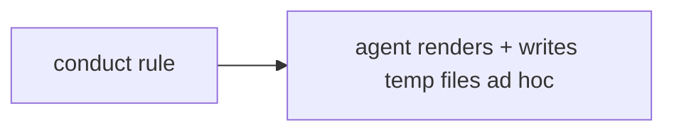
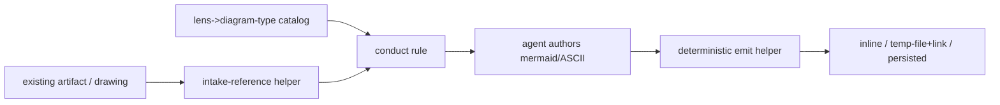
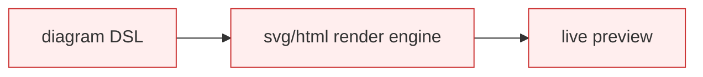

# Design Analysis — Feature 141 / Iteration 008

**Feature**: 141-design-gate-runtime-hardening
**Iteration**: 008 (workshop visuals — per-lens diagram vocabulary, Amendment A5)
**Date**: 2026-06-04
**Spec**: [../../spec.md](../../spec.md)
**Design intake**: this design was produced by **running the per-lens workshop** (the Iteration 7 capability) on this feature itself; the decisions are recorded in [lens-applicability.json](lens-applicability.json) (the SC-021 workshop record). This artifact synthesizes that workshop into the gate's option/decision form.

## Problem Framing

Make the lens workshop and design discussions a **visual whiteboard** (Amendment A5). The decisive reframe from the workshop: visuals are a **per-lens diagram vocabulary** — each design lens gets its native diagram (security → trust-boundary/attack-surface; data → ERD/NoSQL-doc-relations; architecture → component/service/flow; devops → deployment; ui-ux → layout/flow/state; cross-cutting → sequence flows + comparison tables) — not "UI mockups". The capability is the same **behavioral-content / deterministic-emit** split as the workshop conduct: the agent authors the diagram content; a deterministic helper emits the file + clickable link. Open HOW: how much deterministic scaffolding around the (behavioral) diagram authoring.

## Key Design Decision Points

1. **Scaffolding depth** — pure prompt rule vs. prompt rule + deterministic emit helper + a `lens → diagram-type` catalog vs. a full visual-rendering engine. (Central fork; the workshop settled it.)
2. **Per-lens diagram catalog** — a data file mapping each lens to its diagram type(s) + default render form; sibling to the design-lenses catalog (`index.yml` stays pure).
3. **Render + surface tiers** — inline → temp-file+`file:///` link → persisted; mermaid default, ASCII console, svg/html wireframes; emit reuses FR-028.
4. **Intake** — bidirectional, offered per lens (plot-from-description + bring-your-own → `file:///` reference + transcribe-to-mermaid).
5. **Temp lifecycle** — ephemeral under `.specrew/workshop-visuals/` (gitignored, cleaned at close); mermaid-inline keepers; svg/html referenced only when richer.

## Alternatives

### Option A: Simplest — pure prompt rule

**Approach**: a conduct-rule addition tells the agent to render diagrams (mermaid/ASCII) and write temp files itself; no helper, no catalog.
**Architectural pattern**: prompt-only; zero new code.
**Quality features considered**: *(requirements-nfr)* meets the intent cheaply but no deterministic emit (temp-file+link inconsistent) and no catalog (the per-lens vocabulary is re-improvised each run). *(architecture-core)* smallest change.
**Effort estimate**: Small.
**Reversibility cost**: Low.
**Trade-offs**: (+) cheapest. (−) no deterministic floor; the per-lens vocabulary varies run-to-run (the questionnaire-fragility lesson, again).

### Option B: Reasonable — prompt rule + emit helper + catalog (recommended; workshop-chosen)

**Approach**: a `lens → diagram-type → render-form` catalog (data); a deterministic emit helper (writes agent-authored content to the tier destination + returns the clickable `file:///` ref, reusing `Format-SpecrewFileReference`); an intake-reference helper; a conduct-rule addition (per applicable lens, offer the catalog diagram + ask for an existing artifact). Agent authors content (behavioral); helper emits (deterministic).
**Architectural pattern**: behavioral content over a deterministic substrate — the i7 split, reused.
**Quality features considered**: *(ui-ux)* tiered surface + bidirectional intake = the whiteboard journey. *(component-design)* catalog / emit / intake-reference are separate units; emit reuses FR-028. *(requirements-nfr)* ephemeral temp + mermaid-inline keepers + deterministic emit. *(security-compliance / data-storage / devops-operations)* each is a diagram-consuming lens — the catalog gives each its native form. *(architecture-core)* binding constraints (build on FR-028, deterministic emit, `index.yml` pure, no full engine) make B the balance.
**Effort estimate**: Medium.
**Reversibility cost**: Low-Medium (additive helpers + a data file).
**Trade-offs**: (+) deterministic emit + a stable per-lens vocabulary; reuses FR-028; honest behavioral/deterministic split. (−) more than A; the catalog + helper need tests. (−) the diagram *content* quality is still behavioral → SC-022 dogfood.

### Option C: By-the-book — full visual-rendering engine

**Approach**: B plus an svg/html generation engine, a diagram DSL, live preview.
**Architectural pattern**: B + a rendering runtime.
**Quality features considered**: *(architecture-core out-of-scope?)* the engine/DSL/preview are beyond any current FR/SC and over the cap.
**Effort estimate**: Large (over cap).
**Reversibility cost**: High.
**Trade-offs**: (+) richest. (−) over-cap; the diagram-authoring quality is still behavioral, so the engine doesn't buy the core value.

## Applicable Lenses

*(From the workshop record; the feature is a per-lens vocabulary, so the diagram-consuming lenses are selected alongside the foundational ones. FR-026-era.)*

- **architecture-core** - `extensions/specrew-speckit/knowledge/design-lenses/architecture-core.md`
  - Addressed: building blocks = catalog / emit helper / intake-reference / conduct-rule (Option B); volatile diagram-authoring isolated as behavioral; binding constraints (FR-028 reuse, deterministic emit, no engine) select B over A/C.
- **component-design** - `extensions/specrew-speckit/knowledge/design-lenses/component-design.md`
  - Addressed: emit / catalog / intake-reference as decoupled units; emit depends inward on `Format-SpecrewFileReference`; `index.yml` pure (catalog is a sibling) — Option B pattern.
- **requirements-nfr** - `extensions/specrew-speckit/knowledge/design-lenses/requirements-nfr.md`
  - Addressed: SC-022 (behavioral, dogfood) + SC-023 (deterministic floor) are the design drivers; ephemeral-temp + mermaid-inline keepers + deterministic LLM-free emit are the measurable NFRs.
- **ui-ux** - `extensions/specrew-speckit/knowledge/design-lenses/ui-ux.md`
  - Addressed: the whiteboard journey — tiered render+surface + bidirectional per-lens intake (Option B); the per-lens diagram vocabulary is the UX core.
- **security-compliance** - `extensions/specrew-speckit/knowledge/design-lenses/security-compliance.md`
  - Addressed: its catalog entry = trust-boundary + attack-surface diagram (the diagram-consuming lens served by the feature).
- **data-storage** - `extensions/specrew-speckit/knowledge/design-lenses/data-storage.md`
  - Addressed: its catalog entry = ERD + NoSQL document relations by JSON-path identity refs.
- **devops-operations** - `extensions/specrew-speckit/knowledge/design-lenses/devops-operations.md`
  - Addressed: its catalog entry = deployment topology diagram.

*Not selected: integration-api (accept-a-file, no live API), observability-resilience, performance.*

## Crew Recommendation

**Recommended: Option B** — the workshop-chosen shape. Pure-prompt (A) leaves the per-lens vocabulary to re-improvisation and adds no deterministic emit; the full engine (C) is over-cap and doesn't address the behavioral core (diagram authoring). B reuses the i7 behavioral/deterministic split and the FR-028 model. Conduct/content quality is SC-022's runtime (visual) dogfood; the catalog + emit helper are the SC-023 deterministic floor.

## Human Decision

- **Decision verdict**: approved for plan with Option B
- **Chosen option**: Option B
- **Reason**: Settled in the per-lens workshop the maintainer drove on this feature (decisions in lens-applicability.json): the per-lens diagram vocabulary + tiered render+surface + bidirectional intake + the catalog/emit/intake-reference build shape + ephemeral-temp/mermaid-inline keepers. The workshop IS the design authority for this iteration.
- **Modifications**: None beyond the workshop decisions (carried as the plan's acceptance criteria).
- **Design-analysis draft commit**: `aed6dd60`
- **Decision recorded in commit**: `18721b9e` (differs from the draft `aed6dd60`)
