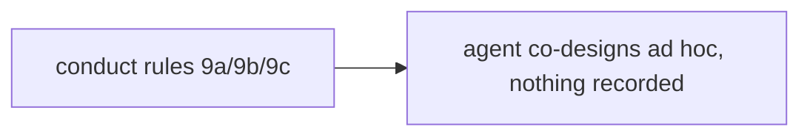
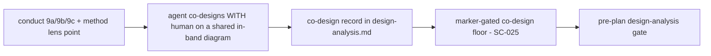
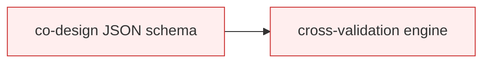

# Design Analysis — Feature 141 / Iteration 009

**Feature**: 141-design-gate-runtime-hardening
**Iteration**: 009 (collaborative architecture & design — Amendment A6)
**Date**: 2026-06-05
**Spec**: [../../spec.md](../../spec.md)
**Design intake**: Amendment A6 was settled at the requirements layer by the maintainer's disposition of the
iteration-8 visual-dogfood findings (AskUserQuestion: "Inside 141 (Amendment A6)") plus the direct build
authorization ("Continue, fix all, as much time as it take"). This artifact records the **HOW** — the build
shape for the A6 conduct and its deterministic floor — in the gate's option/decision form. It is itself
authored the pre-A6 way (i9 builds A6; A6 governs *future* features' design-analysis), so iteration 9's own
`lens-applicability.json` carries no `co_design` marker and the new floor no-ops on it.

## Problem Framing

The iteration-8 visual dogfood (testLenses4, feature 001-doc-translation) proved A4 (the per-lens workshop)
and A5 (visuals) fire, but the design work is still **a questionnaire followed by a unilateral deliverable,
not a collaboration**: the Crew never offered the design method/decomposition style as a discussion (#1), it
authored three finished architectures for the human to pick from rather than co-designing the components,
their responsibilities, and the flows (#2/#4), and the per-lens diagrams were written to disk but never
surfaced in-band so the human saw none (#3/#5). Amendment A6 (FR-034..FR-037) makes the design-analysis a
**co-design session**: frame the phases (FR-034), co-decide the design method/style (FR-035), co-build the
component/responsibility map + key flows WITH the human before presenting options (FR-036), and surface
visuals in-band (FR-037). Like A4/A5 the core is **behavioral** (prompt conduct), validated by a runtime
dogfood (SC-024); the open HOW is how much deterministic scaffolding sits under the behavioral co-design —
specifically the SC-025 co-design-record floor.

## Key Design Decision Points

1. **Scaffolding depth** — pure prompt rules vs. prompt rules + a marker-gated co-design-record gate floor
   + tests vs. a full structured co-design schema/validator engine. (Central fork; the A4/A5 precedent
   settles it.)
2. **Where the co-design record lives** — a `## Co-Design Record` section in `design-analysis.md` (the gate
   reads markdown, as FR-026 coverage already does) with the opt-in marker in `lens-applicability.json` (as
   FR-026/SC-021 markers already live).
3. **Grandfathering** — the floor MUST no-op on pre-A6 design-analysis artifacts (i1-i8, Feature 140, the
   testLenses4 run) — explicit marker opt-in, never inferred from absence (the FR-026/SC-021 precedent).
4. **Design-method surfacing** — a new architecture-core lens **decision point** (data, feeding the existing
   agenda generator) vs. a hardcoded prompt list. (Data keeps the agenda engine pure.)
5. **Surfacing strength** — tighten Rule 9b from *MAY-surface* to **MUST-surface-in-band** (FR-037), expected
   for structural + UI lenses (the i8 surfacing fix).

## Alternatives

### Option A: Simplest — pure prompt rules

+ **Approach**: add the A6 conduct as prompt rules only — Rule 9a phase-framing, Rule 9b surfacing
  strengthened to MUST-in-band, a new Rule 9c collaborative co-design at design-analysis, plus a
  design-method line in the architecture-core lens — with NO gate floor and NO recorded co-design.
+ **Architectural pattern**: prompt-only; zero new gate code.
+ **Quality features considered**: *(requirements-nfr)* meets the behavioral intent cheaply, but there is no
  deterministic anti-omission backstop — a unilateral design-analysis with no co-design record would still
  PASS the gate (the exact questionnaire-fragility the i6/i8 dogfoods keep teaching). *(architecture-core)*
  smallest change.
+ **Effort estimate**: Small.
+ **Reversibility cost**: Low.
+ **Trade-offs**: (+) cheapest, all-behavioral. (−) no floor → the i6/i8 lesson (a green gate while the
  behavior regresses) is unguarded; nothing records that co-design happened.

### Option B: Reasonable — conduct rules + a marker-gated co-design-record floor + tests

+ **Approach**: the Option A conduct PLUS a deterministic, marker-gated, grandfather-safe co-design-record
  floor (SC-025): when an iteration's `lens-applicability.json` opts in via a `co_design: true` marker, the
  pre-plan gate requires a non-placeholder `## Co-Design Record` in `design-analysis.md` (a
  component-to-responsibility map + at least one agreed flow + a human-agreed marker), mirroring the SC-021
  `Test-SpecrewLensWorkshopRecords` pattern and reusing its placeholder helpers. The design method/style is
  added as an architecture-core lens **decision point** (data) so the existing agenda generator raises it
  (FR-035). Tests cover the floor (negative + positive + grandfather) and the agenda addition.
+ **Architectural pattern**: behavioral conduct over a deterministic substrate — the i7/i8 split, reused;
  the floor is marker-gated + grandfather-safe (the SC-021/FR-026 precedent), never inferred from absence.
+ **Quality features considered**: *(architecture-core)* the co-design floor is a new gate unit beside
  FR-026/SC-021, marker-gated so i1-i8/140 no-op. *(component-design)* the floor, the three conduct rules,
  and the lens-data edit are separate units; the floor reuses `Test-SpecrewLensWorkshopRecordPlaceholder`
  rather than re-implementing placeholder detection. *(requirements-nfr)* SC-024 (behavioral co-design
  dogfood) + SC-025 (deterministic floor) are the drivers — the same honest split as A4/A5. *(ui-ux)* the
  co-design experience (co-build on a shared in-band diagram, iterate to agreement) is the UX core; the
  floor only records that it happened.
+ **Effort estimate**: Medium (~18 SP — under the 20 cap).
+ **Reversibility cost**: Low-Medium (additive conduct + one gate function + a lens-data line).
+ **Trade-offs**: (+) deterministic anti-omission floor + the behavioral conduct; honest split; reuses the
  proven pattern. (−) more than A; the floor needs tests. (−) the collaboration QUALITY is still behavioral
  → SC-024 dogfood (the floor cannot judge it — stated honestly).

### Option C: By-the-book — Option B + a structured co-design schema/validator engine

+ **Approach**: Option B plus a formal component/responsibility/flow JSON schema, cross-validation (every
  component has a responsibility; every flow step names a known component), and a richer structured co-design
  artifact.
+ **Architectural pattern**: Option B + a structured-data validation engine.
+ **Quality features considered**: *(architecture-core)* the schema/engine is beyond any A6 FR and pushes
  over the 20 SP cap; the collaboration quality is STILL behavioral, so the engine does not buy the core
  value (the same conclusion A5's Option C reached). *(requirements-nfr)* the schema can be satisfied by a
  hollow co-design (form without collaboration) — the exact trap A6 exists to avoid.
+ **Effort estimate**: Large (over cap).
+ **Reversibility cost**: High.
+ **Trade-offs**: (+) richest structural enforcement. (−) over-cap; over-enforces a behavioral capability;
  a hollow but schema-valid co-design would PASS — form without collaboration.

## Comparison

| Criterion | A — Simplest | B — Reasonable | C — By-the-book |
| --- | --- | --- | --- |
| Behavioral co-design conduct | yes | yes | yes |
| Deterministic anti-omission floor | none | **marker-gated record** | schema + cross-checks |
| Guards the i6/i8 regression lesson | no | **yes** | yes (over-built) |
| Grandfather-safe (i1-i8/140 no-op) | n/a | **yes** | yes |
| Effort vs the 20 SP cap | S | **~18 (fits)** | over cap |
| Over-enforces a behavioral capability | no | no | **yes** |

## Applicable Lenses

+ **architecture-core** - `extensions/specrew-speckit/knowledge/design-lenses/architecture-core.md`
  + Addressed: building blocks = the three conduct rules + the co-design-record gate floor + the
    architecture-core method decision-point (Option B); the floor is a new gate unit beside FR-026/SC-021,
    marker-gated so prior artifacts no-op; FR-035 adds the design-method/style discussion as lens *data*,
    keeping the agenda engine pure.
+ **component-design** - `extensions/specrew-speckit/knowledge/design-lenses/component-design.md`
  + Addressed: the conduct (`specrew-start.ps1`), the floor (`design-analysis-gate.ps1`), and the lens-data
    edit are decoupled units; the floor reuses the SC-021 placeholder helper
    (`Test-SpecrewLensWorkshopRecordPlaceholder`) and the FR-026 artifact-resolution pattern rather than
    re-implementing either.
+ **requirements-nfr** - `extensions/specrew-speckit/knowledge/design-lenses/requirements-nfr.md`
  + Addressed: SC-024 (behavioral co-design dogfood) + SC-025 (deterministic co-design-record floor) are the
    measurable drivers; the honest behavioral/deterministic split (the floor enforces presence, the dogfood
    judges quality) is the same NFR posture proven in A4/A5.
+ **ui-ux** - `extensions/specrew-speckit/knowledge/design-lenses/ui-ux.md`
  + Addressed: the co-design experience IS the UX — co-building the component/responsibility map + flows on a
    shared in-band diagram (FR-036/FR-037), iterating until the human agrees; FR-037 makes the visual surface
    in-band (the i8 surfacing fix) so the human actually sees it during the session.

*Not selected: security-compliance, data-storage, integration-api, devops-operations,
observability-resilience — A6 is a lifecycle-conduct + gate change with no new auth, storage, external API,
deployment, or runtime hot-path surface.*

## Crew Recommendation

**Recommended: Option B** — it is the A4/A5 shape proven across iterations 7 and 8: behavioral conduct (the
co-design + the method discussion + in-band surfacing) with a thin deterministic floor that records the
collaboration happened, marker-gated and grandfather-safe so no prior artifact is retroactively failed.
Option A leaves the i6/i8 regression lesson unguarded (a unilateral design-analysis would PASS); Option C
over-enforces a behavioral capability, exceeds the cap, and a hollow-but-schema-valid co-design would still
pass. The collaboration QUALITY is validated by the runtime dogfood (SC-024), exactly as A4's conduct and
A5's visuals were — the floor (SC-025) is the anti-omission backstop, not a quality judge.

## Human Decision

+ **Decision verdict**: approved for plan with Option B
+ **Chosen Option**: Option B
+ **Reason / modifications**: The maintainer dispositioned the iteration-8 dogfood's collaboration findings
  (#1/#2/#4) and surfacing findings (#3/#5) INSIDE Feature 141 as Amendment A6 (AskUserQuestion answer:
  "Inside 141 (Amendment A6)"), then authorized the build directly ("Continue, fix all, as much time as it
  take"). Option B is the Crew recommendation and the established A4/A5 behavioral-conduct + thin-deterministic-floor
  shape the maintainer has accepted across iterations 7 and 8; no modifications. The collaboration-quality
  acceptance is the iteration-9 runtime dogfood (SC-024), which the maintainer runs downstream.
+ **Decision date**: 2026-06-05
+ **Design-analysis draft commit**: `abfe785e`
+ **Decision recorded in commit**: `1beb17ff`
