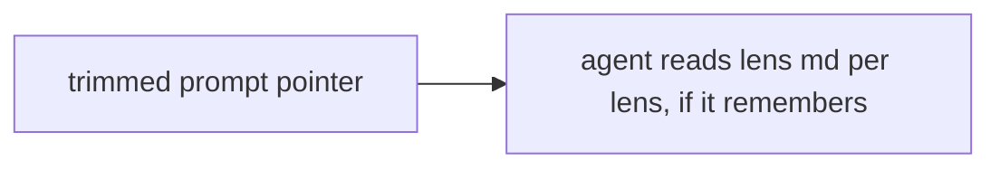
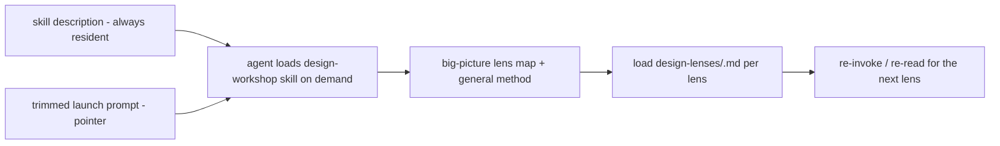
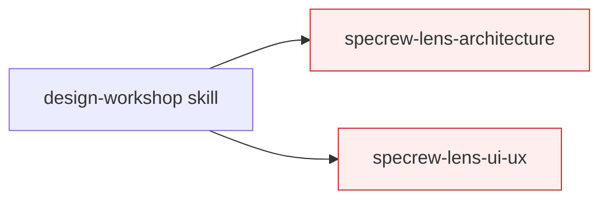

# Design Analysis — Feature 141 / Iteration 010

**Feature**: 141-design-gate-runtime-hardening
**Iteration**: 010 (lens-conduct delivery relocation — the i9-dogfood redo)
**Date**: 2026-06-05
**Spec**: [../../spec.md](../../spec.md)
**Design intake**: maintainer-directed (the i9 SC-024 dogfood disposition — "no proposal; same A4/A5/A6 intent, changed implementation; relocation = i10") + grounded by per-host skill-mechanism research (web-verified). i10 implements the EXISTING FRs (FR-025 workshop, FR-030–033 visuals, FR-034–037 co-design) via a different DELIVERY; no FR change.

## Problem Framing

Across five downstream dogfoods, the A4/A5/A6 lens conduct (Rules 9a/9b/9c + ~50 sibling rules) lived in the
one-shot launch prompt (`specrew-start.ps1` → `.specrew/last-start-prompt.md`, read once). The conduct is
correct — the i9 dogfood proved co-design happens — but the agent **skims** a 50-rule prompt and, by the time
it reaches a lens 20 minutes in, surfaces unreliably (diagrams written to file unshown; terse counts). The
lever is **delivery, not wording**: focused, point-of-use context the agent loads when it works each lens.
Web research settled the mechanics: **Agent Skills are a cross-vendor open standard** (`agentskills.io`) — all
five hosts (Claude Code, Copilot, Codex, Cursor, Antigravity) load the same `SKILL.md`; a skill's
name+description is always in the system prompt and the body loads **on-demand, re-invokably** (re-invocation
*documented* only on Claude — content persists, re-invoke to refresh; undocumented on the other four, so the
skill must be self-contained per load). Specrew's deploy already copies skills to `.claude/skills` +
`.agents/skills` (+ `.github/skills`, `.cursor/rules`), which covers all five hosts.

## Key Design Decision Points

1. **Where the per-lens conduct lives** — keep it in the one-shot prompt (status quo, diluted) vs. relocate to
   a re-invokable skill + the on-demand per-lens md.
2. **One workshop skill vs. a skill per lens** — the web finding (skills re-invoke; description always resident)
   makes a single re-invokable skill viable; per-lens skills add files for a marginal per-lens nudge.
3. **Self-containment + self-reinvocation** — because four hosts don't document reload, the skill body must be
   self-contained per load AND tell the agent to re-invoke / re-read for the next lens.
4. **Description engineering** — the description is the only always-resident trigger; it must carry the literal
   words a design moment uses, what+when, ≤~1024 chars (the tightest host cap).
5. **Multi-host deploy** — uniform `SKILL.md` content to `.claude/skills` + `.agents/skills` (Specrew's existing
   deploy machinery; no per-host content adapter — "just folders").

## Alternatives

### Option A: Simplest — trim the prompt, point at the existing on-demand lens md (no skill)

- **Approach**: cut the lens-conduct chunk from the launch prompt; replace with a short pointer that tells the
  agent to read `design-lenses/<id>.md` per lens (the md already carries the decision points). No skill.
- **Architectural pattern**: prompt pointer + on-demand md.
- **Quality features considered**: *(requirements-nfr)* cheapest; but nothing is **always-resident** to nudge
  the agent into the workshop at the right moment — the description-trigger value is lost, so the agent may
  skip the workshop entirely. *(architecture-core)* smallest change.
- **Effort estimate**: Small.
- **Reversibility cost**: Low.
- **Trade-offs**: (+) least work. (−) no always-resident workshop trigger; relies on the trimmed prompt being
  read — the same one-shot weakness we're fixing.

### Option B: Reasonable — a re-invokable design-workshop skill + per-lens conduct in the lens md

- **Approach**: one `design-workshop` `SKILL.md` (frontmatter description engineered to auto-load on design-lens
  work; body = the big-picture lens map + the general method [ASCII-inline-default surfacing, co-design-not-
  unilateral, capture-agreements, phase-framing] + the per-lens loop "load `design-lenses/<id>.md` for the
  current lens" + a self-reinvocation instruction). Per-lens conduct co-located into each lens md (its diagram
  type + facilitation nuances). Deployed uniformly to `.claude/skills` + `.agents/skills` (covers all 5).
  Launch prompt trimmed to a short pointer. Workshop-folder + JSON pointer for diagram keepers.
- **Architectural pattern**: point-of-use delivery — an always-described, on-demand, re-invokable skill over the
  existing on-demand per-lens md; one source of truth, host-portable (open standard).
- **Quality features considered**: *(architecture-core)* the skill is the always-resident trigger the prompt
  isn't; *(component-design)* skill / per-lens md / trimmed prompt / deploy are decoupled units, the deploy is
  unchanged (auto-discovers the new flat `*.md`); *(requirements-nfr)* self-contained-per-load handles the four
  hosts that don't document reload; *(devops-operations)* uniform `SKILL.md` to two dirs covers all five, no
  per-host adapter.
- **Effort estimate**: Medium (the skill + 9 lens-md sections + the prompt trim + tests).
- **Reversibility cost**: Low (additive skill + md sections; the prompt trim is revertible).
- **Trade-offs**: (+) the always-resident description nudges the workshop reliably; one source of truth; host-
  portable. (−) more than A; still a behavioral bet → the SC-024 re-confirm dogfood. (−) re-invocation only
  documented on Claude — mitigated by self-containment.

### Option C: By-the-book — Option B + a skill per lens (specrew-lens-<id>)

- **Approach**: Option B plus nine `specrew-lens-<id>` skills, each with its own description, for a stronger
  per-lens auto-load cue.
- **Architectural pattern**: Option B + per-lens skill fan-out.
- **Quality features considered**: *(devops-operations)* 9 skills × 2 dirs = 18 deployed units to maintain;
  *(requirements-nfr)* the web finding shows a single re-invokable skill already re-loads per stage, so the
  extra per-lens descriptions buy a marginal nudge at a real maintenance + skill-budget cost (Codex shortens
  descriptions under a ~2% budget; many skills crowd it).
- **Effort estimate**: Large.
- **Reversibility cost**: Medium (more surfaces to unwind).
- **Trade-offs**: (+) strongest per-lens cue. (−) N-skill maintenance + budget pressure for marginal gain;
  over-built given re-invocation already works.

## Comparison

| Criterion | A — Simplest | B — Reasonable | C — By-the-book |
| --- | --- | --- | --- |
| Always-resident workshop trigger | none | **the skill description** | the skill + N lens descriptions |
| One source of truth | md only | **skill + md** | skill + md + N skills |
| Host-portable (open standard) | n/a | **yes (2-dir deploy)** | yes (more files) |
| Maintenance surface | lowest | **moderate** | highest (18 units) |
| Skill-budget pressure | none | low | **real (Codex ~2%)** |
| Re-invocation needed | n/a | single skill (web-confirmed viable) | per-lens (unnecessary) |

## Applicable Lenses

- **architecture-core** - `extensions/specrew-speckit/knowledge/design-lenses/architecture-core.md`
  - Addressed: the building blocks (skill / per-lens md / trimmed prompt / deploy) and the central fork (DP-1:
    keep-in-prompt vs relocate-to-skill) are the option axes; the skill is the always-resident trigger the
    one-shot prompt isn't.
- **component-design** - `extensions/specrew-speckit/knowledge/design-lenses/component-design.md`
  - Addressed: skill, per-lens md, trimmed prompt, and the deploy are decoupled units; the deploy is unchanged
    (it auto-discovers the new flat `design-workshop.md` and the tests enumerate skills dynamically).
- **requirements-nfr** - `extensions/specrew-speckit/knowledge/design-lenses/requirements-nfr.md`
  - Addressed: the reliability driver (point-of-use beats a diluted one-shot prompt) and the self-contained-per-
    load NFR (four hosts don't document reload) are the measurable design constraints; SC-024 re-confirm is the
    behavioral acceptance.
- **devops-operations** - `extensions/specrew-speckit/knowledge/design-lenses/devops-operations.md`
  - Addressed: the multi-host deploy (uniform `SKILL.md` to `.claude/skills` + `.agents/skills` covers all five;
    no per-host content adapter — "just folders") via Specrew's existing deploy machinery.

*Not selected: data-storage, ui-ux, security-compliance, integration-api, observability-resilience — i10 is a
delivery/packaging change with no new storage, screen, auth, external API, or runtime hot-path surface.*

## Crew Recommendation

**Recommended: Option B** — it is the lowest-fragmentation delivery that fixes the actual cause (a diluting
one-shot prompt) with the always-resident workshop description the prompt cannot provide, one source of truth,
and host-portability via the open standard. Option A keeps the one-shot weakness (no always-resident trigger);
Option C over-builds (N-skill maintenance + budget pressure) for a marginal per-lens cue the web finding shows
is unnecessary (the single skill re-invokes per stage). The collaboration/surfacing QUALITY remains behavioral
→ the SC-024 re-confirm dogfood is the acceptance, as in A4/A5/A6.

## Human Decision

- **Decision verdict**: approved for plan with Option B
- **Chosen Option**: Option B
- **Reason / modifications**: Maintainer-directed: disposition of the i9 SC-024 dogfood as a delivery REDO
  ("no proposal — same intent, changed implementation; relocation = i10"), with explicit build requirements —
  investigate per-host skill support (done: all five share the open standard, "just folders"); engineer the
  description to auto-load each lens; the skill must tell the agent to reload for the next lens; provide a
  general lens overview so the agent grasps the big picture and the reload rule. "Yes, implement it." Option B
  is the Crew recommendation and matches every directive. The behavioral acceptance is the i10 dogfood (SC-024
  re-confirm). Future (post-141): the maintainer's sub-agent-per-skill + coordinator model.
- **Decision date**: 2026-06-05
- **Design-analysis draft commit**: `__DRAFT_COMMIT__`
- **Decision recorded in commit**: `__DECISION_COMMIT__`
