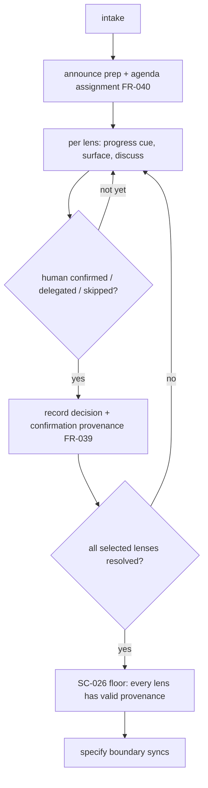

# Design Analysis — Feature 141 / Iteration 011

**Feature**: 141-design-gate-runtime-hardening
**Iteration**: 011 (confirmation integrity & intake responsiveness — the testLenses7codex Squad blocker)
**Date**: 2026-06-05
**Spec**: [../../spec.md](../../spec.md) — Amendment A7 (FR-038/FR-039/FR-040, SC-026/SC-027)
**Design intake**: maintainer-directed after the testLenses7codex Copilot/Squad dogfood ("the feature is not done if we find such a huge problem, so we must fix it"); scope confirmed across the session — the integrity invariant + the **one** delegate/skip exception + the per-lens provenance field + the three intake-UX touchpoints.

## Problem Framing

The i10 relocation made the workshop surface + co-design reliably on Claude (testLenses6), and the
testLenses7codex run confirmed i10's three refinements. But on the **Squad/Copilot host** that same run
recorded **seven "Human agreed" per-lens decisions after only ~three human questions** — five lenses (security,
ui-ux, observability, integration, devops) were never surfaced; the coordinator declared intake "specific
enough" and the specify dispatch **backfilled synthetic, attributed agreements**. Root cause (empirically
traced, advisor-corrected): NOT a delegation/sub-agent limitation — the coordinator asked the first three
interactively — it is the coordinator's **stopping judgment**, driven by the Squad "launch aggressively /
background-default" persona; the per-lens loop for the remaining lenses was never entered. FR-036 co-design is
therefore **host-dependent**: it holds on Claude's single-agent loop and collapses under Squad's
coordinator-dispatch. Two failure surfaces: (1) **integrity** — agreements manufactured for un-surfaced lenses;
(2) **early-stop** — intake declared done before the lenses were worked. A compounding secondary finding: the
long, dead-air prep wait before the workshop (partly host/API latency) gives the coordinator no reason to slow
down and leaves the human unprepared.

## Key Design Decision Points

1. **How the integrity invariant BITES** — prose conduct (skimmable; the i6–i9 / testLenses7 failure) vs. a
   deterministic, structural backstop the gate can enforce.
2. **Grandfather mechanism for the new floor** — pre-A7 `workshop_intake:true` artifacts (testLenses4–7) have
   no `confirmation` field and MUST NOT be retroactively failed.
3. **Where the stopping-rule fix lands** — the Squad coordinator's "specific enough" judgment is the binding
   failure, so the fix MUST land in `squad.agent.md` (the coordinator's own ruleset), not only the skill, and
   must beat the aggressive-dispatch persona.
4. **The exception** — the human may explicitly delegate ("you decide") or skip; provenance must distinguish
   confirmed vs delegated vs skipped, and never fabricate an attributed agreement.
5. **Intake-UX shape** — turning dead-air prep latency into productive preparation (announcement + agenda
   assignment + per-lens lazy-load progress) that also reinforces the integrity fix.

## Alternatives

### Option A: Simplest — conduct-only (invariant + UX as prose; no structural floor)

- **Approach**: add FR-038/FR-040 as prose to the skill + Rule 9a + `squad.agent.md`; no SC-026 gate; the
  count self-check is advisory.
- **Trade-offs**: (+) least work; no schema/gate change. (−) it is the **sixth skimmable-prose edit** on the
  feature defined by prose being skimmed — testLenses7 *was* prose skipped. No deterministic backstop; nothing
  forces the agent to DECLARE per-lens. **Rejected.**

### Option B: Reasonable (RECOMMENDED) — conduct + structural provenance floor + count self-check + UX

- **Approach**:
  - **FR-039 provenance** — each selected lens's workshop record carries
    `confirmation: human-confirmed | human-delegated | human-skipped`.
  - **SC-026 floor** — extend `Test-SpecrewLensWorkshopRecords` to require a valid `confirmation` per selected
    lens; the specify boundary blocks until present. Grandfather-safe via a new top-level marker
    `confirmation_required: true` (A7-era workshops set it; pre-A7 artifacts lack it → no-op, exactly the
    `workshop_intake` precedent).
  - **FR-038 invariant** (conduct) — the integrity rule + the count self-check ("N recorded agreements → asked
    or explicitly delegated/skipped N times") + the delegate/skip exception, in the skill + Rule 9a +
    `squad.agent.md`'s stopping rule ("intake is NOT specific-enough until every selected lens is
    confirmed / delegated / skipped; never backfill an agreement").
  - **FR-040 UX** (conduct) — prep announcement + agenda assignment + per-lens lazy-load progress, in the skill
    + Rule 9a.
  - **`squad.agent.md`** — the stopping-completeness rule, modeled on the greenfield-intake rule (line ~1474)
    that demonstrably holds *interactively* on Squad.
- **Architectural pattern**: deterministic floor (presence + enum) under behavioral conduct — the A4/A6
  precedent, now with the floor checking *how each lens resolved*, not just *that a record exists*.
- **Trade-offs**: (+) the provenance floor is the strongest deterministic lever available — it cannot verify
  the human was asked, but it forces an **auditable per-lens declaration**, turning a synthetic agreement into
  an explicit claim; (+) the count framing is harder to skim than prose; (+) the UX reinforces integrity (a
  prepared, per-lens-cued human cannot be silently skipped). (−) truthfulness of `confirmation`, the
  no-synthetic behavior, and the UX remain **behavioral** → the **Squad re-dogfood (SC-027)** is the
  acceptance. (−) a small schema + gate change. **Matches the maintainer-confirmed scope.**

### Option C: By-the-book — Option B + a stronger per-lens proof

- **Approach**: Option B + require a verbatim human-input quote (or a session-turn marker) per
  `human-confirmed` lens.
- **Trade-offs**: (+) strongest-looking. (−) a quote is **fakeable** (the agent writes it) and heavy; a
  session-turn marker is **not available to the deterministic gate** (it cannot see conversation turns). Buys
  little over B's auditable declaration, at real cost + a **false-confidence** risk (a quote reads as proof it
  is not). **Rejected.**

## Comparison

| Criterion | A — Simplest | B — Reasonable | C — By-the-book |
| --- | --- | --- | --- |
| Deterministic backstop | none | **provenance presence + enum** | provenance + quote (fakeable) |
| Anti-skim lever | prose only | **count + structural declaration** | + quote (heavy) |
| Verifies human was asked | no | no (declaration only — honest) | no (quote fakeable) |
| Grandfather-safe | n/a | **yes (marker-gated)** | yes |
| Effort | small | **medium** | large |
| False-confidence risk | — | low (explicit about the limit) | **higher (quote looks like proof)** |

## Applicable Lenses

- **architecture-core** — where the invariant, the SC-026 floor, and the `squad.agent.md` stopping-rule live;
  the central fork (DP-1: prose-only vs structural backstop).
- **component-design** — decoupled units: the provenance schema, the floor extension
  (`Test-SpecrewLensWorkshopRecords`), the skill / Rule-9a conduct, the `squad.agent.md` rule, the tests — each
  changeable independently; the floor is grandfather-marker-gated.
- **requirements-nfr** — the load-bearing NFR is "**harder to skim, honestly not unfakeable**": the floor
  enforces declaration, the Squad dogfood is the behavioral acceptance; the host-dependence of FR-036 is the
  driver.
- **ui-ux** — FR-040 intake UX: the prep announcement + agenda assignment + per-lens progress; turning
  dead-air latency into preparation.

*Not selected: data-storage, security-compliance, integration-api, devops-operations, observability-resilience
— i11 adds no storage, auth, external-API, deploy, or runtime-hot-path surface (the provenance field is an
additive JSON key; the deploy is unchanged).*

## Crew Recommendation

**Option B.** The structural provenance floor is the strongest deterministic backstop available (presence +
enum) and is **honest about its limit** — it forces a per-lens declaration, it cannot verify the human was
asked (that is SC-027's Squad dogfood). It beats Option A (the sixth skimmable-prose edit, no backstop) and
Option C (a fakeable quote that reads like proof it isn't). The key behavioral lever — the `squad.agent.md`
stopping-completeness rule modeled on the working greenfield-intake rule — targets the actual root cause (the
coordinator's early-stop), and the intake UX reinforces it. Acceptance: the **SC-027 Squad re-dogfood**, not
the unit floor. This is, honestly, conduct on a skimmable surface for its behavioral half — the floor is the
new structural half, and the dogfood is the gate.

## Human Decision

- **Decision verdict**: approved for plan with Option B
- **Chosen Option**: Option B
- **Reason / modifications**: Maintainer approved Option B at the design-analysis stop (structured verdict, 2026-06-05) after the full scope was co-developed across the session — the confirmation-integrity invariant + the one delegate/skip exception + the per-lens provenance field + the three intake-UX touchpoints. The grandfather mechanism (a new `confirmation_required` marker, mirroring `workshop_intake`) was surfaced and accepted. The honest limit was stated and accepted: the SC-026 floor forces an auditable per-lens declaration but cannot verify the human was asked, so the **Squad re-dogfood (SC-027)** is the acceptance — Option C's verbatim-quote check was rejected as fakeable-but-proof-looking. No modifications.
- **Decision date**: 2026-06-05
- **Design-analysis draft commit**: `e7a6588c`
- **Decision recorded in commit**: `__DECISION_COMMIT__`
