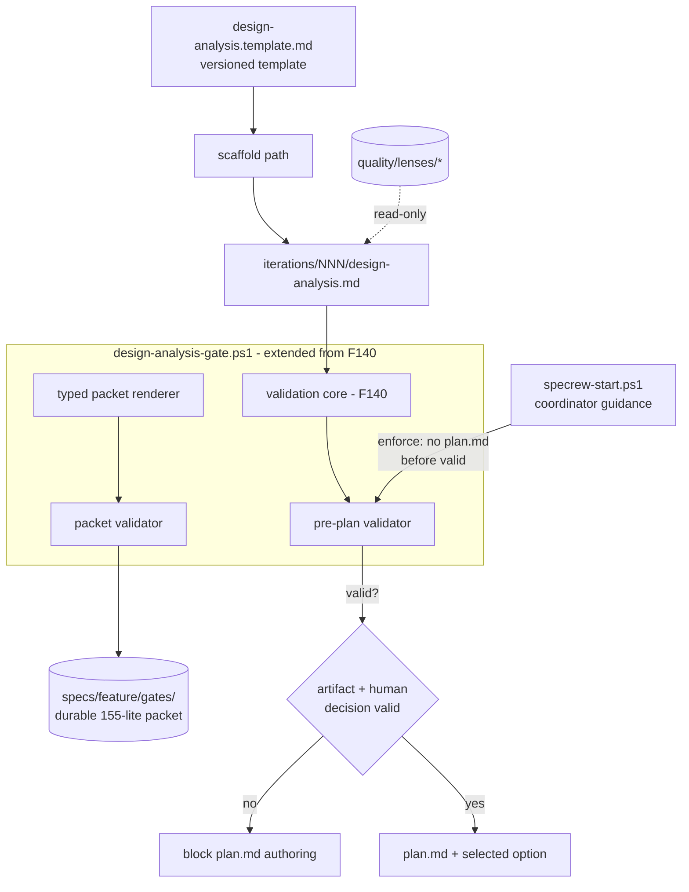
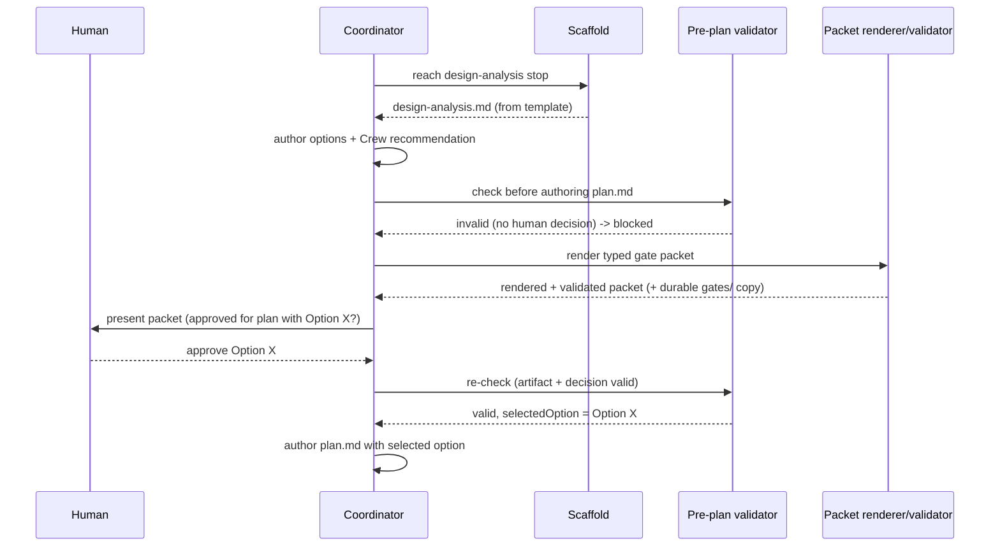

# Review Diagrams: Design Gate Runtime Hardening

**Feature**: 141-design-gate-runtime-hardening  
**Phase**: pre-implementation (planning artifact for reviewer)

## Component diagram (Iteration 1 design-gate runtime path)



## Sequence: design-analysis gate before plan (canonical flow)



## Sequence: smoke-bundle defects (later iterations)

```mermaid
sequenceDiagram
  participant Gen as start-prompt generator
  participant Pkt as start/handoff packet
  participant Proj as greenfield/downstream project
  Gen->>Pkt: render artifact paths
  Note over Pkt: iter 2 - every path has non-empty feature segment (no specs//)
  Gen->>Pkt: render host-conditional wording
  Note over Pkt: iter 2 - selected host only (no Copilot text on Claude)
  Proj->>Gen: run lifecycle command
  Note over Proj: iter 3 - only actionable warnings; baseline commit resolves to real hash
```
