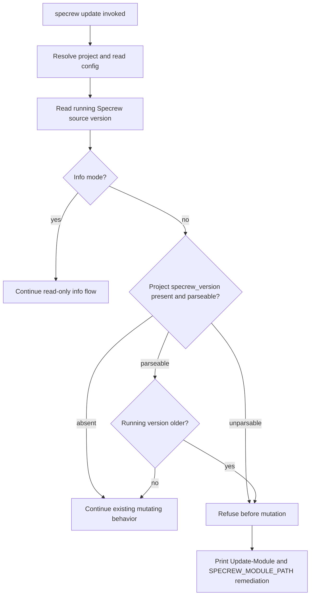

# Review Diagrams: Iteration 001

**Schema**: v1
**Feature**: 159-update-ux-small-fixes

## Downgrade Guard Flow

## Review Notes

- The guard is intentionally before validation probes, deployment scripts, template refresh, installs, and config writes.
- No new architecture diagram was required beyond the existing contract flow.
