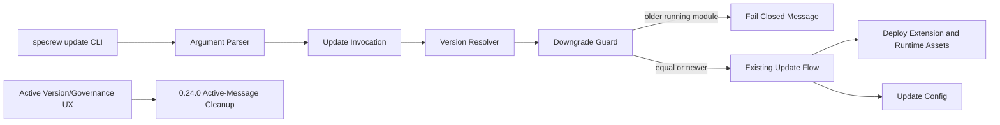
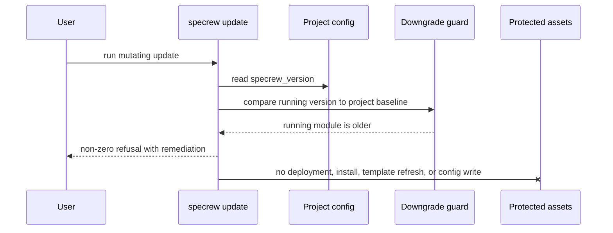
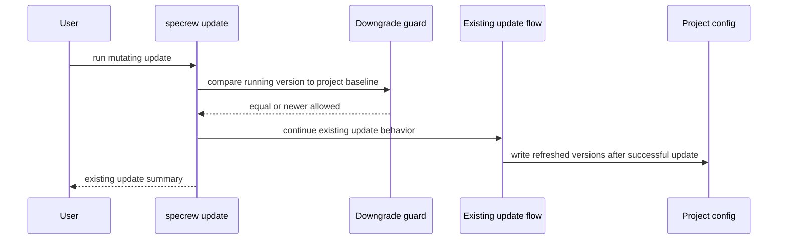

# Review Diagrams: Specrew Update Downgrade Guard and Compatibility Message Cleanup

**Feature**: 159-update-ux-small-fixes  
**Phase**: pre-implementation (planning artifact for reviewer)

## Component Diagram

## Sequence: Stale Module Refusal

## Sequence: Equal/Newer Pass-Through

