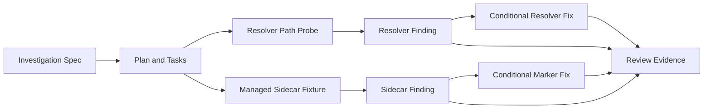
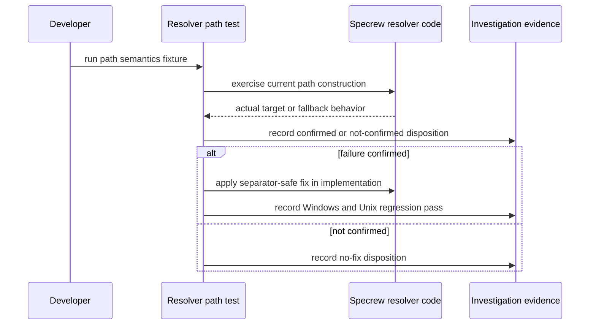
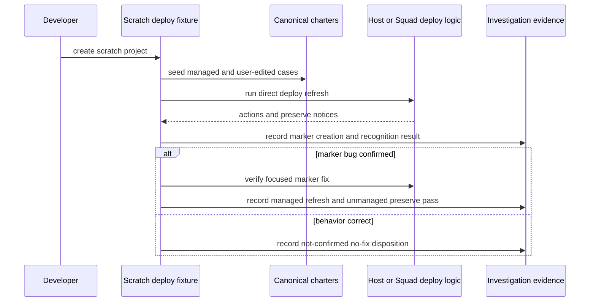

# Review Diagrams: Unix Resolver Sidecar Hardening Investigations

**Feature**: `160-unix-resolver-sidecar-hardening`
**Phase**: pre-implementation planning artifact for reviewer

## Component Diagram

## Sequence: Resolver Path Investigation

## Sequence: Managed Refresh Sidecar Investigation

