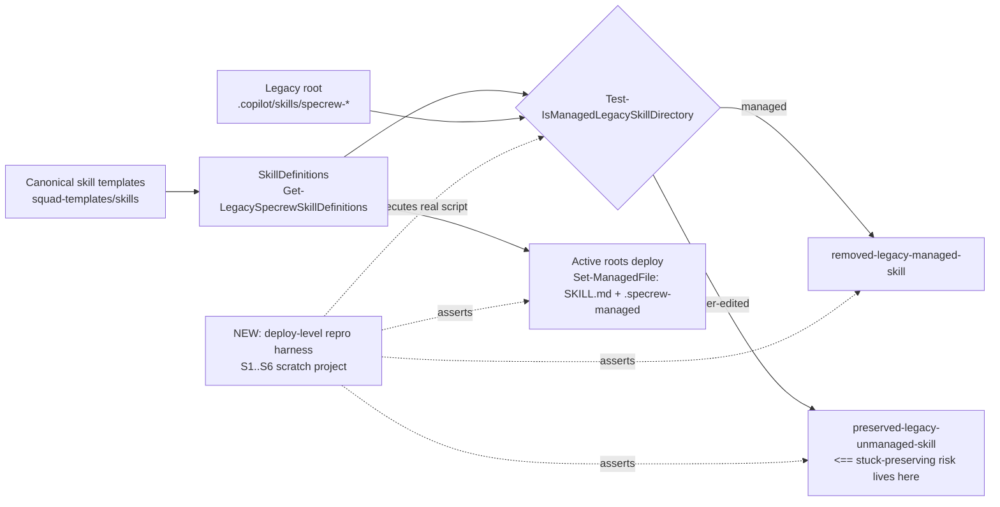
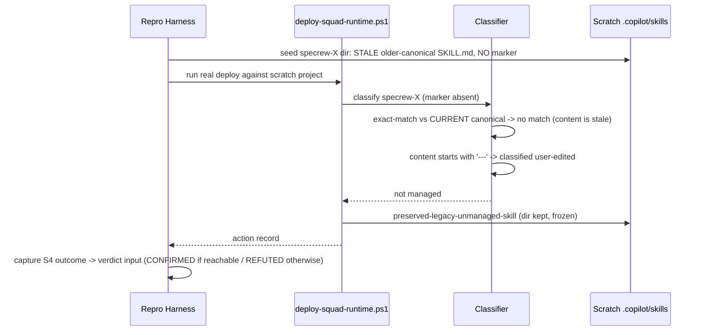

# Review Diagrams: Managed-Skill "Stuck Preserving" Guard

**Feature**: 161-managed-skill-preserving-guard
**Phase**: pre-implementation (planning artifact for reviewer)

## Component diagram



## Sequence: stale-canonical probe (S4 — the residual hypothesis)



## Sequence: verdict-gated fix flow

```mermaid
sequenceDiagram
  participant I as Implementer
  participant E as Evidence
  participant Hu as Human

  I->>E: run S1-S6 + reachability analysis
  E-->>I: S4 outcome + upgrade-path evidence
  alt CONFIRMED (misclassified AND reachable)
    I->>Hu: verdict visible at boundary stop
    Hu-->>I: approve fix scope
    I->>I: narrow classification fix + mirror parity
    I->>E: S4 flips managed; S2 still preserved; F-160 fixture green
  else REFUTED
    I->>E: record refutation + code-path citation
    I->>I: no behavior change; fix budget unspent
  end
```
