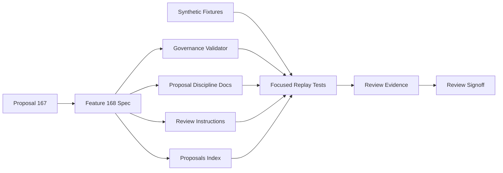
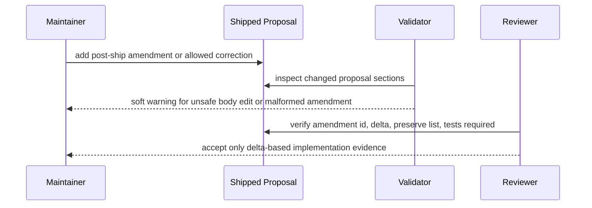

# Review Diagrams: Iteration 001

**Schema**: v1
**Diagram Format**: mermaid

## Structure Diagram

## Flow Diagram

## Review Notes

- Diagrams show the Feature 168 governance flow only.
- Runtime product behavior is not part of this slice.
