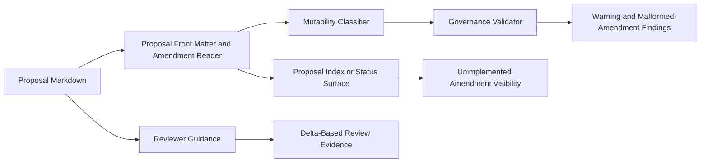
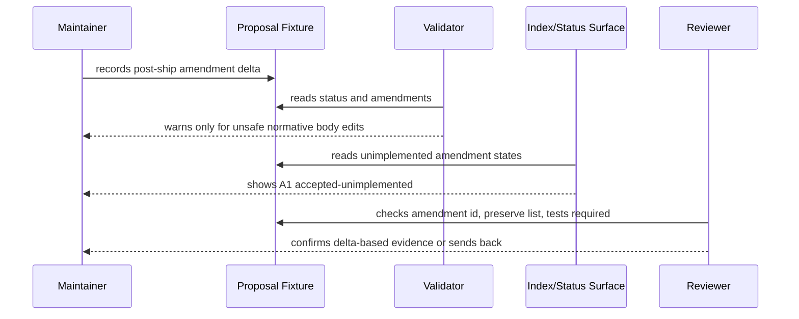

# Review Diagrams: Post-Ship Proposal Amendment Discipline

**Feature**: 168-post-ship-proposal-amendment-discipline
**Phase**: pre-implementation (planning artifact for reviewer)

## Component diagram

## Sequence: shipped proposal amendment validation

