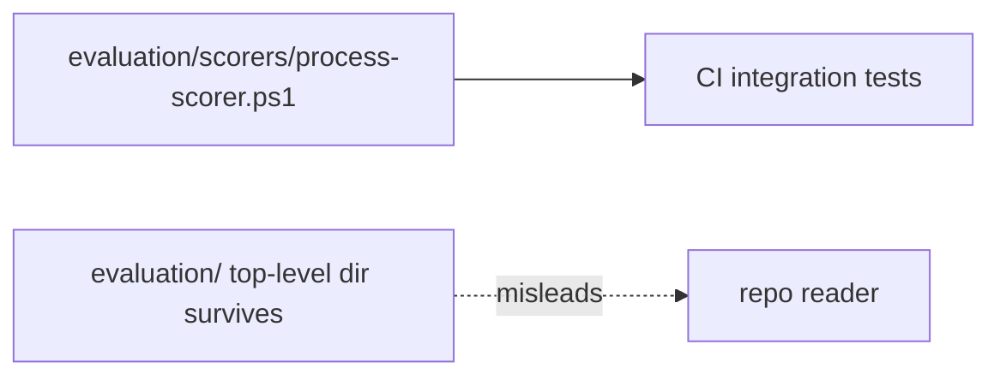
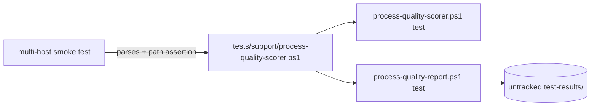

# Design Analysis: Retire Top-Level Evaluation Surface (Iteration 001)

**Feature**: 170-retire-evaluation-surface
**Iteration**: 001
**Date**: 2026-06-06
**Provenance note (honesty record)**: the implementation pre-exists this analysis
(ungoverned Codex session, adopted as snapshot `3b6a3e0d`), and `plan.md` was
authored after the human authorized plan entry at the specify verdict. The
deterministic at-sync plan gate then correctly refused the plan boundary because
this durable design-analysis record was missing — this artifact formalizes the
design decisions the human genuinely made (intake workshop + specify + plan
verdicts) into the canonical gate shape. It was not used to *make* the decision;
it records one.

## Problem Framing

The tracked top-level `evaluation/` directory reads as a maintained public
evaluation harness, but only one of its three files has live value: the
process-quality scorer that CI integration tests consume. The stale README and
generated report mislead readers about what Specrew ships. The design question
is **classification**: is the scorer product runtime, a public harness, or test
infrastructure — and where should it live so the repository surface tells the
truth?

## Key Design Decision Points

- Classification of the scorer: product runtime vs public evaluation harness vs
  internal test infrastructure.
- Long-term home: keep top-level, move to `scripts/internal/`, or co-locate with
  its consumers under `tests/`.
- Destination for the generated report output (was a tracked top-level file).
- Clean break vs leaving a stub/pointer for a future public evaluation surface.

## Applicable Lenses

- architecture-core — Addressed: the classification, home, report destination,
  and clean-break decisions were ratified with the maintainer at the intake
  workshop (recorded human-confirmed in `lens-applicability.json`); the
  before/after structure diagram is persisted at
  `specs/170-retire-evaluation-surface/workshop/architecture-core.md` and the
  binding constraints (frozen CI entry points, untracked report output) carry
  into `plan.md`.

## Alternatives

### Option A: Simplest

- **Approach**: delete only the stale `evaluation/README.md` and
  `evaluation/report.md`; leave the scorer at `evaluation/scorers/`.
- **Architectural pattern**: status-quo location; minimal deletion.
- **Quality features considered**: lowest-touch change; zero test-caller churn.
- **Effort estimate**: ~0.5 SP.
- **Reversibility cost**: trivial (two files restorable from history).
- **Trade-offs**: the top-level directory survives, so the repository still
  implies a public evaluation surface — fails the feature's core intent (AC1)
  and leaves the classification ambiguity unresolved.

### Option B: Reasonable

- **Approach**: clean-break relocation — move the scorer to
  `tests/support/process-quality-scorer.ps1`, delete the rest of `evaluation/`,
  update the four test callers, docs, path scans, and validator mirrors.
- **Architectural pattern**: test-infrastructure classification; co-location
  with the consuming tests; generated output to untracked scratch space.
- **Quality features considered**: repository-surface truthfulness, CI
  continuity (frozen entry points), maintainability (scorer lives with its only
  consumers), Linux path-safety (AC4 assertion preserved).
- **Effort estimate**: 1-2 SP.
- **Reversibility cost**: cheap — a future public evaluation surface would be
  designed fresh as its own governed slice (named deferred scope in
  Proposal 169), not by undoing this move.
- **Trade-offs**: the repo stops advertising an evaluation harness (intended);
  historical mentions in shipped specs/fixtures remain as preserved history.

**By-the-book**: not meaningfully distinct for this slice — the by-the-book
variant would be designing a real public evaluation harness (schemas, contracts,
docs, versioning), which is exactly the **deferred** outcome-quality scorer that
Proposal 169 names as out of scope. It is a different future feature, not a
third variant of this cleanup.

## Crew Recommendation

- **Recommended**: Option B
- Option B is the only option that satisfies AC1 (no tracked `evaluation/`)
  while preserving the scorer's live CI value, and it matches the
  classification the maintainer already articulated when filing Proposal 169
  ("the scorer is test infrastructure, not product runtime").

## Human Decision

- **Decision verdict**: approved for plan with Option B
- **Chosen Option**: Option B
- **Reason / modifications**: Maintainer confirmed Option B ("Option B it is")
  after the three options were rendered in full in-band prose. The choice
  matches the intake-workshop confirmation (clean break, scorer to
  `tests/support/`, untracked report output, frozen CI entry points) and the
  shape of the adopted implementation. No modifications. Render note: two
  structured-menu attempts failed to surface the option descriptions on the
  Claude host (the A8 menu-before-render gravity); the verdict was taken on the
  plain-prose render.
- **Decision date**: 2026-06-06
- **Design-analysis draft commit**: `1ccdcf80`
- **Decision recorded in commit**: recorded in the commit following the draft;
  hash finalized below after commit.
