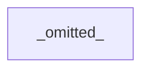
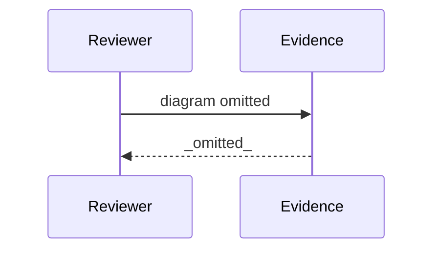
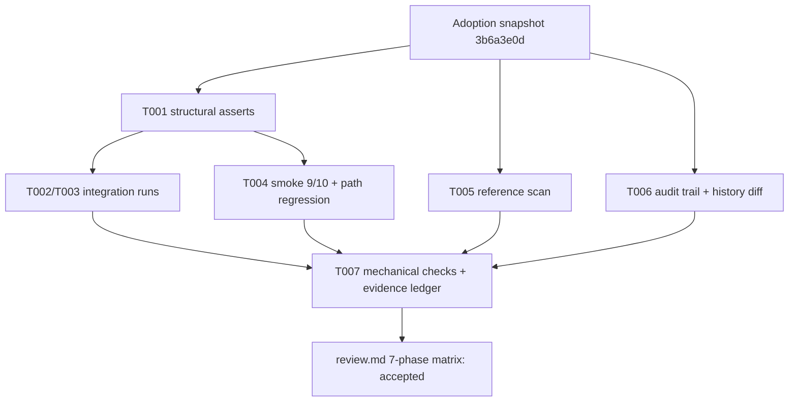

# Review Diagrams: Iteration 001

**Schema**: v1
**Diagram Format**: mermaid

> **⚠️ Review Evidence Warning** _(Form-vs-Meaning Gap Detected)_
>
> This iteration's task tracking declares **7 completed task(s)**, but the git diff against baseline `52602eded0aa17d28b768ae86073d212a9c56b05` contains **13 file(s)**.
>
> **Severity**: WARNING  
> **Implication**: Review evidence may be incomplete or misleading.
>
> **Possible causes**:
>
> - Implementation work was not committed before scaffolding review artifacts
> - Task status markers in plan.md or review.md do not match actual progress
> - Baseline reference in state.md is stale or incorrect
>
> **Remediation**:
>
> 1. Verify implementation is committed: `git diff 52602eded0aa17d28b768ae86073d212a9c56b05...HEAD --stat`
> 2. If uncommitted work exists: `git add . && git commit -m "Implementation complete"`
> 3. Re-run scaffolder with `-Force` flag to regenerate review artifacts after commit
> 4. Re-run `validate-governance.ps1` to clear pre-review commit gate error
>
> _See Proposal 073 (Review Evidence Integrity) for background on this validation._

---

## Structure Diagram

## Flow Diagram

## Omissions

- Structure diagram omitted: modules touched (0) below threshold (3).
- Flow diagram omitted: entrypoints changed (0) below threshold (1).

## Local View Hints

- specs\170-retire-evaluation-surface\iterations\001\review-diagrams.md

## Form-vs-Meaning Gap — Explained (reviewer disposition: not a defect)

The warning above is expected for this iteration and is dispositioned as
explained: this was a verification-first iteration whose product implementation
PRE-DATES the task baseline (adoption snapshot 3b6a3e0d, committed at feature
creation). The 7 tasks were read-only verification runs; the 13 files in the
baseline..HEAD diff are lifecycle/evidence artifacts (iteration plan, state,
drift log, quality evidence, spec SC-004 reconciliation, governance ledger),
not untracked implementation. The implementation diff itself was reviewed
against the pre-adoption baseline b31345f4 (see review.md Phases 2/5/6).

## Verification flow (this iteration)

