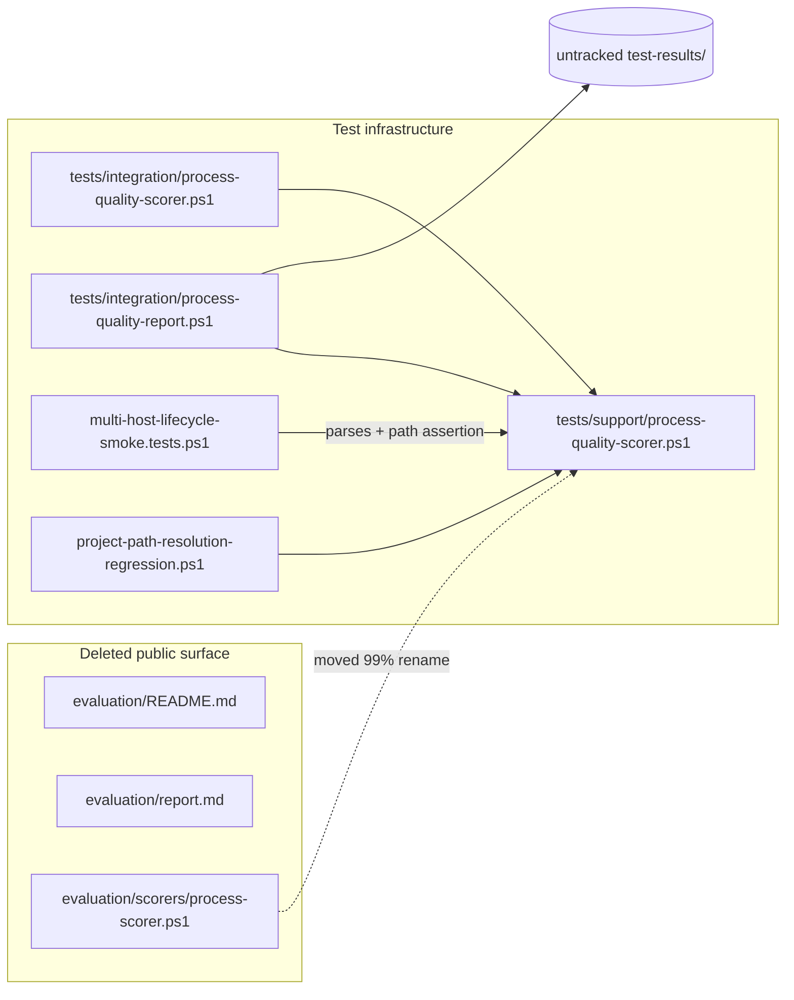
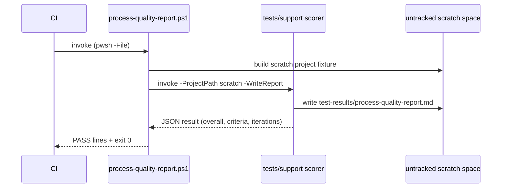

# Review Diagrams: Retire Top-Level Evaluation Surface

**Feature**: 170-retire-evaluation-surface
**Phase**: pre-implementation (planning artifact for reviewer)

## Component diagram

## Sequence: CI process-quality regression run

