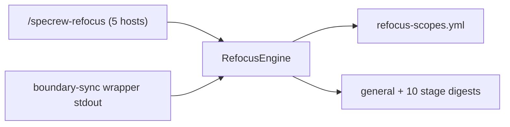
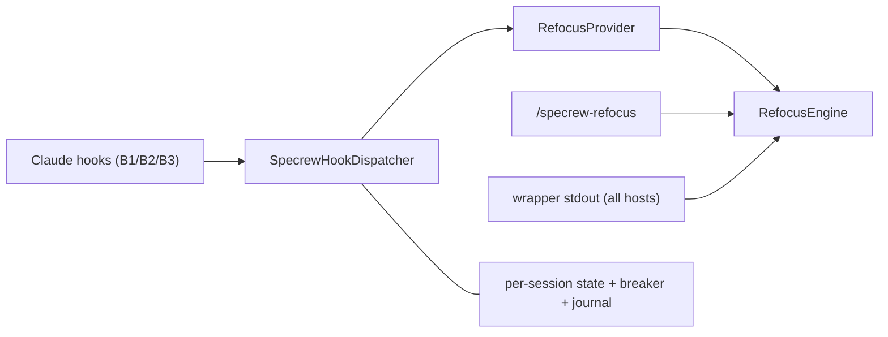
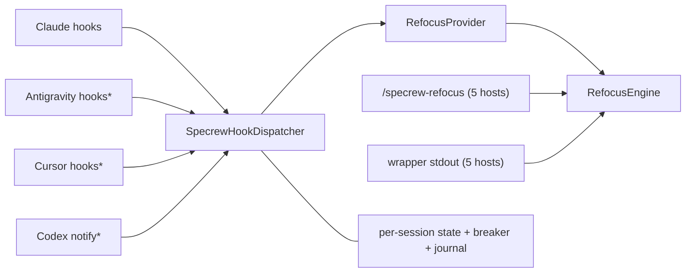

# Design Analysis: Specrew Refocus — Slash Command + Event-Driven Auto-Refocus

**Feature**: 171-specrew-refocus
**Iteration**: 001
**Date**: 2026-06-06
**Status**: decided — approved for plan with Option C

## Problem Framing

Methodology drift is empirically born at three moments: compaction destroys the corpus in context; cold/bypass launches never load it; long sessions cross lifecycle gates with stale discipline. The shipped answer (coordinator advisory + human awareness) is discretionary — it asks a possibly-drifted agent or a busy human to notice drift. Proposal 146 (amended `2199a8dd`) demands a reactive manual surface AND mechanical re-injection from triggers that live outside the model's context, multi-host honest.

## Key Design Decision Points

1. Engine placement → deployed extension script (downstream-capable, no module import per fire)
2. Trigger delivery → host-neutral contract + 3 channels (lifecycle stdout / primer floor / host hooks)
3. B3 detection → watch the state (boundary-cursor diff), never the actor
4. Scope mapping → data-driven catalog with schema_version + provider registry
5. Payload → general + per-stage digest family with drift guardrail
6. Hook multiplexing → ONE dispatcher per event, ordered/budgeted registry
7. Runtime state → per-session files keyed by sanitized host session id
8. Safety → automatic circuit breaker + 3 manual kill-switch levels + journal + reason codes
9. Compaction → managed compaction points (`--compact-instructions`); auto-compact steering research-gated

## Alternatives

### Option A - Simplest: manual surface + host-neutral channels only

- **Approach**: ship Pillar A (slash command on all 5 hosts) + channel 1 (boundary-sync wrapper stdout emission) + channel 2 (primer pointer) + the digest family and catalog. NO hook layer, no breaker (no automation to guard).
- **Architectural pattern**: stable host-neutral engine over versioned data; in-band lifecycle delivery only — no per-host trigger adapters.
- **Quality features considered**: P1 fail-open + P3 token economy on the engine/wrapper paths; P2 exactly-once trivial (one channel); P4 latency moot (no hook path); P5 digest drift guardrail unchanged.
- **Effort estimate**: ~8-10 SP, 1 iteration.
- **Reversibility cost**: low — hooks can be added later additively, but arrive as a second feature paying re-integration + re-review cost over the same components.
- **Trade-offs**: smallest thing that delivers value everywhere with zero new host coupling; but the two empirically worst drift events (compaction, bypass launches) stay uncovered and the feature's central thesis (non-discretionary triggers outside the model's context) is unrealized.



### Option B - Reasonable: A + Claude hook binding only

- **Approach**: everything in A, plus the dispatcher/provider/registry machinery bound on Claude only (B1 post-compaction, B2 launch/resume, B3 boundary-cross), the circuit breaker, journal, and managed compaction points. Antigravity/Cursor/Codex bindings deferred to research-gated fast-follow slices.
- **Architectural pattern**: volatility cut realized for one host — host-neutral engine + ONE per-host trigger adapter (Claude) + per-session runtime state.
- **Quality features considered**: full P1-P5 register incl. the P4 latency bar on Claude's hook paths; breaker + kill-switch + journal observability for the one bound host.
- **Effort estimate**: ~15-18 SP, 2 iterations.
- **Reversibility cost**: medium — per-host follow-ups re-open the dispatcher, deploy loop, and tests three more times; the contract shape is set by the first binding without multi-host pressure to keep it honest.
- **Trade-offs**: ships the non-discretionary layer where the surface is documented today and defers unverified surfaces; but multi-host parity (the product's load-bearing promise) ships asymmetric — and the maintainer explicitly rejected Claude-first framing during the workshop.



### Option C - By the book: B + research-verified bindings for ALL hook-capable hosts (workshop-bound scope)

- **Approach**: the full workshop-bound scope — trigger contract + both host-neutral channels + digest family + dispatcher/registry + per-session state + breaker/kill-switches/journal + managed compaction points + a research-matrix artifact per host, with verified hook bindings for Claude, Antigravity, Cursor, and Codex-where-expressible inside this feature; Copilot ships channels 1+2 with documented variance.
- **Architectural pattern**: the volatility cut realized fully — N thin per-host trigger adapters over one stable engine, bindings declared as data in each host package (F-044 pattern).
- **Quality features considered**: full P1-P5 register on every bound host; SC-008 runtime beta validation on >=2 hook-bound hosts; research-matrix verification gates each binding's C2 contract.
- **Effort estimate**: ~18-25 SP, 2 iterations (research tasks lead iteration 002).
- **Reversibility cost**: lowest long-term — the contract is shaped under real multi-host pressure once; each binding is an isolated adapter that can be disabled per host (catalog flag) without touching the others.
- **Trade-offs**: largest scope with schedule risk concentrated in per-host research; bounded structurally — a host that fails verification degrades to channels 1+2 with documented variance (never a slipped feature); matches the product's host-neutrality guarantee and the recorded workshop decision.



*\* research-matrix verified before binding; failure → channels 1+2 with documented variance.*

## Applicable Lenses

*(FR-026 anti-omission coverage — each selected lens from `lens-applicability.json`, pointing into the option comparison; full per-lens records in `../../workshop/`.)*

- **architecture-core**
  Addressed: the option axis IS this lens's central decision (trigger delivery + host bindings); Option C realizes the bound host-neutral contract + volatility cut; Options A/B price the cuts (no hooks / Claude-only) against the recorded multi-host correction.
- **component-design**
  Addressed: all three options consume the same human-agreed 12-component map (Co-Design Record below); they differ only in which trigger adapters materialize — A drops Dispatcher/Provider/HostHookBindings, B materializes them for one host, C for all hook-capable hosts.
- **requirements-nfr**
  Addressed: P1 fail-open and P2 exactly-once bind identically across options; P4's latency bar only exists in B/C (hook paths); Option A trivially satisfies P4 by having no hook path — weighed in each option's cost line.
- **integration-api**
  Addressed: contracts C1/C4/C5 (engine CLI, catalog, digests) are option-invariant; C2 (host hook protocol) and C6 (merge-aware hook deploy) exist only in B/C — C multiplies C2 verification across hosts via the research-matrix gate.
- **security-compliance**
  Addressed: the auto-execution trust surface (hook registration, event-JSON parsing, session-id sanitization) is introduced by B/C only; Option A has no new execution surface; C's surface equals B's per host (same dispatcher), replicated under the same controls.
- **devops-operations**
  Addressed: kill-switch levels + circuit breaker + opt-out memory are required exactly where automation exists (B/C); deployment classes (managed mirrors, managed-with-overlay catalog) and FileList obligations are option-invariant; C adds per-host binding declarations to the deploy loop.
- **observability-resilience**
  Addressed: journal + reason codes + `--status` failure trace apply to any option with automatic injections (B/C); Option A retains the banner-only audit trail; C's per-host bindings each cite journal evidence in SC-008 beta validation.

## Crew Recommendation

**Option C** — it is the scope the human already bound during the intake workshop (architecture-core decision 2: "All hook-capable hosts in this feature"), it is the only option consistent with the recorded multi-host correction, and its schedule risk is structurally bounded (research-matrix verification gates each binding; failure degrades that host to channels 1+2 with documented variance instead of blocking the feature).

## Co-Design Record

**Design method (human-bound, lens 1)**: repo-established layering = IDesign-style volatility cut — volatile per-host trigger adapters over a stable host-neutral engine over versioned data.

**Component-to-responsibility map (co-designed and human-agreed at the component-design lens; re-confirmed at this stop):**

```text
                        TRIGGER ADAPTERS (volatile, per-host)
  +----------------+  +--------------------------------------+  +---------------------+
  | RefocusSkill   |  | SpecrewHookDispatcher                |  | CoordinatorAdvisory |
  +-------+--------+  +------+-----------------+-------------+  +----------+----------+
          |                  v                 v                           |
          |        +------------------+ +----------------------------+    |
          |        | RefocusProvider  | | RefocusRuntimeState        |    |
          |        +--------+---------+ +----------------------------+    |
          v                 v                                             v
  +--------------------------------------------------------------------------+
  |                         RefocusEngine (stable)                           |
  +------+------------------------------+------------------------------------+
         v                              v
  +---------------------+   +----------------------------------+
  | RefocusScopeCatalog |   | RefocusDigests                   |
  +---------------------+   +----------------------------------+
         ^
  +------+--------------------------------------------+
  | WrapperEmission (channel 1, all hosts)            |
  +---------------------------------------------------+
  Cross-cutting: HostHookBindings · DeployIntegration · DigestDriftCheck
```

- `RefocusSkill` — the `/specrew-refocus` manual surface per host
- `SpecrewHookDispatcher` — the ONE registered handler per host event; provider ordering, budget arbitration, dedupe, fail-open
- `RefocusProvider` — registry row #1; event/source → engine scope routing (B1/B2/B3)
- `CoordinatorAdvisory` — fallback suggestion surface + boundary-packet compact hygiene
- `RefocusEngine` — scope → catalog → digests → banner + payload; pure; never dedupes humans
- `RefocusScopeCatalog` — scopes, triggers, budgets, provider registry (data, versioned)
- `RefocusDigests` — general + 10 per-stage purpose-authored digests with declared sources
- `RefocusRuntimeState` — per-session dedupe + breaker + journal files
- `WrapperEmission` — boundary-sync wrapper stdout payload (every host)
- `HostHookBindings` — per-host binding declarations (research-gated)
- `DeployIntegration` — managed mirrors + managed-with-overlay catalog + merge-aware hook config
- `DigestDriftCheck` — test-lane currency warn

**Agreed key flow (dedupe-correct B3):** boundary-sync advances cursor → WrapperEmission appends `general + <next-stage>` payload to stdout (all hosts) and fingerprints it → next hook event on a hook-bound host: Dispatcher → RefocusProvider state-diffs per-session RuntimeState → fingerprint present → silent (journal: deduped); wrapper path bypassed → un-fingerprinted crossing detected → inject now (journal: injected).

**Human-agreed**: yes — co-designed across the 7-lens intake workshop 2026-06-06 (architecture and component map iterated with three human-raised design changes: multi-host trigger contract; dispatcher + provider registry; managed compaction points + breaker semantics). Re-presented and re-confirmed at this design-analysis stop.

## Human Decision

- **Decision verdict**: approved for plan with Option C
- **Chosen option**: Option C
- **Reason**: Option C is the scope the maintainer bound during the intake workshop (architecture-core decision 2: hook bindings for ALL hook-capable hosts in this feature) and the only option consistent with the explicit multi-host correction ("this feature is not just for Claude"). The schedule risk of unverified host surfaces is structurally contained by the research-matrix gate: a host that fails verification ships channels 1+2 with documented variance instead of blocking the feature.
- **Modifications**: None. Defaults accepted as rendered (options A/B/C, Crew recommendation C, co-design record re-confirmed).
- **Authorizing human**: Alon Fliess (structured verdict menu, 2026-06-06)
- **Design-analysis draft commit**: `5eee3e91`
- **Decision recorded in commit**: `e1b55cf1` (pinned in the follow-up commit immediately after this one)
